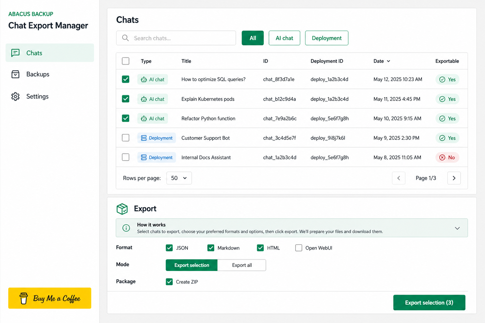

# Abacus Backup Chat Export Manager

A local backup and export manager for Abacus.AI chat conversations, with a FastAPI backend and a lightweight React dashboard for running jobs, checking status, and exporting collected data.


## Background

This project exists to make Abacus chat backups repeatable instead of manual. The codebase combines API-key based access to Abacus.AI, a small local database, background backup jobs, and a browser UI for operators who need a clear export workflow.

It is designed for local or self-hosted use, so secrets and exported conversations stay under the control of the person running the tool.

## Features

- Connect to Abacus.AI through the backend client in `backend/app/abacus_client.py`
- Store settings, backup history, and job metadata through the local database layer
- Run asynchronous backup jobs with progress information
- Inspect conversations in a React table UI
- Export backed-up data through the backend exporter module
- Manage API keys and local settings from the dashboard
- Run as a single Docker image or via the provided compose setup

## Screenshots



The screenshot shows the main dashboard with connection status, backup progress, chat table, export panel, and history components.

## Requirements

- Docker Desktop for the simplest start
- Alternatively: Python 3.11+ for the backend and Node.js 20+ for the frontend
- Abacus.AI API key with access to the conversations you want to back up

## Installation

### Option 1: Docker Compose

```bash
docker compose -f compose.yaml up --build
```

Open the web UI at the port exposed by `compose.yaml`.

### Option 2: Local Development

Backend:

```bash
cd backend
python -m venv .venv
.venv\Scripts\Activate.ps1
pip install -r requirements.txt
uvicorn app.main:app --reload
```

Frontend:

```bash
cd frontend
npm install
npm run dev
```

## Usage

1. Start backend and frontend.
2. Enter or verify the Abacus API key in the UI.
3. Load available conversation scopes.
4. Start a backup job and follow progress in the dashboard.
5. Review the backed-up chats and export them as needed.

## Technical Details

- **Backend:** FastAPI, Pydantic, `abacusai`, local database utilities
- **Frontend:** React, Vite, lucide-react, custom dashboard components
- **Containerization:** Root `Dockerfile` and `compose.yaml`
- **Configuration:** `.env.example`, backend config module, local settings service

### Architecture

```text
app-abacus-chat-backup/
├── backend/
│   └── app/
│       ├── main.py
│       ├── backup_engine.py
│       ├── jobs.py
│       ├── exporters.py
│       ├── database.py
│       └── abacus_client.py
├── frontend/
│   └── src/
│       ├── App.tsx
│       ├── api.ts
│       └── components/
├── docs/
│   └── preview-ui.png
├── compose.yaml
└── Dockerfile
```

## Troubleshooting

- If the UI cannot connect, check the backend URL in the frontend configuration.
- If authentication fails, verify the Abacus API key and permissions.
- If a backup job stalls, inspect backend logs from `docker compose logs -f`.
- If exports are empty, first confirm that conversation scopes were selected and backed up.

## Privacy & Security

- Store API keys only in local environment/configuration files.
- Do not commit `.env` files or exported chat archives.
- The repository includes `SECURITY.md`; review it before exposing this app beyond localhost.
- Treat exports as sensitive because conversations may contain private or business data.

## Development

```bash
cd frontend
npm run build

cd ..\backend
python -m compileall app
```

Use the Docker flow for an end-to-end check before publishing or sharing the tool.

## License

This project includes a `LICENSE` file. See that file for the applicable license terms.

## Support

Open an issue or document operational notes in `CHANGELOG.md` when backup behavior, Abacus API behavior, or export formats change.
