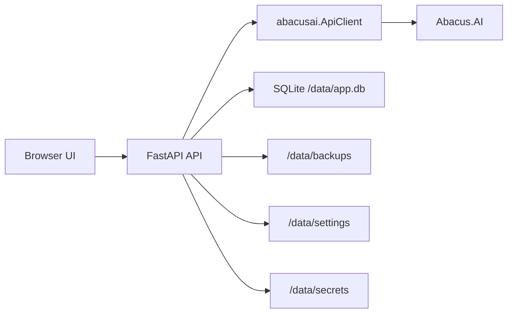

# Abacus Backup Chat Export Manager

A local Docker web application to backup and export your Abacus.AI chats and deployment conversations using the official Python library `abacusai`.


The app runs locally, connects to Abacus.AI only via API key, and stores backups persistently in a Docker volume. No browser scraping, no Selenium, no Playwright, and no Abacus password login.

## Background

Abacus.AI does **not** provide a built-in product feature to download or bulk-export chats from the web UI (no first-party “export conversation” button or similar). Access to conversation data is **only via the official API**, through clients such as the Python SDK (`abacusai`). This application implements that API-backed retrieval and packaging locally—there is no separate Abacus-side export service beyond what the API exposes for your account.

This project was built for a simple need: keep local, inspectable backups of Abacus.AI conversations without manual copy-paste work or browser automation. The goal is a tool that:

- just works locally in Docker
- uses the official `abacusai` SDK
- keeps API keys out of logs, manifests, backup files, and browser storage
- exports selected chats or everything in one run
- creates useful backup formats for humans and developers
- survives container restarts through a persistent Docker volume

## Features

- **API-key connection** - Connect via `.env`, Docker environment, temporary UI input, or explicit local persistence.
- **Official SDK only** - Uses `from abacusai import ApiClient`.
- **No scraping** - No browser automation, Selenium, Playwright, cookies, or password login.
- **Chat discovery** - Loads AI chat sessions and deployment conversations where the SDK/account allows it.
- **Deployment conversation scopes** - Automatically discovers deployment/external application scopes where the SDK allows it; manual overrides are available in the UI.
- **Multi-select export** - Select individual chats or export everything.
- **Export formats** - JSON, Markdown, HTML, Open WebUI import JSON, and optional ZIP archive.
- **Backup history** - View manifests, download ZIPs, and delete local backups.
- **Persistent local storage** - SQLite metadata and backup files live under `/data`.
- **Local API-key persistence** - Optional, clearly marked local storage under `/data/secrets`.
- **Basic Auth option** - Protect the local UI/API with `APP_BASIC_AUTH_USER` and `APP_BASIC_AUTH_PASSWORD`.
- **Docker ready** - One image containing backend and built frontend.

## Screenshots

No screenshots are included yet. After running the app, open:

```text
http://localhost:8080
```

The UI contains connection status, chat table, export controls, job progress, backup history, and settings for deployment conversation scopes.

## Requirements

- Docker Desktop or Docker Engine with Docker Compose
- Abacus.AI API key
- Local port `8080` available

For development:

- Python 3.11+
- Node.js 20+

## Quick Start

```bash
cp .env.example .env
# edit .env and set ABACUS_API_KEY, or enter the key in the UI
docker compose up -d --build
```

Open:

```text
http://localhost:8080
```

Check status:

```bash
docker compose ps
```

Stop the app:

```bash
docker compose down
```

## Installation

### Option 1: Docker Compose

```bash
git clone <your-repository-url>
cd app-abacus-chat-backup
cp .env.example .env
docker compose up -d --build
```

### Option 2: Docker Build

```bash
docker build -t abacus-backup-manager:local .
docker run --rm -p 8080:8080 \
  -e ABACUS_API_KEY="your-api-key" \
  -e APP_DATA_DIR=/data \
  -v abacus_backup_data:/data \
  abacus-backup-manager:local
```

## Configuration

Configuration can be provided through `.env`, Docker Compose environment variables, or the UI where supported.

| Variable | Default | Description |
| --- | --- | --- |
| `ABACUS_API_KEY` | empty | Abacus.AI API key. Recommended for regular use. |
| `ABACUS_DEPLOYMENT_IDS` | empty | Deployment IDs for deployment conversations. |
| `ABACUS_EXTERNAL_APPLICATION_IDS` | empty | External application IDs for deployment conversation listing. |
| `ABACUS_CONVERSATION_TYPES` | empty | Conversation type scopes required by some SDK/account setups. |
| `APP_DATA_DIR` | `/data` | Container data directory. |
| `APP_ALLOW_UI_API_KEY` | `true` | Allows API-key entry in the UI. |
| `APP_ALLOW_PERSISTENT_API_KEY` | `true` | Allows the "store locally" UI mode for API keys. |
| `APP_BASIC_AUTH_USER` | empty | Optional Basic Auth username. |
| `APP_BASIC_AUTH_PASSWORD` | empty | Optional Basic Auth password. |

Example:

```env
ABACUS_API_KEY=
ABACUS_DEPLOYMENT_IDS=
ABACUS_EXTERNAL_APPLICATION_IDS=
ABACUS_CONVERSATION_TYPES=
APP_ALLOW_UI_API_KEY=true
APP_ALLOW_PERSISTENT_API_KEY=true
APP_BASIC_AUTH_USER=
APP_BASIC_AUTH_PASSWORD=
```

## Usage

### 1. Connect

1. Open the web UI.
2. Enter an API key or use the key from `.env`.
3. Click **Verbinden testen**.
4. The app discovers available Abacus SDK methods.

API keys are never returned to the frontend. If entered in the UI, the key is kept in server memory by default. If you explicitly enable local persistence, it is stored under:

```text
/data/secrets/abacus_api_key.local
```

### 2. Deployment Conversation Scopes

The app automatically tries to discover scopes through the official SDK:

- `list_projects`
- `list_deployments`
- `list_external_applications`
- SDK conversation type enum fallback

Some Abacus SDK/account setups require at least one scope for `list_deployment_conversations`. The official Abacus documentation lists `deploymentId`, `externalApplicationId`, and `conversationType` for `listDeploymentConversations`; in the Python SDK these are called as `deployment_id`, `external_application_id`, and `conversation_type`.

If autodiscovery is not enough, go to **Einstellungen** and enter one or more manual values in:

- Deployment IDs
- External Application IDs
- Conversation Types

The values are stored locally in:

```text
/data/settings/conversation_scopes.json
```

### 3. Load Chats

Click **Chats laden** or **Refresh**. The app lists available AI chat sessions and deployment conversations.

Long lists show the first **10** rows by default; use **Weitere … anzeigen** to expand the full filtered list. **Alle auswählen** still selects every row that matches the current filters, not only the visible rows.

### 4. Select and Export

1. Select individual chats or choose **Alle exportieren** (all exportable chats from the loaded list, independent of checkboxes).
2. Choose export formats: JSON, Markdown, HTML, Open WebUI.
3. **ZIP erstellen**: when enabled, the server writes per-chat files first, then builds `backup.zip` at the **end** of the job (same folder contents, not a second export). When disabled, only loose files are written; the backup download endpoint can still create the ZIP on first download if needed.
4. Start the export and watch job progress.

### 5. Download Backups

Completed backups appear in **Backup-Historie**. You can:

- view `manifest.json`
- download ZIP
- delete the local backup

## Export Formats

### JSON

Best for complete archival and developers. SDK objects are converted defensively with `.to_dict()`, dictionaries, lists, datetime values, bytes handling, and safe fallbacks.

### Markdown

Best for readable chat transcripts. The exporter searches common message fields such as:

- `messages`
- `chat_messages`
- `conversation`
- `events`
- `history`
- `turns`
- `responses`
- `thread`

If no clear message list is found, Markdown contains a short note and JSON remains the source of truth.

### HTML

Best when the Abacus SDK provides an export method returning HTML or export content. If the SDK only returns metadata or a URL, metadata is stored and no external download is forced.

In addition, **every HTML export** generates a readable transcript **`{title}_{id}_Konversation.html`** derived from the chat payload (same message detection as Markdown): alternating **Benutzer** vs **Assistent** (plus **System** when present), timestamps when available, and a short legend at the top. Use this file when you want to see who said what. **`Konversation.html` is styled for screen reading and for browser print / Save as PDF** (`@media print`, A4-oriented margins, page-break handling). For many **deployment** conversations, the API stores the assistant’s answer in nested **`segments`** (not in the top-level `text` field); the export flattens those so the preview matches the full thread. The **authoritative, lossless** copy of the session is still **`*.json`**, including `history` and all segment objects.

If you select **only HTML** as export format (JSON/Markdown unchecked), each chat produces **only** `*_Konversation.html` — no SDK `*_html.*` artifacts — ideal for a single handoff document (PDF/print). When HTML is combined with other formats, SDK artifacts (`*_html.*`) are still written alongside JSON/Markdown as needed.

Files are written next to the other formats with a `*_html` stem: raw HTML (or text/binary when the response is not HTML) uses a normal extension (e.g. `.html`, `.txt`, `.bin`). When the SDK returns a structured object, the main document is `*_html.html` if HTML is embedded in the payload, and a sidecar `*_html.meta.json` holds the full structured response (not a misleading `*.export.json` name).

Each backup folder also contains **`index.html`** at the root: an overview page with links to every exported file (and to `manifest.json` / `errors.log`). Open it in a browser after unzipping — relative links work offline.

### Open WebUI

Best when you want to import Abacus.AI conversations into Open WebUI. The exporter creates:

- one `*_openwebui.json` file per converted chat
- one root-level `openwebui_import.json` containing all successfully converted chats from the backup job

`openwebui_import.json` follows Open WebUI's documented chat import shape: a JSON array, each item with `chat.history.messages`, `chat.history.currentId`, and `user` / `assistant` roles. If a chat payload does not expose recognizable text messages, the job records a conversion warning for that item and still keeps the JSON backup as source of truth.

### ZIP

Best for portable backup packages. ZIP contains `manifest.json`, `errors.log`, and all exported files. It is produced **after** all chats in the job are processed (or generated on first download if the job ran without up-front ZIP creation).

## Technical Details

- **Backend:** Python 3.11, FastAPI, Uvicorn
- **Frontend:** React, TypeScript, Vite, TailwindCSS
- **Abacus SDK:** `abacusai`
- **Database:** SQLite
- **Backup storage:** `/data/backups`
- **Container port:** `8080`
- **Runtime command:** `uvicorn app.main:app --host 0.0.0.0 --port 8080`

### Architecture



### Project Structure

```text
.
├── Dockerfile
├── compose.yaml
├── .env.example
├── backend/
│   ├── requirements.txt
│   └── app/
│       ├── main.py
│       ├── abacus_client.py
│       ├── backup_engine.py
│       ├── exporters.py
│       ├── database.py
│       ├── jobs.py
│       ├── security.py
│       └── local_settings.py
└── frontend/
    ├── package.json
    └── src/
```

## API Endpoints

| Method | Endpoint | Description |
| --- | --- | --- |
| `GET` | `/api/health` | Healthcheck |
| `POST` | `/api/connect` | Test API key and discover SDK methods |
| `DELETE` | `/api/api-key` | Delete locally stored API key |
| `GET` | `/api/status` | App status and config summary |
| `GET` | `/api/conversation-scopes` | Read stored conversation scopes |
| `PUT` | `/api/conversation-scopes` | Save conversation scopes |
| `GET` | `/api/chats` | List chats |
| `POST` | `/api/export` | Start export job |
| `GET` | `/api/jobs/{job_id}` | Read job progress |
| `POST` | `/api/jobs/{job_id}/cancel` | Cancel job best-effort |
| `GET` | `/api/backups` | List backups |
| `GET` | `/api/backups/{backup_id}/manifest` | Read manifest |
| `GET` | `/api/backups/{backup_id}/download` | Download ZIP |
| `DELETE` | `/api/backups/{backup_id}?confirm=true` | Delete local backup |

## Privacy and Security

- Uses the official Abacus.AI Python SDK.
- No Abacus password login.
- No browser scraping or browser automation.
- API key is never returned to the frontend.
- API key is not written to SQLite.
- API key is not written to manifests, backups, or error logs.
- UI-entered API keys are not stored in browser `localStorage`.
- Optional persistent API-key storage is local only and clearly marked as unsafe/local.
- Backups contain sensitive chat contents and should be protected accordingly.
- Do not expose this app publicly without additional authentication.

Recommended for shared networks:

```env
APP_BASIC_AUTH_USER=admin
APP_BASIC_AUTH_PASSWORD=a-long-local-password
```

## Troubleshooting

### "Deployment Conversations konnten nicht geladen werden"

Autodiscovery and manual scopes did not yield a usable SDK scope. Add at least one value in **Einstellungen**: Deployment ID, External Application ID, or Conversation Type.

### "Nicht verbunden"

- Check the API key.
- Click **Verbinden testen** again.
- If using `.env`, restart the container after changing it.

### No chats appear

- Click **Refresh**.
- Verify the API key has access to the relevant Abacus resources.
- Check whether the SDK methods are listed as available in the UI.

### HTML export missing

The SDK may not expose the export method for your account or may return only metadata. JSON and Markdown exports still run where possible.

### Port 8080 already in use

Change `compose.yaml`:

```yaml
ports:
  - "8081:8080"
```

Then open `http://localhost:8081`.

## Development

### Backend

PowerShell:

```powershell
cd backend
python -m venv .venv
.\.venv\Scripts\Activate.ps1
pip install -r requirements.txt
$env:APP_DATA_DIR="..\data"
uvicorn app.main:app --reload --port 8080
```

### Frontend

```bash
cd frontend
npm install
npm run dev
```

Vite proxies `/api` to `http://127.0.0.1:8080`.

### Build Checks

```bash
python -c "import ast, pathlib; [ast.parse(p.read_text(encoding='utf-8'), filename=str(p)) for p in pathlib.Path('backend').rglob('*.py')]; print('python syntax ok')"
```

```bash
cd frontend
npm run build
```

```bash
docker build -t abacus-backup-manager:local .
```

## Contributing

Contributions are welcome. Open an issue or submit a pull request with a clear description of the change.

## Changelog

Release history and notable changes: see [CHANGELOG.md](CHANGELOG.md).

## License

No license file is included yet. Add a `LICENSE` file before publishing the project publicly.

## Support

If you find this project useful and would like to support its development, consider buying me a coffee.

[](https://buymeacoffee.com/mrhymes)

[Support on Buy Me a Coffee](https://buymeacoffee.com/mrhymes)

## Acknowledgments

- [Abacus.AI](https://abacus.ai/) for the platform and official Python SDK.
- [FastAPI](https://fastapi.tiangolo.com/) for the backend framework.
- [React](https://react.dev/) and [Vite](https://vitejs.dev/) for the frontend toolchain.

---

Made for local, practical backups of important Abacus.AI conversations.
