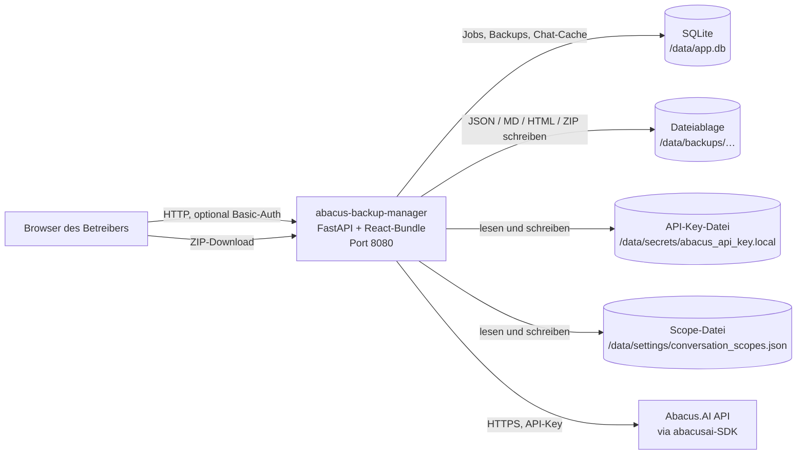
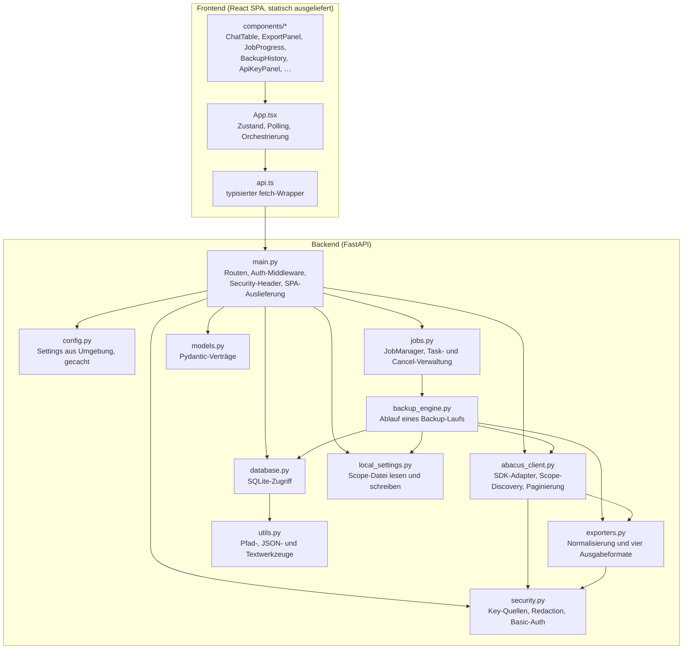

# 02 — Architektur · app-abacus-chat-backup

Systemkontext, interne Bausteine, Verzeichnisstruktur und nachträglich dokumentierte Architekturentscheidungen.

[← Zurück zum Index](README.md)

## Systemkontext

Die Anwendung ist ein einzelner Container mit einem einzigen ausgehenden Ziel: der Abacus.AI-API, angesprochen über das offizielle Python-SDK. Es gibt keine Datenbank als eigenen Dienst, keinen Cache-Server, keinen Message-Broker und keinen weiteren Drittdienst.

Belege: Port und Bindung `Dockerfile:29,35`; Volume `compose.yaml:22-23`; Pfade `backend/app/config.py:59-67`; SDK-Client `backend/app/security.py:69-73`.

## Komponenten

### Verantwortlichkeit je Baustein

| Baustein | Verantwortung | Beleg |
|---|---|---|
| `main.py` | Definiert alle 14 API-Routen plus die Bundle-Auslieferung, die optionale Basic-Auth-Middleware, die Security-Header-Middleware, den Startup-Hook und die Auslieferung des React-Bundles inklusive SPA-Fallback | `backend/app/main.py:87-112,135-148,431-448` |
| `config.py` | Liest die gesamte Konfiguration einmalig aus der Umgebung in ein eingefrorenes `Settings`-Dataclass; leitet alle Datenpfade aus `APP_DATA_DIR` ab | `backend/app/config.py:11-76` |
| `security.py` | Einziger Ort, an dem API-Schlüssel gelesen, gespeichert, gelöscht und registriert werden; rekursive Schwärzung registrierter Geheimnisse; Konstantzeitvergleich für Basic-Auth | `backend/app/security.py:14-111` |
| `jobs.py` | Erzeugt Job-IDs, legt den Datensatz an, startet den Lauf als `asyncio`-Task, verwaltet `threading.Event`-Abbruchflaggen und markiert beim Start unterbrochene Jobs | `backend/app/jobs.py:15-60` |
| `backup_engine.py` | Der eigentliche Ablauf: Items auflösen, je Item Detail laden (timeout-geschützt), Formate schreiben, Manifest, Fehlerprotokoll, Übersichtsseite und ZIP erzeugen, Datenbank aktualisieren | `backend/app/backup_engine.py:52-237` |
| `abacus_client.py` | Kapselt das gesamte SDK-Verhalten: Methoden-Erkennung per `hasattr`, Aufruf mit den vom SDK tatsächlich unterstützten Parametern, Durchprobieren von Signaturvarianten, Paginierung und automatische Scope-Ermittlung | `backend/app/abacus_client.py:75-147,150-460` |
| `exporters.py` | Wandelt beliebige SDK-Objekte in einfache Datenstrukturen, erkennt die Nachrichtenliste heuristisch und erzeugt JSON, Markdown, zwei HTML-Varianten, Open-WebUI-JSON und das ZIP | `backend/app/exporters.py:38-78,566-728,731-767` |
| `database.py` | Sämtlicher SQLite-Zugriff über parametrisierte Statements; öffnet je Aufruf eine eigene Verbindung, seriaisiert Schreibzugriffe über ein `RLock` | `backend/app/database.py:12-248` |
| `local_settings.py` | Persistiert die manuell gepflegten Konversations-Scopes als JSON-Datei und führt sie mit den Umgebungsvorgaben zusammen | `backend/app/local_settings.py:12-51` |
| `models.py` | Alle Request- und Response-Verträge als Pydantic-Modelle, dazu `APP_NAME` und `APP_VERSION` | `backend/app/models.py:8-161` |
| `frontend/src/App.tsx` | Hält den gesamten Anwendungszustand, pollt laufende Jobs im Sekundentakt, schaltet zwischen den drei Ansichten | `frontend/src/App.tsx:39-101,196-253` |
| `frontend/src/api.ts` | Einziger Ort mit `fetch`-Aufrufen; relative Pfade, daher immer same-origin | `frontend/src/api.ts:13-101` |

## Verzeichnisstruktur

| Pfad | Inhalt |
|---|---|
| `backend/app/` | Das gesamte Python-Backend — elf Module, kein Unterpaket, keine Schichttrennung über Verzeichnisse hinweg |
| `backend/requirements.txt` | Vier direkte Abhängigkeiten als Versionsbereiche; **kein Lockfile** |
| `frontend/src/` | React-Quellcode: `App.tsx`, `api.ts`, `types.ts`, `main.tsx`, `index.css` |
| `frontend/src/components/` | Neun Präsentationskomponenten, jede genau ein Panel der Oberfläche |
| `frontend/dist/` | Lokales Build-Ergebnis des Bundles, **nicht versioniert** (`.gitignore:4`, Stand 2026-09-29); im Image wird es neu gebaut, nicht kopiert (`.dockerignore:6`) |
| `frontend/node_modules/` | Lokal installierte Abhängigkeiten; nicht Teil des Images (`.dockerignore:4-5`) |
| `docs/` | Diese Dokumentation und der Oberflächen-Screenshot `preview-ui.png` |
| `scripts/` | **Leer.** Keine Datei enthalten |
| Projektwurzel | `Dockerfile`, `compose.yaml`, `.env.example`, `.dockerignore`, `.gitignore`, `LICENSE`, `README.md`, `CHANGELOG.md`, `SECURITY.md`, `RELEASE_README.md`, `todo2026.md`, `MONETARISIERUNGSBEWERTUNG.md` |

Zur Laufzeit entsteht zusätzlich die Struktur unterhalb von `APP_DATA_DIR` (Default `/data`), beschrieben in [06-datenmodell.md](06-datenmodell.md#dateiablage-je-sicherung).

## Nachträgliche Architekturentscheidungen (ADR)

Die folgenden Entscheidungen sind im Code klar erkennbar, aber nirgends im Repository als Entscheidung festgehalten.

### ADR-1 — Duck-Typing gegen das Abacus-SDK statt fester Aufrufe

**Kontext:** Das `abacusai`-SDK ändert Methodennamen und Parameterbenennungen zwischen Versionen; dieselbe Funktion existiert mal mit `snake_case`-, mal mit `camelCase`-Parametern, mal gar nicht.

**Entscheidung:** Es gibt eine feste Liste von zehn Kandidatenmethoden. Vor jedem Zugriff wird per `hasattr` geprüft, ob die Methode existiert; die Parameter werden über `inspect.signature` gegen die tatsächliche Signatur gefiltert, und bei Misserfolg wird eine geordnete Liste von Aufrufvarianten durchprobiert.

**Konsequenz:** Die Anwendung überlebt SDK-Umbenennungen ohne Codeänderung und meldet fehlende Methoden als Warnung statt abzustürzen. Der Preis ist hoch: Ein Major-Release bricht nicht laut, sondern still — ein Backup kann leer bleiben, ohne dass ein Fehler geworfen wird. Zusätzlich vervielfacht die Variantensuche die API-Last genau im Fehlerfall, etwa bei einem Rate-Limit, und die einmal erfolgreiche Variante wird nicht gemerkt, sondern bei jedem Item neu gesucht.

**Beleg:** `backend/app/abacus_client.py:13-24,75-110,220-224,632-680`; Versionsbereich ohne Obergrenze in `backend/requirements.txt:4`.

### ADR-2 — Alles in einem Container, Frontend als statisches Bundle aus demselben Origin

**Kontext:** Ein getrennt deployter SPA-Server hätte CORS, eine zweite Auth-Grenze und eine zweite Basis-URL erfordert.

**Entscheidung:** Ein Multi-Stage-Image baut das React-Bundle und kopiert es in das Python-Image; FastAPI liefert `/assets/*` über `StaticFiles` aus und beantwortet jeden unbekannten Pfad mit `index.html`. Das Frontend spricht die API ausschließlich über relative Pfade an.

**Konsequenz:** Es gibt **keine CORS-Konfiguration** — der im Portfolio verbreitete `allow_origins=["*"]`-Befund existiert hier schlicht nicht. Die Basic-Auth der Middleware schützt automatisch auch die Oberfläche. Nachteil: Frontend und Backend sind nur gemeinsam deploybar, und ein Frontend-Fix erzwingt einen kompletten Image-Neubau inklusive `npm ci`.

**Beleg:** `Dockerfile:1-20`, `backend/app/main.py:431-448`, `frontend/src/api.ts:18`.

### ADR-3 — SQLite als reine Metadatenablage, Nutzdaten im Dateisystem

**Kontext:** Chatverläufe können sehr groß werden; sie müssen nach dem Entpacken auch ohne die Anwendung lesbar sein.

**Entscheidung:** In SQLite liegen ausschließlich Job-Status, Backup-Verweise mit Manifest und ein Chat-Listen-Cache. Die eigentlichen Exporte liegen als gewöhnliche Dateien in `/data/backups/<backup_id>/`, ergänzt um `manifest.json`, `errors.log`, `index.html` und optional `backup.zip`.

**Konsequenz:** Ein entpacktes Backup ist ohne die Anwendung vollständig auswertbar — man öffnet `index.html` im Browser. Das Restore-Verfahren ist damit trivial. Nachteil: Datenbank und Dateisystem können auseinanderlaufen. Bricht ein Job ab, bleibt ein Verzeichnis ohne Datenbankeintrag zurück, das weder gelistet noch über die API gelöscht werden kann; `mark_interrupted_jobs` räumt nur die Datenbankseite auf.

**Beleg:** `backend/app/database.py:20-58`, `backend/app/backup_engine.py:63-76,212-226`, `backend/app/database.py:70-87`.

### ADR-4 — Geheimnisse zentral registrieren und rekursiv aus jeder Ausgabe schwärzen

**Kontext:** Ein Backup-Werkzeug schreibt alles, was die API liefert, ungefiltert auf die Platte — darunter potenziell der eigene API-Schlüssel, wenn er in einer Nachricht oder in einem Fehlertext auftaucht.

**Entscheidung:** Jeder API-Schlüssel wird an allen vier Eintrittspunkten in ein prozessweites Set registriert. Jede Ausgabefunktion — JSON, Markdown, HTML, Open WebUI, Fehlermeldungen an den Client — läuft durch `redact_secrets` bzw. `redact_secrets_from_text` und ersetzt jeden registrierten Wert durch `[REDACTED_SECRET]`.

**Konsequenz:** Der Schlüssel kann weder in einem Export noch in einer HTTP-Fehlermeldung landen. Der Preis ist ein prozessweiter, wachsender Set-Zustand und eine String-Ersetzung über jeden geschriebenen Text — bei großen Backups messbar, aber unkritisch. Grenze: Nur *registrierte* Werte werden geschwärzt; ein fremdes Geheimnis im Chatinhalt bleibt unberührt.

**Beleg:** `backend/app/security.py:14-18,25-32,35-43,54-98`; Anwendung in `backend/app/exporters.py:84,117,241,248,443`, `backend/app/main.py:211,276,358`.

### ADR-5 — Backup-Job als `asyncio`-Task mit Thread-Auslagerung und hartem Timeout je SDK-Aufruf

**Kontext:** Das SDK ist synchron und blockierend; ein hängender Aufruf würde den gesamten Event-Loop und damit auch die Oberfläche blockieren.

**Entscheidung:** `POST /api/export` legt den Job an und kehrt sofort zurück. Der Lauf startet als `asyncio.create_task`, der die synchrone Engine über `asyncio.to_thread` ausführt. Innerhalb der Engine bekommt jeder einzelne SDK-Aufruf einen eigenen `ThreadPoolExecutor` mit 120-Sekunden-Timeout; bei Zeitüberschreitung wird `shutdown(wait=False)` gerufen, damit der hängende Thread den Job nicht blockiert.

**Konsequenz:** Die Oberfläche bleibt bedienbar, ein einzelner hängender Chat kostet höchstens 120 Sekunden, und betroffene Items landen in `timed_out_items` mit Retry-Schaltfläche. Nachteile: Der Fortschritt existiert nur im Prozess — ein Neustart bricht jeden laufenden Job ab (er wird beim nächsten Start als `failed` markiert); und der Erfolgspfad von `_call_with_timeout` fährt den Executor nie herunter, weil `return` im `try`-Block den `else`-Zweig überspringt.

**Beleg:** `backend/app/main.py:279-288`, `backend/app/jobs.py:26-43`, `backend/app/backup_engine.py:14-29,94-100,162-168`, `backend/app/database.py:70-87`.

### ADR-6 — Kanonischer Auswahlschlüssel `type:deployment_id:id` statt roher Chat-ID

**Kontext:** Dieselbe Konversations-ID kann über mehrere Deployments und Scopes hinweg auftauchen, insbesondere weil organisationsweite Konversationen mit `include_org_level_conversations: True` in jeder Deployment-Abfrage erscheinen.

**Entscheidung:** Frontend und Backend bilden denselben Schlüssel `type:deployment_id_or_empty:id`; die Auswahl wird ausschließlich über diesen Schlüssel abgeglichen.

**Konsequenz:** Eine Einzelauswahl exportiert genau einen Eintrag statt aller Namensvettern. Der ursprüngliche Fehler ist im Changelog als behobener 1.0.0-Punkt dokumentiert. Offen bleibt die Kehrseite: Dieselbe organisationsweite Konversation kann unter zwei verschiedenen Scope-Zuordnungen als zwei Einträge gelten und doppelt exportiert werden.

**Beleg:** `backend/app/backup_engine.py:260-267`, `frontend/src/components/ChatTable.tsx:21-23`, `backend/app/abacus_client.py:292-296,436`.

## Marker in diesem Dokument

Keine — alle Aussagen sind mit Fundstelle belegt.
