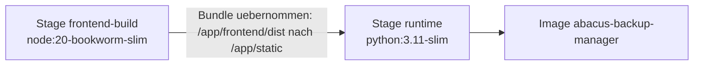
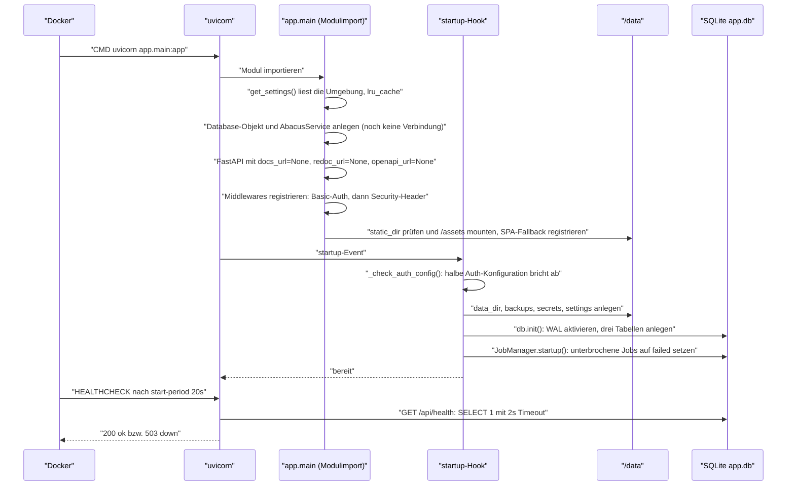
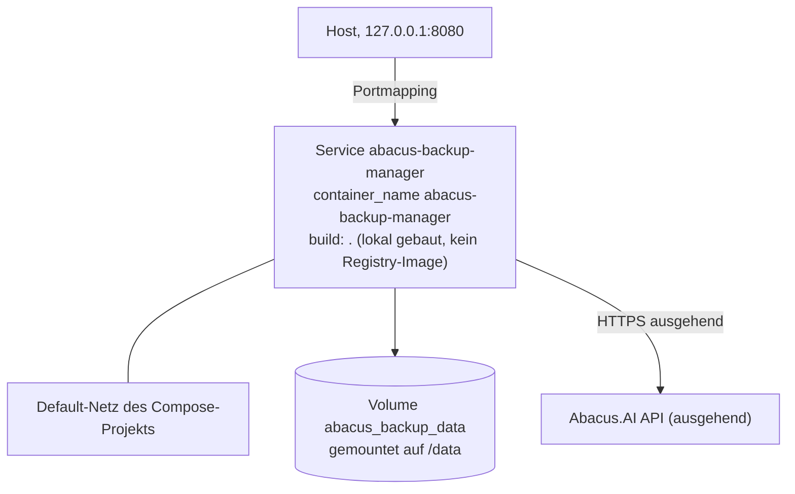

# 04 — Container · app-abacus-chat-backup

Image-Aufbau, Laufzeitparameter, Ports, Volumes, Start- und Stoppverhalten sowie die Compose-Topologie.

[← Zurück zum Index](README.md)

> **Quelle aller Angaben in diesem Dokument: `Dockerfile` und `compose.yaml`, nicht ein gebautes Image.** Auf dem Host existiert kein Abbild dieses Projekts (`docker images` liefert keinen Treffer), und ein Build würde `npm ci` und `pip install` und damit Netzwerkzugriff erfordern, was für diese Dokumentation ausgeschlossen ist. Überall dort, wo die Spezifikation Angaben aus dem Image verlangt (Digest, Systempakete, UID/GID, Layer-Größen), steht ein Marker.

> **Stand-Hinweis (aktualisiert 2026-09-29):** Die Härtungen `USER app`, die Loopback-Bindung des Ports und `no-new-privileges` sind inzwischen **committet**; der Arbeitsbaum war zum QA-Audit am 2026-09-29 sauber.

## Basis-Images

| Stage | Image | Zweck | Beleg |
|---|---|---|---|
| `frontend-build` | `node:20-bookworm-slim` | Baut das React-Bundle | `Dockerfile:1` |
| Runtime (unbenannt) | `python:3.11-slim` | Führt die Anwendung aus; erhält das fertige Bundle per `COPY --from` | `Dockerfile:9,20` |

**Betriebssystem:** Beide Images sind Debian-basiert. `node:20-bookworm-slim` nennt Debian 12 („Bookworm") im Tag. `python:3.11-slim` trägt keine Distributionsangabe im Tag — der `slim`-Tag der offiziellen Python-Images folgt dem jeweils aktuellen Debian-Stable, ist aber ohne Image-Inspektion nicht belegbar.

> ⚠️ NICHT ERMITTELBAR — Quelle fehlt: SHA-256-Digests beider Basis-Images sowie die exakte Debian-Version des Runtime-Images. Beide Tags sind beweglich; ohne `docker image inspect` auf einem gebauten Abbild ist der tatsächlich verwendete Stand nicht bestimmbar. **Handlungsoption:** Beide `FROM`-Zeilen auf `@sha256:…` pinnen — dann ist der Stand reproduzierbar und dokumentierbar.

## Multi-Stage-Aufbau

| Stage | Schritte | Beleg |
|---|---|---|
| **1 — `frontend-build`** | `WORKDIR /app/frontend`; nur `package*.json` kopieren; `npm ci --no-audit --no-fund`; dann den restlichen Frontend-Quellcode kopieren; `npm run build` (= `tsc -b && vite build`) | `Dockerfile:1-7`, `frontend/package.json:8` |
| **2 — Runtime** | `ENV` setzen; `WORKDIR /app`; nur `requirements.txt` kopieren; `pip install --no-cache-dir`; Anwendungscode nach `/app/app`; Bundle aus Stage 1 nach `/app/static`; `/data/backups` anlegen; unprivilegierten Benutzer anlegen und Besitz übertragen; `USER app`; `EXPOSE`, `HEALTHCHECK`, `CMD` | `Dockerfile:9-35` |

Die Reihenfolge ist in beiden Stages Cache-freundlich: Erst die Manifestdatei, dann die Installation, dann der Quellcode. Eine Codeänderung invalidiert damit nicht die Installationsschicht.

## Im Image installierte Systempakete

> ⚠️ NICHT ERMITTELBAR — Quelle fehlt: Liste der Systempakete mit Version und Lizenz. Das Dockerfile installiert **keine** zusätzlichen Systempakete — es gibt kein `apt-get install`. Die vorhandenen Pakete stammen ausschließlich aus dem Basis-Image `python:3.11-slim`; sie ließen sich nur per `dpkg -l` innerhalb eines gebauten Images ermitteln.

Belegbar ist die Konsequenz dieses Verzichts: Das Image bringt **weder `curl` noch `wget`** mit — deshalb ist der Healthcheck als Python-Einzeiler formuliert und im Dockerfile ausdrücklich so begründet (`Dockerfile:30-31`).

## Laufzeitparameter

| Parameter | Wert | Beleg |
|---|---|---|
| `WORKDIR` | `/app` | `Dockerfile:15` |
| Benutzer | `app`, angelegt per `adduser --system --group app`, danach `USER app` | `Dockerfile:25-27` |
| UID / GID | ⚠️ siehe Marker unten | — |
| `CMD` | `["uvicorn", "app.main:app", "--host", "0.0.0.0", "--port", "8080"]` (Exec-Form) | `Dockerfile:35` |
| `ENTRYPOINT` | nicht gesetzt — der `CMD` ist der Prozess | kein `ENTRYPOINT` im `Dockerfile` |
| `ENV` im Image | `PYTHONDONTWRITEBYTECODE=1`, `PYTHONUNBUFFERED=1`, `APP_STATIC_DIR=/app/static` | `Dockerfile:11-13` |
| Besitzverhältnisse | `chown -R app:app /data /app` vor dem Benutzerwechsel | `Dockerfile:26` |

> ⚠️ NICHT ERMITTELBAR — Quelle fehlt: UID und GID des Benutzers `app`. `adduser --system` vergibt die ID dynamisch aus dem Systembereich (unter Debian typischerweise 100–999); der konkrete Wert steht erst im gebauten Image in `/etc/passwd`. **Relevanz:** Für Bind-Mounts auf einem Host müsste die ID bekannt sein, um Schreibrechte zu setzen. Der Standardbetrieb nutzt ein benanntes Docker-Volume, bei dem Docker die Rechte übernimmt — dort ist die ID unkritisch. **Handlungsoption:** Feste IDs vergeben (`adduser --system --uid 10001 --group --gid 10001 app`).

`PYTHONUNBUFFERED=1` ist die Voraussetzung dafür, dass Ausgaben ungepuffert in `docker logs` erscheinen — ohne diese Variable würde die Startmeldung zur Basic-Auth erst verzögert sichtbar (`backend/app/main.py:126-132`).

## Ports

| Port | Protokoll | Zweck | Veröffentlichung | Beleg |
|---|---|---|---|---|
| 8080 | TCP/HTTP | Einziger Port: REST-API **und** React-Oberfläche aus demselben Origin | `"127.0.0.1:8080:8080"` — nur Loopback des Hosts | `Dockerfile:29,35`, `compose.yaml:9` |

Der Prozess selbst bindet auf `0.0.0.0` (`Dockerfile:35`), ist also innerhalb des Container-Netzes von überall erreichbar. Die Begrenzung entsteht **ausschließlich** durch das Host-Portmapping. Die Compose-Datei erklärt das im Kommentar ausdrücklich: Eine Änderung auf `"8080:8080"` ist nur zusammen mit gesetzter Basic-Auth oder hinter einem Reverse-Proxy vorgesehen (`compose.yaml:6-9`).

## Volumes und Mounts

| Mount | Quelle | Ziel | Inhalt | Rechte | Persistenzbedarf |
|---|---|---|---|---|---|
| `abacus_backup_data` | benanntes Docker-Volume | `/data` | SQLite-Datenbank `app.db`, alle Sicherungen unter `backups/`, die API-Key-Datei unter `secrets/`, die Scope-Datei unter `settings/` | schreibend (zwingend) | **hoch** — hier liegen die einzigen Nutzdaten. Ein Verlust bedeutet Verlust aller Sicherungen **und** des gespeicherten API-Schlüssels |

Belege: `compose.yaml:22-23,44-45`; Unterverzeichnisse aus `backend/app/config.py:59-67`; Anlage beim Start in `backend/app/main.py:139-142`.

Es gibt **keinen** weiteren Mount — insbesondere keinen Bind-Mount von Quellcode und keinen Docker-Socket.

## Healthcheck

| Ebene | Definition | Beleg |
|---|---|---|
| Image | `HEALTHCHECK --interval=30s --timeout=3s --start-period=20s --retries=3` mit `python -c "import urllib.request; urllib.request.urlopen('http://127.0.0.1:8080/api/health', timeout=2)"` | `Dockerfile:32-33` |
| Compose | identische Parameter, Test in Exec-Form | `compose.yaml:24-29` |

Die Sonde funktioniert, weil `/api/health` als einziger Pfad von der Basic-Auth ausgenommen ist (`backend/app/main.py:68`). Ein Nicht-2xx-Status — insbesondere die 503, die der Endpunkt bei fehlgeschlagenem SQLite-Ping liefert (`backend/app/main.py:183-187`) — lässt `urlopen` eine Ausnahme werfen und markiert den Container als `unhealthy`. Der Healthcheck ist damit **kein** reiner Prozess-Lebendtest, sondern prüft tatsächlich die Datenbank.

## Ressourcenbedarf

> **Geschätzt, nicht gemessen.** Es liegt kein laufender Container vor; es wurden keine `docker stats` erhoben.

| Ressource | Schätzung | Begründung aus dem Code |
|---|---|---|
| RAM Leerlauf | 120–250 MB | Ein Uvicorn-Prozess mit FastAPI und Pydantic; `abacusai` zieht erfahrungsgemäß einen umfangreichen Unterbau nach, dessen Import allein den Grundbedarf bestimmt |
| RAM unter Last | deutlich höher, nach oben offen | Ein Backup-Lauf hält den vollständigen Detaildatensatz **einer** Konversation im Speicher (`backend/app/backup_engine.py:94`), zusätzlich sammelt er bei aktivem Open-WebUI-Format **alle** konvertierten Chats des Laufs in einer Liste bis zum Jobende (`backend/app/backup_engine.py:70,132,208-211`). Bei vielen großen Konversationen wächst dieser Puffer linear mit |
| CPU Leerlauf | nahe null | Kein Hintergrundjob, kein Poller, kein Scheduler im Backend |
| CPU unter Last | 1 Kern, überwiegend wartend | Der Lauf ist streng sequenziell und größtenteils I/O-gebunden; rechenintensiv sind nur die Markdown-/HTML-Erzeugung und die ZIP-Kompression (`backend/app/exporters.py:720-728`) |
| Plattenbedarf | linear zur Menge der Chats, **ohne Obergrenze** | Jeder Lauf legt ein neues Verzeichnis an; bei `zip: true` liegt das Material zusätzlich als ZIP **im selben Verzeichnis** (`backend/app/exporters.py:722`) — also doppelt. Es gibt keine Rotation und kein Aufräumen |

Es sind **keine** Ressourcengrenzen definiert: `compose.yaml` enthält weder `mem_limit` noch `cpus` noch einen `deploy.resources`-Block.

## Image-Größe und Layer

> ⚠️ NICHT ERMITTELBAR — Quelle fehlt: Gesamtgröße des Images und Größe je Layer. Erfordert `docker history` bzw. `docker image inspect` auf einem gebauten Abbild; es liegt keines vor.

Belegbar ist, **welche** Schichten die Größe bestimmen — die drei größten sind nach Dockerfile-Struktur eindeutig:

1. Das Basis-Image `python:3.11-slim` selbst (`Dockerfile:9`).
2. `RUN pip install --no-cache-dir -r requirements.txt` (`Dockerfile:17`) — vier Pakete samt transitivem Baum, darunter `abacusai`; mit Abstand die größte selbst erzeugte Schicht.
3. `COPY --from=frontend-build /app/frontend/dist /app/static` (`Dockerfile:20`) — ein lokaler Vergleichsbuild vom 2026-05-16 maß 199 624 Byte JavaScript und 17 204 Byte CSS, also rund 220 KB (`frontend/dist/` ist seitdem nicht mehr versioniert). Verglichen mit Schicht 2 vernachlässigbar, aber die drittgrößte selbst erzeugte.

Der Anwendungscode (`Dockerfile:19`) umfasst rund 3 000 Zeilen Python und liegt im niedrigen dreistelligen Kilobyte-Bereich. `--no-cache-dir` beim `pip install` und die `.dockerignore` (schließt `.git`, `.env`, `node_modules`, `dist`, `__pycache__`, `data`, `backups` aus — `.dockerignore:1-12`) verhindern die üblichen Größentreiber.

## Startup-Sequenz

Belege: `backend/app/main.py:50-52,59,87,105,115-148,431-448`; `backend/app/database.py:17-58`; `backend/app/jobs.py:23-24`; `Dockerfile:32-33`.

Wichtige Eigenschaften dieser Sequenz:

- **Keine Datenbankmigration**, nur `CREATE TABLE IF NOT EXISTS`. Eine ältere Datenbank wird nicht angepasst (`backend/app/database.py:20-58`).
- **Keine Verbindung zu Abacus.AI beim Start.** Der `AbacusService` wird leer erzeugt; verbunden wird erst beim ersten Aufruf, der es erfordert (`backend/app/main.py:348-373`).
- **Fail-fast nur bei halb konfigurierter Auth.** Ist genau eine der beiden Basic-Auth-Variablen gesetzt, wirft der Startup-Hook einen `RuntimeError` und der Container startet nicht. Sind **beide** leer, startet er mit einer Warnzeile und offener API (`backend/app/main.py:115-132`).
- **Kein Warm-up, kein Vorladen.** Die Chatliste wird erst auf Anforderung geholt.

## Shutdown-Verhalten

| Aspekt | Verhalten | Beleg |
|---|---|---|
| Signalempfänger | `uvicorn` läuft als PID 1 (Exec-Form des `CMD`) und empfängt SIGTERM direkt — kein Shell-Wrapper, der das Signal schlucken würde | `Dockerfile:35` |
| Anwendungseigener Shutdown-Hook | **Keiner.** Es gibt kein `@app.on_event("shutdown")` und keinen `lifespan`-Kontextmanager | `backend/app/main.py` enthält nur `@app.on_event("startup")` (Zeile 135) |
| Laufende Backup-Jobs | Werden **nicht** sauber beendet. Der Lauf steckt in `asyncio.to_thread` und damit in einem Nicht-Daemon-Thread; das Abbruchflag wird beim Herunterfahren nicht gesetzt | `backend/app/jobs.py:35-43`, `backend/app/backup_engine.py:85-86` |
| Zustand nach hartem Stopp | Der Job bleibt in der Datenbank auf `queued`/`running` stehen und wird **beim nächsten Start** auf `failed` gesetzt, mit dem Vermerk „Job was interrupted by a container restart or process exit." | `backend/app/database.py:70-87` |
| Dateireste | Das bereits angelegte Backup-Verzeichnis bleibt liegen — ohne Datenbankeintrag. Es erscheint in keiner Liste und lässt sich über die API nicht löschen | `backend/app/backup_engine.py:63-76` gegenüber `220-226` |
| Datenbankintegrität | SQLite läuft im WAL-Modus; ein harter Abbruch verliert höchstens die letzte nicht abgeschlossene Transaktion | `backend/app/database.py:22` |

## Compose-Topologie

| Eigenschaft | Wert | Beleg |
|---|---|---|
| Anzahl Dienste | **einer** — es gibt keine Datenbank, keinen Cache, keinen Proxy als eigenen Container | `compose.yaml:1-42` |
| Startreihenfolge | Nicht zutreffend — es gibt keine `depends_on`-Beziehung, weil nur ein Dienst existiert | `compose.yaml` enthält keinen `depends_on`-Block |
| Netzwerke | Kein `networks`-Block; Compose legt das implizite Default-Netz des Projekts an | `compose.yaml` |
| Image-Herkunft | `build: .` — es wird lokal gebaut, kein Tag aus einer Registry gezogen | `compose.yaml:3` |
| Restart-Policy | **Nicht gesetzt.** Der Container startet nach einem Host-Neustart nicht von selbst | kein `restart:`-Eintrag in `compose.yaml` |
| Härtung | `security_opt: no-new-privileges:true` | `compose.yaml:10-11` |
| Ressourcengrenzen | keine | kein `deploy`/`mem_limit` in `compose.yaml` |

### HomeLAB_UX-Integration

Der Dienst trägt zwölf `homelab.*`-Labels und ist damit auf die Auto-Discovery des Dashboards `app-homelabux` ausgelegt (`compose.yaml:30-42`): `homelab.enable=true`, `homelab.port=8080`, `homelab.health=/api/health`, `homelab.group=Tools`, dazu Name, Slug, Beschreibung, Icon, Tags, Reihenfolge und Sichtbarkeit. `homelab.version` wird aus der Compose-Variablen `${APP_VERSION:-dev}` interpoliert — diese Variable wird von der Anwendung selbst **nicht** gelesen; sie existiert ausschließlich für dieses Label.

Damit die Health-Abfrage des Dashboards funktioniert, muss `/api/health` ohne Anmeldung erreichbar bleiben — genau dafür existiert die Ausnahmeliste in `backend/app/main.py:66-68`, die im Code auch so begründet ist.

## Marker in diesem Dokument

- ⚠️ NICHT ERMITTELBAR — Digests beider Basis-Images und exakte Debian-Version des Runtime-Images
- ⚠️ NICHT ERMITTELBAR — Systempakete im Image mit Version und Lizenz
- ⚠️ NICHT ERMITTELBAR — UID und GID des Benutzers `app`
- ⚠️ NICHT ERMITTELBAR — Image-Gesamtgröße und Größe je Layer
