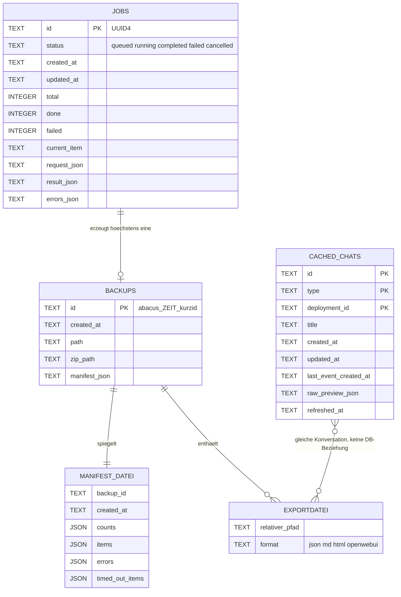

# 06 — Datenmodell · app-abacus-chat-backup

SQLite-Schema, Dateiablage, Zwischenspeicher, Migrationsmechanismus und Löschkonzept — mit besonderem Blick auf personenbezogene Daten.

[← Zurück zum Index](README.md)

## Überblick der Speicherorte

Alles liegt unterhalb von `APP_DATA_DIR` (Default `/data`), im Containerbetrieb im benannten Volume `abacus_backup_data`.

| Pfad | Inhalt | Erzeugt in |
|---|---|---|
| `/data/app.db` | SQLite-Datenbank mit drei Tabellen | `backend/app/config.py:63`, `backend/app/database.py:17-58` |
| `/data/backups/<backup_id>/` | Eine Sicherung: Exportdateien, Manifest, Fehlerprotokoll, Übersichtsseite, optional ZIP | `backend/app/backup_engine.py:64-66` |
| `/data/secrets/abacus_api_key.local` | Der lokal gespeicherte Abacus-API-Schlüssel, Klartext, `chmod 0600` | `backend/app/config.py:66`, `backend/app/security.py:35-43` |
| `/data/settings/conversation_scopes.json` | Manuell gepflegte Suchbereiche | `backend/app/config.py:67`, `backend/app/local_settings.py:20-25` |

Alle vier Verzeichnisse werden beim Start angelegt (`backend/app/main.py:139-142`).

## ER-Diagramm



**Wichtig:** Es gibt in der Datenbank **keine einzige Fremdschlüsselbeziehung**. Die Verbindung zwischen `jobs` und `backups` besteht nur indirekt darüber, dass die Backup-ID die ersten acht Zeichen der Job-UUID enthält (`backend/app/backup_engine.py:63`, `backend/app/utils.py:21-23`). Ein `PRAGMA foreign_keys` wird nirgends gesetzt.

## Tabelle `jobs`

Zweck: Fortschritt und Ergebnis eines Backup-Laufs, überlebt einen Neustart.

| Feld | Typ | Constraints | Index | Fachliche Bedeutung |
|---|---|---|---|---|
| `id` | TEXT | PRIMARY KEY | implizit | UUID4, in `jobs.py:27` erzeugt und dem Client zurückgegeben |
| `status` | TEXT | NOT NULL | — | `queued` → `running` → `completed` \| `failed` \| `cancelled` |
| `created_at` | TEXT | NOT NULL | — | UTC-ISO-8601 ohne Mikrosekunden (`utils.py:11-12`) |
| `updated_at` | TEXT | NOT NULL | — | Bei **jedem** `update_job` neu gesetzt (`database.py:102`) |
| `total` | INTEGER | NOT NULL DEFAULT 0 | — | Anzahl aufgelöster Items zu Beginn des Laufs |
| `done` | INTEGER | NOT NULL DEFAULT 0 | — | Verarbeitete Items; Grundlage der Prozentanzeige |
| `failed` | INTEGER | NOT NULL DEFAULT 0 | — | Items ohne geschriebene Datei **oder** mit fehlgeschlagenem/abgelaufenem Detail-Abruf — seit 2026-09-29 zählt auch ein Item, für das nur eine Stub-JSON aus der Vorschau entstand, als Fehler (`backup_engine.py:93-97,177-178`) |
| `current_item` | TEXT | — | — | `"<type>:<id>"` während der Verarbeitung, sonst `NULL` |
| `request_json` | TEXT | NOT NULL | — | Der vollständige `ExportRequest` als JSON |
| `result_json` | TEXT | — | — | Bei Erfolg: `backup_id`, `backup_path`, `zip_path`, `download_url`, `timed_out_items` |
| `errors_json` | TEXT | NOT NULL DEFAULT '[]' | — | Fortlaufende Liste aller Fehlertexte des Laufs |

Beleg: `backend/app/database.py:23-35`. Die `percent`-Angabe der API ist berechnet, nicht gespeichert (`database.py:131`).

## Tabelle `backups`

Zweck: Verzeichnis aller Sicherungen mit eingebettetem Manifest.

| Feld | Typ | Constraints | Index | Fachliche Bedeutung |
|---|---|---|---|---|
| `id` | TEXT | PRIMARY KEY | implizit | `abacus_<YYYY-MM-DD>_<HH-MM-SS>_<8 Zeichen Job-ID>` |
| `created_at` | TEXT | NOT NULL | — | Zeitpunkt des Jobstarts, nicht des Abschlusses |
| `path` | TEXT | NOT NULL | — | Absoluter Pfad des Backup-Verzeichnisses |
| `zip_path` | TEXT | — | — | `NULL`, wenn der Job ohne `zip` lief; wird beim ersten Download nachgetragen (`main.py:327-328`) |
| `manifest_json` | TEXT | NOT NULL | — | Vollständiges Manifest als JSON — eine **Kopie** der Datei auf der Platte |

Beleg: `backend/app/database.py:37-43`. Die Sortierung `ORDER BY created_at DESC` läuft ohne Index über die vollständige Tabelle (`database.py:165`) — bei der zu erwartenden Zeilenzahl unkritisch.

`size_bytes` in der API-Antwort ist **nicht** gespeichert, sondern wird bei jedem Aufruf von `GET /api/backups` durch rekursives Aufsummieren des Verzeichnisses berechnet (`backend/app/utils.py:93-104`, aufgerufen in `database.py:179`). Bei vielen großen Sicherungen wird dieser Endpunkt entsprechend langsam.

## Tabelle `cached_chats`

Zweck: Zwischenspeicher der Konversationsliste, damit die Oberfläche nicht bei jedem Öffnen die Abacus-API befragen muss.

| Feld | Typ | Constraints | Index | Fachliche Bedeutung |
|---|---|---|---|---|
| `id` | TEXT | NOT NULL, Teil des PK | PK-Index | Konversations-ID aus der API |
| `type` | TEXT | NOT NULL, Teil des PK | PK-Index | `ai_chat` oder `deployment_conversation` |
| `deployment_id` | TEXT | NOT NULL DEFAULT '', Teil des PK | PK-Index | Leerstring statt `NULL`, damit der zusammengesetzte Primärschlüssel greift |
| `title` | TEXT | — | — | Anzeigename; kann **personenbezogene Inhalte** enthalten, weil Chattitel oft aus der ersten Nutzerfrage entstehen |
| `created_at` | TEXT | — | — | Rohwert aus der API, nicht normalisiert |
| `updated_at` | TEXT | — | — | Rohwert aus der API |
| `last_event_created_at` | TEXT | — | — | Zeitpunkt der letzten Nachricht |
| `raw_preview_json` | TEXT | — | — | Flache Vorschau der Rohdaten: bis zu 24 Schlüssel, Strings auf 300 Zeichen gekürzt (`utils.py:69-90`). **Kann Gesprächsinhalte enthalten** |
| `refreshed_at` | TEXT | NOT NULL | — | Zeitpunkt der letzten vollständigen Ersetzung — wird **nirgends ausgewertet** |

Beleg: `backend/app/database.py:45-56`.

**Der zusammengesetzte Primärschlüssel `(id, type, deployment_id)` entspricht exakt dem kanonischen Auswahlschlüssel des Frontends** (`frontend/src/components/ChatTable.tsx:21-23`) — dieselbe Konversations-ID unter zwei Deployments ist bewusst zwei Zeilen.

**Es gibt keine TTL.** `replace_cached_chats` löscht die Tabelle vollständig und schreibt sie neu — der einzige Auslöser ist `GET /api/chats?refresh=true` (`database.py:205-227`, `main.py:259,273`). Ohne `refresh` liefert die API den Cache unabhängig von seinem Alter und markiert das nur über die Warnung „Loaded from local cache." (`main.py:263`).

## Dateiablage je Sicherung

```text
/data/backups/abacus_2026-07-30_09-14-22_1a2b3c4d/
├── ai_chat_sessions/
│   ├── <Titel>_<kurzid>.json                 # Rohdaten, vollstaendig
│   ├── <Titel>_<kurzid>.md                   # Markdown-Transkript
│   ├── <Titel>_<kurzid>_Konversation.html    # lesbares Gespraechsprotokoll, A4-druckfaehig
│   ├── <Titel>_<kurzid>_html.html            # SDK-eigener HTML-Export (nur wenn nicht HTML-only)
│   ├── <Titel>_<kurzid>_html.meta.json       # Sidecar, wenn das SDK ein Objekt statt HTML liefert
│   └── <Titel>_<kurzid>_openwebui.json       # nur bei Format "openwebui"
├── deployment_conversations/                 # gleiche Dateistruktur
├── manifest.json                             # vollstaendige Metadaten des Laufs
├── errors.log                                # alle Fehlertexte, zeilenweise
├── index.html                                # navigierbare Uebersicht mit relativen Links
├── openwebui_import.json                     # Sammeldatei fuer Bulk-Import (nur bei "openwebui")
└── backup.zip                                # Archiv des gesamten Ordners, im Ordner selbst
```

Belege: `backend/app/backup_engine.py:64-66,90,112,119,133-137,147-156,163,209-218`; Dateinamensbildung `backend/app/backup_engine.py:288-291` mit `safe_filename` (ASCII-Normalisierung, Reduktion auf `[A-Za-z0-9_.-]`, maximal 90 Zeichen) und `short_id` (erste acht Zeichen ohne Bindestriche).

Das ZIP wird **innerhalb** des Verzeichnisses erzeugt, das es archiviert (`backend/app/exporters.py:722`); die Schleife überspringt die Zieldatei selbst (Zeile 725). Praktische Folge: Der Platzbedarf einer Sicherung ist rund das Doppelte der reinen Exportdaten.

### Struktur von `manifest.json`

| Feld | Bedeutung |
|---|---|
| `backup_id`, `created_at`, `app`, `app_version` | Kopfdaten; `app_version` = `1.0.0` aus `models.py:9` |
| `request` | Der ursprüngliche `ExportRequest` |
| `counts` | `ai_chat`, `deployment_conversation`, `total`, `processed`, `failed`, optional `openwebui_chats` |
| `items[]` | Je Konversation: `id`, `type`, `deployment_id`, `title`, `files[]` (relative Pfade), `export_stats`, `errors[]` |
| `errors[]` | Alle Fehler des Laufs |
| `timed_out_items[]` | Items, die in einen 120-Sekunden-Timeout liefen, mit `step` (`detail` oder `html_export`) |
| `index_html` | Fest `"index.html"` |
| `openwebui_import` | Relativer Pfad der Sammeldatei, nur bei Open-WebUI-Export |

Beleg: `backend/app/backup_engine.py:177-211`.

`export_stats` je Item ist die eingebaute Vollständigkeitskontrolle: `extracted_messages`, `history_items`, `total_events`, `complete_by_total_events` und die Metadaten des Abrufs (`backend/app/exporters.py:120-138`, `backend/app/abacus_client.py:358-367`). Liegt `complete_by_total_events` auf `false`, schreibt die Engine zusätzlich einen Warntext in die Fehlerliste des Items (`backend/app/backup_engine.py:103-108`).

## Weitere persistente Dateien

| Datei | Format | Inhalt | Rechte | Beleg |
|---|---|---|---|---|
| `/data/secrets/abacus_api_key.local` | Klartext, eine Zeile | Der Abacus-API-Schlüssel | `chmod 0600`, Fehler beim Setzen werden stillschweigend ignoriert | `backend/app/security.py:35-43` |
| `/data/settings/conversation_scopes.json` | JSON | `deployment_ids`, `external_application_ids`, `conversation_types` | Standardrechte | `backend/app/local_settings.py:20-25` |

Beide Dateien werden bei jedem Schreibvorgang vollständig ersetzt; es gibt kein Merge und keine Historie.

## Migrationsmechanismus

**Keiner.** `Database.init()` führt ein einziges `executescript` mit `PRAGMA journal_mode=WAL` und drei `CREATE TABLE IF NOT EXISTS` aus (`backend/app/database.py:17-58`). Es gibt:

- kein Alembic, kein Prisma, kein EF, keine SQL-Migrationsdateien;
- keine `PRAGMA user_version`-Auswertung;
- kein `ALTER TABLE` im gesamten Repository.

**Konsequenz:** Eine bestehende Datenbank erhält bei einem Update keine neu hinzugekommenen Spalten. Der Fehler zeigt sich nicht beim Start, sondern zur Laufzeit als SQL-Fehler beim ersten Zugriff auf die fehlende Spalte. Bei einem Werkzeug, dessen Datenbank rein sekundäre Metadaten hält, ist der Ausweg allerdings billig: Datenbank löschen, Sicherungen bleiben als Dateien erhalten — nur die Backup-Liste in der Oberfläche ist dann leer.

**Seed-Daten:** Keine. Es werden keine Zeilen beim Start eingefügt.

## Zwischenspeicher

| Schicht | Inhalt | Invalidierung | TTL |
|---|---|---|---|
| SQLite `cached_chats` | Vollständige Konversationsliste | **Nur manuell** über `refresh=true`; ersetzt die Tabelle vollständig | **keine** |
| `lru_cache` auf `get_settings()` | Das eingefrorene `Settings`-Objekt | nur durch Prozessneustart | Prozesslaufzeit (`backend/app/config.py:57`) |
| `AbacusService._discovered_conversation_scopes` | Automatisch entdeckte Suchbereiche, im Prozessspeicher | Bei jedem erfolgreichen `connect_with_fallback` auf `None` gesetzt; sonst nur mit `force=True` | Prozesslaufzeit (`backend/app/abacus_client.py:157,211,226-228`) |
| `_SECRET_VALUES` | Menge registrierter Geheimnisse für die Schwärzung | **nie** — Einträge werden nur hinzugefügt, auch beim Löschen der Key-Datei nicht entfernt | Prozesslaufzeit (`backend/app/security.py:11,54-58`) |
| Browser-Zustand | Chatliste, Auswahl, Job, Backups | React-State, kein `localStorage`, kein `sessionStorage` | Seitenaufbau (`frontend/src/App.tsx:40-50`) |

Kein Redis, kein Memcached, kein HTTP-Cache-Header außer `Cache-Control: no-store` auf `/api/health`.

## Personenbezogene Daten

Dies ist der sensibelste Punkt des Projekts: Das Werkzeug speichert vollständige Chatverläufe. Was ein Nutzer je in einen KI-Chat geschrieben hat — Namen, Adressen, Gesundheits- oder Vertragsangaben, Quellcode, Geschäftsgeheimnisse — landet unverändert auf der Platte.

| Datenart | Wo gespeichert | Format | Aufbewahrung | Löschweg |
|---|---|---|---|---|
| **Vollständiger Chatverlauf** (Nutzerfragen, Antworten, Zeitstempel, Modellnamen) | `/data/backups/<id>/*/*.json`, `*.md`, `*_Konversation.html`, `*_openwebui.json`, zusätzlich im ZIP | Klartext, unverschlüsselt | **unbegrenzt** — es gibt keine Retention, keine Rotation, keinen Aufräumjob | Nur manuell: `DELETE /api/backups/{id}?confirm=true` oder Löschen des Verzeichnisses |
| **Chattitel und Vorschau** | Tabelle `cached_chats` (`title`, `raw_preview_json`) und `manifest.json` | Klartext | Bis zum nächsten `refresh=true` bzw. unbegrenzt im Manifest | Tabelle wird beim Refresh geleert; Manifest nur mit der Sicherung |
| **Metadaten** (Konversations-IDs, Deployment-IDs, Zeitstempel) | `jobs`, `backups`, `cached_chats`, `manifest.json`, `errors.log`, `index.html` | Klartext | unbegrenzt | mit der jeweiligen Sicherung |
| **Fehlertexte** (können Titel und IDs enthalten) | `errors_json` in `jobs`, `errors.log`, `index.html` | Klartext, um registrierte Geheimnisse bereinigt | unbegrenzt | mit der jeweiligen Sicherung |
| **Abacus-API-Schlüssel** | `/data/secrets/abacus_api_key.local` | Klartext, `0600` | bis zum Löschen | `DELETE /api/api-key` (`backend/app/main.py:237-240`) |
| **Basic-Auth-Zugangsdaten** | ausschließlich Prozessumgebung | Klartext | Prozesslaufzeit | Neustart mit anderer Konfiguration |

### Bewertung des Löschkonzepts

| Anforderung | Stand |
|---|---|
| Löschung einer einzelnen Sicherung | **vorhanden** — Verzeichnis wird per `shutil.rmtree` entfernt, Datenbankeintrag gelöscht (`backend/app/main.py:336-345`) |
| Bestätigungspflicht | **vorhanden** — ohne `?confirm=true` antwortet die API mit 400 |
| Pfadprüfung vor dem Löschen | **vorhanden** — `_safe_backup_path` prüft per `relative_to`, dass der Pfad innerhalb von `/data/backups` liegt (`backend/app/main.py:414-421`) |
| Automatische Aufbewahrungsfrist | **fehlt vollständig.** Kein Höchstalter, keine Höchstzahl, kein Aufräumen beim Start |
| Löschung einzelner Konversationen aus einer Sicherung | **fehlt** — Granularität ist die gesamte Sicherung |
| Verschlüsselung at rest | **fehlt** — alle Dateien liegen im Klartext im Volume |
| Verwaiste Verzeichnisse | **werden nicht aufgeräumt.** Bricht ein Job ab, existiert das Verzeichnis bereits, der Datenbankeintrag aber noch nicht. Das Verzeichnis erscheint danach in keiner Liste und lässt sich über die API weder herunterladen noch löschen; nur `mark_interrupted_jobs` räumt die Datenbankseite auf (`backend/app/backup_engine.py:63-76` gegenüber `220-226`, `backend/app/database.py:70-87`) |
| Löschung des Chat-Caches | Indirekt über `GET /api/chats?refresh=true`; einen eigenen Endpunkt zum Leeren gibt es nicht |
| Löschung von Jobzeilen | **kein Weg.** Die Tabelle `jobs` wächst mit jedem Lauf; es gibt kein `DELETE FROM jobs` im gesamten Code |

Die rechtliche Einordnung dieser Daten — Verarbeitungszweck, Rechtsgrundlage-Kandidat, Auftragsverarbeiter — steht in [11-sicherheit-compliance.md](11-sicherheit-compliance.md#verarbeitung-personenbezogener-daten).

## Nebenläufigkeit und Konsistenz

| Aspekt | Umsetzung | Beleg |
|---|---|---|
| Verbindungsmodell | Jede Operation öffnet eine **eigene** SQLite-Verbindung mit `timeout=30` und `check_same_thread=False` | `backend/app/database.py:60-63` |
| Schreibserialisierung | Ein prozessweites `RLock` um alle schreibenden Methoden | `backend/app/database.py:15,90,112,154,198,202,207` |
| Journal-Modus | WAL — Leser blockieren Schreiber nicht | `backend/app/database.py:22` |
| Transaktionsgrenzen | Implizit je `with self._connect()`-Block; es gibt keine explizite Transaktion über mehrere Methoden hinweg | durchgängig in `database.py` |
| Zweite `Database`-Instanz | Die Backup-Engine erzeugt im Worker-Thread eine **eigene** Instanz auf dieselbe Datei — mit **eigenem** Lock. Zwischen API-Thread und Worker-Thread besteht daher keine gemeinsame Sperre; die Serialisierung übernimmt allein SQLite mit `timeout=30` | `backend/app/backup_engine.py:60-61` gegenüber `backend/app/main.py:51` |
| Schreiblast | `update_job` wird je Item mehrfach aufgerufen und öffnet jedes Mal eine neue Verbindung — bei tausenden Items ebenso viele Verbindungsaufbauten | `backend/app/backup_engine.py:87,189`, `backend/app/database.py:99-113` |

## Marker in diesem Dokument

Keine — alle Aussagen sind mit Fundstelle belegt.
