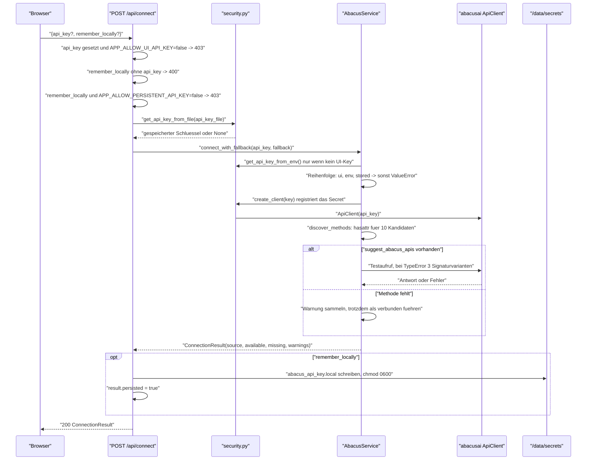
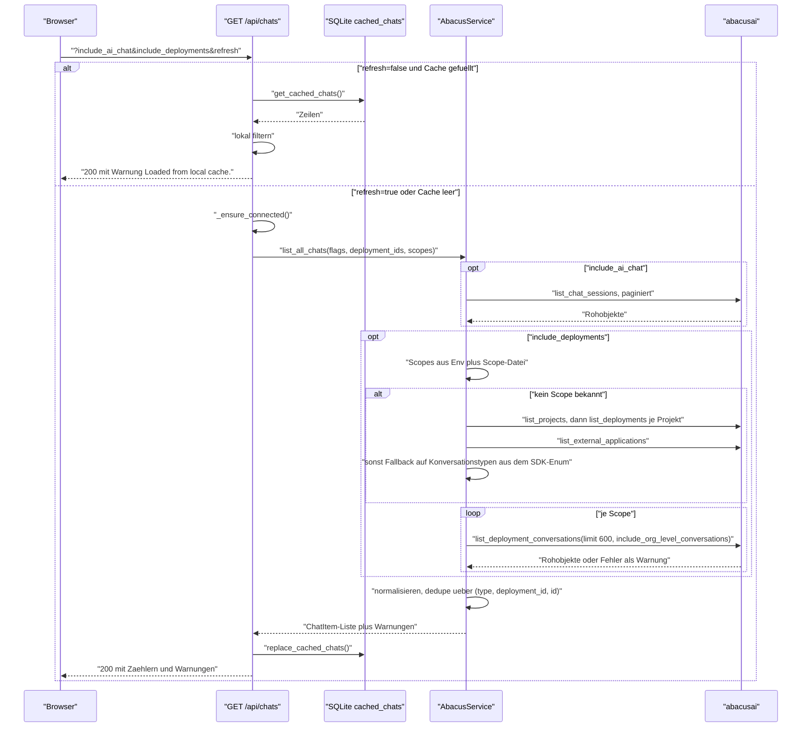
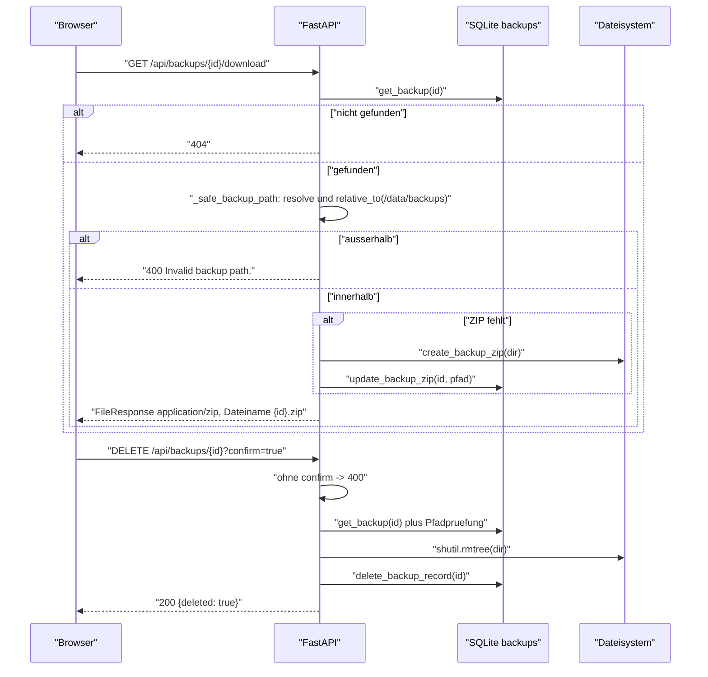
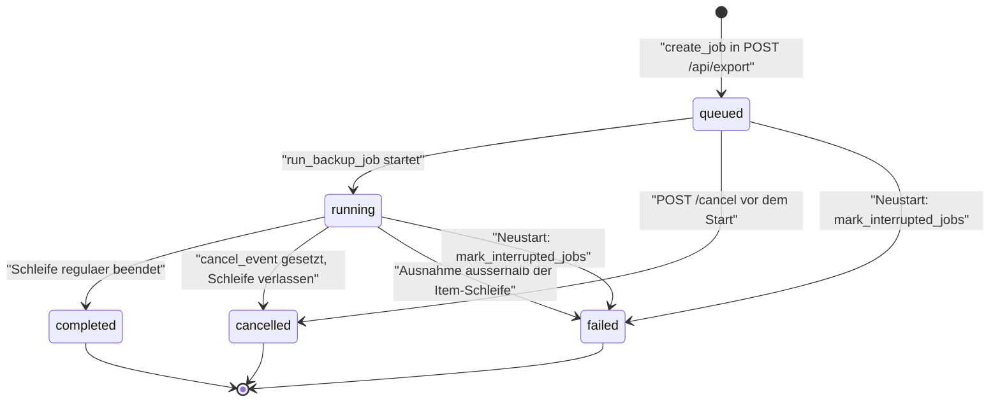

# 07 — Prozesse · app-abacus-chat-backup

Die fachlichen Hauptabläufe als Sequenzdiagramm mit Prosa, dazu Zustandsautomat, Nebenläufigkeit und Abbruchverhalten.

[← Zurück zum Index](README.md)

Die Anwendung kennt **keine** zeitgesteuerten Abläufe. Jeder der folgenden Prozesse wird durch eine Aktion in der Oberfläche ausgelöst.

## Prozess 1 — Verbinden und Auflösung des API-Schlüssels

**Auslöser:** Klick auf „Connect" im Panel **Settings**, oder implizit jeder Aufruf, der eine Verbindung benötigt.



**Schritte und Datenfluss.** Die Vorrangfolge der Schlüsselquellen ist eindeutig: ein in der Oberfläche eingegebener Schlüssel schlägt die Umgebungsvariable `ABACUS_API_KEY`, diese schlägt die gespeicherte Datei (`backend/app/abacus_client.py:176-178`). Der gewählte Schlüssel wird beim Erzeugen des SDK-Clients registriert und ist ab diesem Moment aus jeder Ausgabe geschwärzt (`backend/app/security.py:69-73`).

**Verbindungstest.** Als Lebendprobe dient `suggest_abacus_apis` mit einer festen Beispielabfrage. Der erste Versuch nutzt Positionsargumente; nur bei `TypeError` werden drei benannte Varianten durchprobiert (`backend/app/abacus_client.py:187-200`). Ein anderer Fehler führt zu `RuntimeError("Abacus connection test failed: …")` und damit zu HTTP 400.

**Fehlerverhalten.** Jede Ausnahme wird durch `safe_error` geschickt, das den registrierten Schlüssel aus dem Text entfernt, den Rest aber unverändert an den Client durchreicht (`backend/app/security.py:97-98`, `backend/app/main.py:210-211`). Es gibt **keinen** Retry.

**Endzustände:** verbunden (`_client` gesetzt, `source` ∈ {`ui`, `env`, `stored`}) · nicht verbunden mit HTTP 400 · abgelehnt mit 403 wegen deaktivierter Funktion.

**Stiller Verbindungsversuch.** `GET /api/status` ruft `_try_connect_silently` auf: Existiert weder Umgebungs- noch Dateischlüssel, passiert nichts; sonst wird verbunden und jeder Fehler kommentarlos verschluckt (`backend/app/main.py:361-373`). `_ensure_connected` verhält sich gleich, meldet aber Fehler als HTTP 400 (`backend/app/main.py:348-358`).

## Prozess 2 — Konversationen auflisten und Suchbereiche ermitteln

**Auslöser:** Klick auf „Laden" oder „Aktualisieren" in der Chat-Tabelle.



**Normalisierung.** Die Rohobjekte des SDK sind uneinheitlich benannt. Für ID, Titel, Zeitstempel und Nachrichtenzahl existiert je eine Liste von Kandidatenschlüsseln in `snake_case` und `camelCase`; der erste vorhandene gewinnt (`backend/app/abacus_client.py:26-55,504-536`). Findet sich **keine** ID, wird eine Ersatz-ID aus einem SHA-256-Digest der Vorschau gebildet und das Item als `exportable=false` markiert — es erscheint in der Liste, kann aber nicht exportiert werden (`backend/app/abacus_client.py:514-520`).

**Paginierung.** `iter_paginated_results` blättert maximal 50 Seiten weit und beendet die Schleife auf drei Wegen: über ein Fortsetzungstoken (mit Schutz gegen wiederkehrende Tokens), über ein `has_more`-Flag mit Offset-Erhöhung, oder — als Standardfall — nach der ersten Seite (`backend/app/abacus_client.py:113-147`). **Genau hier liegt das größte fachliche Risiko dieses Werkzeugs:** Liefert eine SDK-Methode eine nackte Liste ohne Token und ohne `has_more`, bricht die Schleife nach Seite 1 ab. `list_chat_sessions` wird ohne explizites `limit` aufgerufen (`backend/app/abacus_client.py:265-268`) — greift serverseitig ein Standardlimit, fehlen ältere Chats im Backup, ohne dass eine Warnung entsteht.

**Automatische Scope-Ermittlung.** Ohne vorgegebene Scopes läuft eine dreistufige Suche: erst Projekte (eine Seite, maximal 100) und dazu je Projekt die Deployments (bis fünf Seiten), dann externe Anwendungen (eine Seite), und falls beides leer bleibt, die Konversationstypen aus dem SDK-Enum als Fallback mit entsprechender Warnung (`backend/app/abacus_client.py:226-246,370-422`). Das Ergebnis wird im Prozessspeicher gehalten, bis eine neue Verbindung es zurücksetzt.

**Fehlerverhalten.** Fehler je Scope beenden den Ablauf nicht, sondern werden als Warnung gesammelt und mit der Antwort ausgeliefert (`backend/app/abacus_client.py:448-455`). Eine leere Liste mit Warnungen ist damit ein realistischer und für den Nutzer sichtbarer Ausgang.

**Endzustände:** Liste aus dem Cache · frisch geladene Liste plus ersetzter Cache · HTTP 400 bei fehlender Verbindung.

## Prozess 3 — Backup-Lauf

Der Kernprozess. **Auslöser:** Klick auf „Export starten".

```mermaid
sequenceDiagram
  participant U as "Browser"
  participant API as "POST /api/export"
  participant JM as "JobManager"
  participant EN as "run_backup_job (Worker-Thread)"
  participant SVC as "AbacusService"
  participant EX as "exporters.py"
  participant FS as "/data/backups"
  participant DB as "SQLite"

  U->>API: "ExportRequest"
  API->>API: "mode=selected ohne chat_ids -> 400; leere formats -> 400"
  API->>API: "_ensure_connected()"
  API->>JM: "start_export(request)"
  JM->>DB: "create_job(uuid, request) Status queued"
  JM->>JM: "cancel_event anlegen, asyncio.create_task"
  JM-->>API: "job_id"
  API-->>U: "200 {job_id}"

  JM->>EN: "asyncio.to_thread(run_backup_job)"
  EN->>FS: "Backup-Verzeichnis, zwei Unterordner, leere errors.log"
  EN->>DB: "Status running, current_item Loading chats"
  EN->>SVC: "_resolve_items: list_all_chats plus Auswahlfilter"
  EN->>DB: "total setzen"

  loop "je Konversation"
    EN->>EN: "cancel_event gesetzt? dann Schleife verlassen"
    EN->>DB: "current_item = type:id"
    EN->>SVC: "get_chat_detail, Timeout 120s"
    alt "Timeout"
      EN->>EN: "Fehlertext, Eintrag in timed_out_items, detail bleibt Vorschau"
    else "Fehler"
      EN->>EN: "Fehlertext, detail bleibt Vorschau"
    end
    EN->>EX: "conversation_export_stats(detail)"
    opt "complete_by_total_events = false"
      EN->>EN: "Warnung History may be incomplete"
    end
    opt "json"
      EN->>FS: "write_json, geschwaerzt"
    end
    opt "markdown"
      EN->>FS: "write_markdown aus bester Nachrichtenliste"
    end
    opt "openwebui"
      EN->>FS: "Einzeldatei schreiben, Chat fuer Sammeldatei merken"
    end
    opt "html"
      EN->>FS: "Konversation.html (lokal, ohne SDK)"
      opt "nicht HTML-only"
        EN->>SVC: "export_chat_html, Timeout 120s"
        EN->>FS: "SDK-Export bzw. meta.json"
      end
    end
    EN->>EN: "keine Datei oder Detail fehlgeschlagen? failed erhoehen"
    EN->>DB: "done, failed, errors_json aktualisieren"
  end

  EN->>FS: "manifest.json, errors.log, index.html"
  opt "zip=true"
    EN->>FS: "backup.zip im Backup-Ordner"
  end
  EN->>DB: "insert_backup, Job auf completed bzw. cancelled"
  U->>API: "GET /api/jobs/{id} im Sekundentakt bis Endzustand"
```

**Auflösung der Items.** Bei `mode=all` werden alle exportierbaren Konversationen genommen. Bei `mode=selected` wird ausschließlich über den kanonischen Schlüssel `type:deployment_id_or_empty:id` abgeglichen — eine nackte ID trifft bewusst nichts, weil dieselbe ID in mehreren Deployments vorkommen kann (`backend/app/backup_engine.py:252-267`). Die Suchbereiche stammen aus dem Request, sonst aus Umgebung und Scope-Datei (`backend/app/backup_engine.py:243-251`).

**HTML-Sonderregel.** Ist `html` das **einzige** angeforderte Format, entsteht nur das lokal erzeugte Gesprächsprotokoll `*_Konversation.html` und der SDK-Export unterbleibt. Der Grund steht als Kommentar im Code: Das Transkript wird zuerst geschrieben, damit ein hängender SDK-Export nicht verhindert, dass überhaupt eine lesbare HTML-Datei entsteht (`backend/app/backup_engine.py:142-172`).

**Nachrichtenerkennung.** Die Exporter kennen das Antwortformat nicht, sondern suchen es: `_find_message_lists` durchsucht die Struktur bis Tiefe 12 nach Listen unter zwölf bekannten Schlüsseln, bewertet jede Kandidatenliste nach Anteil an Rolle, Inhalt und Zeitstempel und nimmt die beste (`backend/app/exporters.py:731-767`). Findet sich der sichtbare Text nicht im Feld `text`, wird zusätzlich die verschachtelte `segments`-Struktur rekursiv abgeflacht (`backend/app/exporters.py:778-842`).

**Fehler- und Wiederholungsverhalten.** Es gibt **keinen** Retry. Jeder Fehler ist itembezogen: Fehlertext in die Item-Liste, Lauf geht weiter. Ein Timeout beendet nur den betroffenen Aufruf. Wiederholung ist eine **Nutzeraktion** — die Oberfläche bietet nach dem Lauf die Schaltfläche „Retry timed-out items", die einen neuen Job mit genau diesen Items startet (`frontend/src/App.tsx:161-177`).

**Fehlerzählung.** `failed` wird erhöht, wenn für ein Item keine Datei geschrieben wurde **oder** der Detailabruf scheiterte bzw. in den Timeout lief (`backend/app/backup_engine.py:93-97,177-178`, Flag `detail_ok`). Bis zum QA-Audit am 2026-09-29 zählte ein Item mit bloßer Stub-JSON aus der Vorschau als Erfolg; dieser blinde Fleck ist behoben.

**Abbruch mitten im Lauf.** Das Abbruchflag wird **zwischen** zwei Items geprüft (`backend/app/backup_engine.py:85-86`); das laufende Item wird zu Ende verarbeitet. Nach dem Verlassen der Schleife läuft der reguläre Abschluss vollständig durch: Manifest, Fehlerprotokoll, Übersichtsseite, ZIP und Datenbankeintrag entstehen auch bei `cancelled` (`backend/app/backup_engine.py:191-234`). **Ein abgebrochener Lauf hinterlässt also eine gültige, aber unvollständige Sicherung.**

**Prozessabbruch mitten im Lauf.** Stirbt der Container, bleibt das Verzeichnis ohne Datenbankeintrag zurück und ist über die API weder sichtbar noch löschbar; der Job wird beim nächsten Start auf `failed` gesetzt (`backend/app/database.py:70-87`). Details in [10-betrieb.md](10-betrieb.md#störungsbilder).

**Endzustände:** `completed` · `cancelled` · `failed` (Ausnahme außerhalb der Item-Schleife, `backend/app/backup_engine.py:235-237`).

## Prozess 4 — Sicherung herunterladen und löschen

**Auslöser:** Klick auf „Download" oder „Löschen" in der Backup-Historie.



**Nachträgliche ZIP-Erzeugung.** Lief der Job mit `zip: false`, entsteht das Archiv beim ersten Download — synchron, im Request. Bei einer großen Sicherung blockiert dieser Request entsprechend lange; es gibt weder Fortschrittsanzeige noch Timeout (`backend/app/main.py:325-328`).

**Pfadschutz.** Beide Endpunkte prüfen den in der Datenbank gespeicherten Pfad gegen das Backup-Wurzelverzeichnis, bevor sie ihn benutzen. Da die Backup-ID nur als Datenbankschlüssel und nie als Pfadbestandteil aus dem Request verwendet wird, ist Path Traversal über die URL nicht möglich (`backend/app/main.py:406-421`).

**Fehler- und Endzustände:** Datei geliefert · 404 unbekannte ID · 400 Pfadprüfung fehlgeschlagen · 400 fehlende Bestätigung. Ein Löschen entfernt Verzeichnis **und** Datenbankeintrag; ein Restore aus dem Papierkorb existiert nicht.

## Zustandsautomat eines Jobs



| Übergang | Auslöser | Beleg |
|---|---|---|
| → `queued` | `create_job` beim Anlegen | `backend/app/database.py:88-97` |
| `queued` → `running` | Erstes `update_job` in der Engine | `backend/app/backup_engine.py:77` |
| `running` → `completed` | Schleife regulär beendet | `backend/app/backup_engine.py:191,234` |
| `*` → `cancelled` | `POST /api/jobs/{id}/cancel` setzt Flag **und** schreibt den Status direkt, wenn der Job noch `queued` oder `running` ist | `backend/app/jobs.py:51-60` |
| `running` → `failed` | Ausnahme außerhalb der Item-Schleife oder Laufzeitfehler im Task | `backend/app/backup_engine.py:235-237`, `backend/app/jobs.py:38-40` |
| `queued`/`running` → `failed` | Prozessneustart | `backend/app/database.py:70-87` |
| Endzustände | Kein Übergang aus `completed`, `failed` oder `cancelled` heraus — es gibt kein Reaktivieren | kein entsprechender Code |

**Beobachtung zum Abbruch:** `cancel_job` setzt den Status sofort auf `cancelled`, während der Worker-Thread noch am aktuellen Item arbeitet und anschließend Manifest, ZIP und Datenbankeintrag schreibt. Die Oberfläche zeigt den Job also als abgebrochen, bevor er tatsächlich beendet ist. Da der Abschlussblock den Status ein zweites Mal setzt (`backend/app/backup_engine.py:191,234`), bleibt der Endwert konsistent `cancelled`.

## Hintergrundjobs und Zeitpläne

**Es gibt keine.** Kein Cron, kein `BackgroundTasks`, kein Scheduler, kein periodischer Task. Die einzige wiederkehrende Aktivität sind zwei externe Poller:

| Poller | Intervall | Ziel | Beleg |
|---|---|---|---|
| Browser-Jobpolling | 1 Sekunde, nur bei nicht-terminalem Job | `GET /api/jobs/{id}` | `frontend/src/App.tsx:84-96` |
| Container-Healthcheck | 30 Sekunden, Timeout 3 s, 3 Versuche, Start-Karenz 20 s | `GET /api/health` | `Dockerfile:32-33`, `compose.yaml:24-29` |

## Queues, Worker und Nebenläufigkeit

| Aspekt | Umsetzung | Konsequenz |
|---|---|---|
| Queue | **Keine.** `start_export` legt sofort einen `asyncio`-Task an (`backend/app/jobs.py:31-33`) | Mehrere gleichzeitig gestartete Exporte laufen **parallel** — es gibt keine Begrenzung auf einen Job |
| Worker | Ein Thread je Job über `asyncio.to_thread` (`backend/app/jobs.py:37`) | Der Standard-Threadpool von `asyncio` begrenzt die Zahl paralleler Läufe indirekt |
| Geteilter Zustand | Alle Läufe nutzen **denselben** `AbacusService` und damit denselben SDK-Client (`backend/app/main.py:52`, `backend/app/jobs.py:19`) | `last_warnings` und `_discovered_conversation_scopes` werden von parallelen Läufen gegenseitig überschrieben |
| Locking | Ein `RLock` je `Database`-Instanz — API und Worker halten **verschiedene** Instanzen (`backend/app/backup_engine.py:60`) | Die eigentliche Serialisierung übernimmt SQLite selbst mit `timeout=30` |
| Timeout je SDK-Aufruf | Eigener `ThreadPoolExecutor` mit 120 s (`backend/app/backup_engine.py:14-28`) | Hängende Aufrufe blockieren den Lauf nicht |
| Executor-Aufräumen | Seit 2026-09-29 im `finally`: `shutdown(wait=False, cancel_futures=True)` bei Erfolg, Timeout und SDK-Fehler (`backend/app/backup_engine.py:25-28`) | Kein Executor-Leck mehr; ein hängender Worker-Thread blockiert den Job nicht |
| Abbruchsignal | `threading.Event` je Job, zwischen den Items geprüft | Feinere Granularität als das Item gibt es nicht |

## Transaktions- und Konsistenzgrenzen

| Grenze | Verhalten |
|---|---|
| Datenbank ↔ Dateisystem | **Nicht transaktional.** Das Verzeichnis entsteht am Anfang, der Datenbankeintrag am Ende. Dazwischen ist der Zustand inkonsistent |
| Einzelne Datenbankoperation | Implizite Transaktion je `with`-Block; ein `update_job` ist atomar |
| Fortschritt | Nach jedem Item geschrieben — nach einem Absturz ist der zuletzt gemeldete Stand korrekt, aber der Job gilt trotzdem als `failed` |
| Cache-Ersetzung | `DELETE` und Neubefüllung laufen in **einem** `with`-Block unter dem Lock und sind damit atomar (`backend/app/database.py:205-227`) |
| Scope-Datei | Wird vollständig überschrieben; ein Absturz mitten im Schreiben kann eine unvollständige JSON-Datei hinterlassen. `safe_json_loads` fängt das beim Lesen ab und liefert Standardwerte (`backend/app/utils.py:37-43`) |

## Marker in diesem Dokument

Keine — alle Aussagen sind mit Fundstelle belegt.
