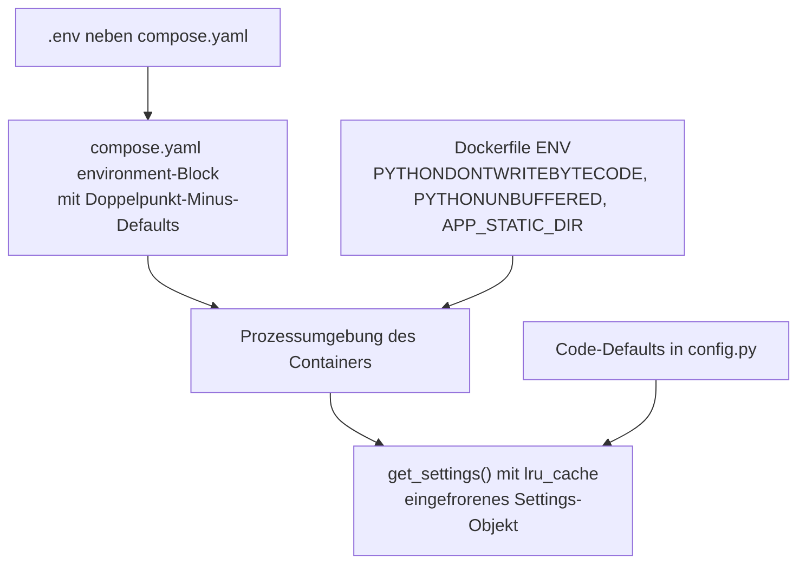

# 08 — Konfiguration · app-abacus-chat-backup

Vollständige Liste der Umgebungsvariablen, Konfigurationsquellen und deren Vorrang, Feature-Flags und Unterschiede zwischen den Umgebungen.

[← Zurück zum Index](README.md)

## Vollständige Env-Variablen-Tabelle

Ermittelt durch vollständigen Grep über `os.getenv`, `os.environ`, `import.meta.env` und `process.env` im gesamten Repository sowie über die `environment`- und `labels`-Blöcke der Compose-Datei und die `ENV`-Zeilen des Dockerfiles. Das Frontend liest **keine** Umgebungsvariable — der Grep über `frontend/src/` liefert keinen Treffer.

| Name | Pflicht | Default | Typ / Format | Wirkung | Secret | Fundstelle |
|---|---|---|---|---|---|---|
| `ABACUS_API_KEY` | nein¹ | leer | String | API-Schlüssel für Abacus.AI. Zweitrangig hinter einem in der Oberfläche eingegebenen Schlüssel, vorrangig vor der gespeicherten Datei | **ja** | `backend/app/security.py:15`, `compose.yaml:13` |
| `ABACUS_DEPLOYMENT_IDS` | nein | leer | Liste, getrennt durch Leerzeichen, Komma oder Semikolon | Schränkt die Suche auf bestimmte Deployments ein und unterdrückt damit die automatische Discovery | nein | `backend/app/config.py:71`, `backend/app/utils.py:46-50`, `compose.yaml:14` |
| `ABACUS_EXTERNAL_APPLICATION_IDS` | nein | leer | Liste wie oben | Schränkt auf bestimmte externe Anwendungen ein | nein | `backend/app/config.py:72`, `compose.yaml:15` |
| `ABACUS_CONVERSATION_TYPES` | nein | leer | Liste wie oben | Schränkt auf bestimmte Konversationstypen ein (z. B. `CHATLLM`) | nein | `backend/app/config.py:73`, `compose.yaml:16` |
| `APP_DATA_DIR` | nein | `/data` | Absoluter Pfad | **Wurzel aller Daten.** Davon abgeleitet: `app.db`, `backups/`, `secrets/abacus_api_key.local`, `settings/conversation_scopes.json` | nein | `backend/app/config.py:59-67`, `compose.yaml:17` |
| `APP_STATIC_DIR` | nein | `/app/static` | Absoluter Pfad | Verzeichnis des React-Bundles. Existiert es nicht, liefert die Anwendung **nur** die API aus — ohne Oberfläche und ohne SPA-Fallback | nein | `backend/app/config.py:68`, `backend/app/main.py:431`, `Dockerfile:13` |
| `APP_ALLOW_UI_API_KEY` | nein | `true` | Boolean² | `false` lehnt jeden in der Oberfläche eingegebenen Schlüssel mit HTTP 403 ab; nutzbar sind dann nur Umgebung und gespeicherte Datei | nein | `backend/app/config.py:69`, `backend/app/main.py:194-195`, `compose.yaml:18` |
| `APP_ALLOW_PERSISTENT_API_KEY` | nein | `true` | Boolean² | `false` verbietet das Ablegen des Schlüssels als Datei (HTTP 403) und blendet die Option in der Oberfläche aus | nein | `backend/app/config.py:70`, `backend/app/main.py:198-199`, `frontend/src/components/ApiKeyPanel.tsx:124`, `compose.yaml:19` |
| `APP_BASIC_AUTH_USER` | **bedingt**³ | leer | String | Benutzername der HTTP-Basic-Auth | **ja** | `backend/app/config.py:74`, `compose.yaml:20` |
| `APP_BASIC_AUTH_PASSWORD` | **bedingt**³ | leer | String | Passwort der HTTP-Basic-Auth | **ja** | `backend/app/config.py:75`, `compose.yaml:21` |
| `APP_COMMIT` | nein | nicht gesetzt | String | Wird unverändert als Feld `commit` in `GET /api/health` ausgegeben. Fehlt die Variable, entfällt das Feld — es wird **nie** erfunden | nein | `backend/app/main.py:65` |
| `GIT_COMMIT` | nein | nicht gesetzt | String | Ausweichname für `APP_COMMIT`; `APP_COMMIT` hat Vorrang | nein | `backend/app/main.py:65` |
| `APP_VERSION` | nein | `dev` | String | **Wird von der Anwendung nicht gelesen.** Dient ausschließlich der Interpolation des Docker-Labels `homelab.version` für das HomeLAB_UX-Dashboard | nein | `compose.yaml:39` |
| `PYTHONDONTWRITEBYTECODE` | nein | `1` (im Image) | Boolean | Verhindert `.pyc`-Dateien im Container | nein | `Dockerfile:11` |
| `PYTHONUNBUFFERED` | nein | `1` (im Image) | Boolean | Ungepufferte Ausgabe, damit Logzeilen sofort in `docker logs` erscheinen | nein | `Dockerfile:12` |

¹ Nicht Pflicht im Sinne des Starts — die Anwendung startet ohne Schlüssel. Ohne **irgendeine** Schlüsselquelle scheitert jedoch jeder Aufruf, der Daten von Abacus.AI benötigt, mit HTTP 400 („No Abacus.AI API key available.", `backend/app/abacus_client.py:179-180`).

² Als wahr gelten `1`, `true`, `yes`, `y`, `on` — case-insensitiv nach `strip()`. **Jeder andere Wert gilt als falsch**, auch ein Tippfehler wie `ture`. Es gibt keine Validierung und keine Warnung (`backend/app/config.py:50-54`).

³ Entweder **beide** oder **keine**. Ist genau eine der beiden gesetzt, bricht der Startup-Hook mit `RuntimeError` ab und der Container startet nicht (`backend/app/main.py:115-125`). Sind beide leer, ist die gesamte API ohne Anmeldung erreichbar — dann protokolliert die Anwendung beim Start eine Warnung (`backend/app/main.py:129-132`).

## Konfigurationsquellen und Vorrang

**Vorrangreihenfolge, von stark nach schwach:**

1. Explizit gesetzte Prozessumgebung (`docker run -e …`, Shell-Export bei lokalem Start).
2. `environment`-Block der Compose-Datei; die Form `${VAR:-default}` zieht dabei den Wert aus einer `.env` **neben** der Compose-Datei (`compose.yaml:12-21`).
3. `ENV`-Zeilen des Dockerfiles — sie greifen nur, wenn Compose die Variable nicht überschreibt (`Dockerfile:11-13`).
4. Code-Defaults in `backend/app/config.py:59-75`.

**Wichtige Eigenheit:** `get_settings()` trägt `@lru_cache(maxsize=1)` und liefert ein `@dataclass(frozen=True)` (`backend/app/config.py:11,57`). Die Konfiguration wird also **einmal** beim ersten Zugriff gelesen und ist danach unveränderlich. Es gibt kein Reload zur Laufzeit — jede Änderung erfordert einen Neustart des Prozesses.

**Die `.env`-Datei wird nicht von der Anwendung gelesen.** Es gibt kein `python-dotenv`-Aufruf im Code; das Paket kommt nur als Extra von `uvicorn[standard]` mit. Die `.env` wird ausschließlich von Docker Compose ausgewertet. Wer die Anwendung ohne Compose startet, muss die Variablen selbst in die Umgebung bringen.

## Konfiguration über Dateien

Zwei Einstellungen liegen nicht in der Umgebung, sondern als Dateien im Datenverzeichnis:

| Datei | Inhalt | Geschrieben durch | Beleg |
|---|---|---|---|
| `<APP_DATA_DIR>/secrets/abacus_api_key.local` | API-Schlüssel im Klartext, `chmod 0600` | `POST /api/connect` mit `remember_locally: true`; gelöscht durch `DELETE /api/api-key` | `backend/app/security.py:35-51` |
| `<APP_DATA_DIR>/settings/conversation_scopes.json` | `{"deployment_ids": [], "external_application_ids": [], "conversation_types": []}` | `PUT /api/conversation-scopes` | `backend/app/local_settings.py:12-25` |

### Zusammenführung der Suchbereiche

Umgebungsvorgaben und Dateiinhalt **konkurrieren nicht, sondern addieren sich**. `merge_scope_summaries` vereinigt beide Quellen und entfernt Duplikate unter Beibehaltung der Reihenfolge (`backend/app/local_settings.py:28-39`, aufgerufen in `backend/app/main.py:218,376-378`). Eine Einschränkung über die Oberfläche kann eine Umgebungsvorgabe daher **nicht aufheben**, nur erweitern.

Die automatische Discovery greift nur, wenn nach dieser Vereinigung **kein einziger** Scope vorliegt (`backend/app/main.py:219-224`, `backend/app/abacus_client.py:278-288`). Wer also eine einzige Deployment-ID setzt, schaltet die Discovery für alle anderen ab.

## Feature-Flags

| Flag | Wirkung bei `false` | Standard |
|---|---|---|
| `APP_ALLOW_UI_API_KEY` | Die Eingabe eines Schlüssels über die Oberfläche wird mit HTTP 403 abgelehnt. Sinnvoll, wenn der Schlüssel ausschließlich über die Umgebung kommen soll | `true` |
| `APP_ALLOW_PERSISTENT_API_KEY` | Der Schlüssel darf nicht als Datei abgelegt werden (HTTP 403); die Oberfläche blendet das Kontrollkästchen aus, weil `StatusResponse.allow_persistent_api_key` mitgeliefert wird | `true` |

Weitere Flags gibt es nicht. Insbesondere sind die abgeschaltete API-Dokumentation, die Security-Header und die Basic-Auth-Ausnahme für `/api/health` **fest verdrahtet** und nicht konfigurierbar (`backend/app/main.py:59,66-68,73-84`).

## Unterschiede zwischen den Umgebungen

Es gibt **keine** getrennten Compose-Dateien für Entwicklung und Produktion — `compose.yaml` ist die einzige. Die Unterschiede ergeben sich aus dem Startweg:

| Aspekt | Container (`compose.yaml`) | Lokale Entwicklung (`README.md:48-66`) |
|---|---|---|
| Datenverzeichnis | `/data` im Volume `abacus_backup_data` | `/data` **relativ zur Laufwerkswurzel**, weil der Default greift. Unter Windows entsteht dadurch `C:\data`. **`APP_DATA_DIR` sollte lokal gesetzt werden** |
| Statisches Bundle | `/app/static`, im Image erzeugt | `/app/static` existiert nicht → die Oberfläche wird **nicht** ausgeliefert; stattdessen läuft der Vite-Dev-Server auf Port 5173 und leitet `/api` per Proxy auf `127.0.0.1:8080` (`frontend/vite.config.ts:6-11`) |
| Port | `127.0.0.1:8080` | Backend 8000 bei `uvicorn app.main:app --reload` ohne Portangabe, Frontend 5173 — der Vite-Proxy zeigt allerdings fest auf **8080**, weshalb `--port 8080` beim lokalen Backend nötig ist |
| Basic-Auth | über `.env` steuerbar | nur über Shell-Variablen |
| Härtung | `no-new-privileges`, unprivilegierter Benutzer, Loopback-Bindung | keine |

## Erzeugte `.env.example`

Im Projektwurzelverzeichnis existierte bereits eine `.env.example` mit acht der 13 relevanten Variablen. Sie wurde **nicht verändert**; die fehlenden Einträge sind in einem klar abgegrenzten Abschnitt **am Dateiende** ergänzt worden (`.env.example`, Abschnitt „Ergänzt am 2026-07-30"):

| Ergänzt | Grund |
|---|---|
| `APP_DATA_DIR` | Für den Betrieb ohne Compose zwingend zu setzen, sonst landen Daten in `/data` bzw. `C:\data` |
| `APP_STATIC_DIR` | Steuert, ob die Oberfläche überhaupt ausgeliefert wird |
| `APP_COMMIT` | Optionale Build-Metadaten in `/api/health` |
| `GIT_COMMIT` | Ausweichname für `APP_COMMIT` |
| `APP_VERSION` | Compose-Label `homelab.version`; wird von der Anwendung nicht gelesen |

Die Datei enthält **keine** echten Werte — alle Secret-Felder sind leer.

## Marker in diesem Dokument

Keine — alle Variablen sind mit Fundstelle belegt.
