<!-- GENERIERT — nicht bearbeiten. Quelle: app-abacus-chat-backup/docs/ -->

# Dokumentation — app-abacus-chat-backup

| Feld | Wert |
|---|---|
| Projekt | `app-abacus-chat-backup` |
| Pfad | `app-abacus-chat-backup/` |
| Version | NICHT ERMITTELBAR (Quelle: `kein Manifest mit Versionsfeld gefunden`) |
| Git-Commit | `cf227a3` |
| Branch | `main` |
| Generiert am | 2026-09-29 |
| Teildokumente | 12 von 12 |


**Inhaltsverzeichnis**

- [01 — Überblick · app-abacus-chat-backup](#01--überblick--app-abacus-chat-backup)
  - [Worum es geht](#worum-es-geht)
  - [Wichtigste Funktionen](#wichtigste-funktionen)
  - [Typischer Anwendungsfall](#typischer-anwendungsfall)
  - [Was das Projekt bewusst nicht tut](#was-das-projekt-bewusst-nicht-tut)
  - [Reifegrad](#reifegrad)
  - [Marker in diesem Dokument](#marker-in-diesem-dokument)
- [02 — Architektur · app-abacus-chat-backup](#02--architektur--app-abacus-chat-backup)
  - [Systemkontext](#systemkontext)
  - [Komponenten](#komponenten)
  - [Verzeichnisstruktur](#verzeichnisstruktur)
  - [Nachträgliche Architekturentscheidungen (ADR)](#nachträgliche-architekturentscheidungen-adr)
  - [Marker in diesem Dokument](#marker-in-diesem-dokument-1)
- [03 — Stack und Abhängigkeiten · app-abacus-chat-backup](#03--stack-und-abhängigkeiten--app-abacus-chat-backup)
  - [Laufzeitumgebungen](#laufzeitumgebungen)
  - [Backend](#backend)
  - [Frontend](#frontend)
  - [Eigene Lizenz des Projekts](#eigene-lizenz-des-projekts)
  - [Veraltete und ungepflegte Pakete](#veraltete-und-ungepflegte-pakete)
  - [Schwachstellen-Scan](#schwachstellen-scan)
  - [Marker in diesem Dokument](#marker-in-diesem-dokument-2)
- [04 — Container · app-abacus-chat-backup](#04--container--app-abacus-chat-backup)
  - [Basis-Images](#basis-images)
  - [Multi-Stage-Aufbau](#multi-stage-aufbau)
  - [Im Image installierte Systempakete](#im-image-installierte-systempakete)
  - [Laufzeitparameter](#laufzeitparameter)
  - [Ports](#ports)
  - [Volumes und Mounts](#volumes-und-mounts)
  - [Healthcheck](#healthcheck)
  - [Ressourcenbedarf](#ressourcenbedarf)
  - [Image-Größe und Layer](#image-größe-und-layer)
  - [Startup-Sequenz](#startup-sequenz)
  - [Shutdown-Verhalten](#shutdown-verhalten)
  - [Compose-Topologie](#compose-topologie)
  - [Marker in diesem Dokument](#marker-in-diesem-dokument-3)
- [05 — API · app-abacus-chat-backup](#05--api--app-abacus-chat-backup)
  - [Bereitgestellte Endpunkte](#bereitgestellte-endpunkte)
  - [Authentifizierung](#authentifizierung)
  - [CORS](#cors)
  - [Versionierung und Pagination](#versionierung-und-pagination)
  - [Sicherheitsheader](#sicherheitsheader)
  - [Konsumierte externe API](#konsumierte-externe-api)
  - [Weitere Schnittstellen](#weitere-schnittstellen)
  - [Marker in diesem Dokument](#marker-in-diesem-dokument-4)
- [06 — Datenmodell · app-abacus-chat-backup](#06--datenmodell--app-abacus-chat-backup)
  - [Überblick der Speicherorte](#überblick-der-speicherorte)
  - [ER-Diagramm](#er-diagramm)
  - [Tabelle jobs](#tabelle-jobs)
  - [Tabelle backups](#tabelle-backups)
  - [Tabelle cached_chats](#tabelle-cached_chats)
  - [Dateiablage je Sicherung](#dateiablage-je-sicherung)
  - [Weitere persistente Dateien](#weitere-persistente-dateien)
  - [Migrationsmechanismus](#migrationsmechanismus)
  - [Zwischenspeicher](#zwischenspeicher)
  - [Personenbezogene Daten](#personenbezogene-daten)
  - [Nebenläufigkeit und Konsistenz](#nebenläufigkeit-und-konsistenz)
  - [Marker in diesem Dokument](#marker-in-diesem-dokument-5)
- [07 — Prozesse · app-abacus-chat-backup](#07--prozesse--app-abacus-chat-backup)
  - [Prozess 1 — Verbinden und Auflösung des API-Schlüssels](#prozess-1--verbinden-und-auflösung-des-api-schlüssels)
  - [Prozess 2 — Konversationen auflisten und Suchbereiche ermitteln](#prozess-2--konversationen-auflisten-und-suchbereiche-ermitteln)
  - [Prozess 3 — Backup-Lauf](#prozess-3--backup-lauf)
  - [Prozess 4 — Sicherung herunterladen und löschen](#prozess-4--sicherung-herunterladen-und-löschen)
  - [Zustandsautomat eines Jobs](#zustandsautomat-eines-jobs)
  - [Hintergrundjobs und Zeitpläne](#hintergrundjobs-und-zeitpläne)
  - [Queues, Worker und Nebenläufigkeit](#queues-worker-und-nebenläufigkeit)
  - [Transaktions- und Konsistenzgrenzen](#transaktions--und-konsistenzgrenzen)
  - [Marker in diesem Dokument](#marker-in-diesem-dokument-6)
- [08 — Konfiguration · app-abacus-chat-backup](#08--konfiguration--app-abacus-chat-backup)
  - [Vollständige Env-Variablen-Tabelle](#vollständige-env-variablen-tabelle)
  - [Konfigurationsquellen und Vorrang](#konfigurationsquellen-und-vorrang)
  - [Konfiguration über Dateien](#konfiguration-über-dateien)
  - [Feature-Flags](#feature-flags)
  - [Unterschiede zwischen den Umgebungen](#unterschiede-zwischen-den-umgebungen)
  - [Erzeugte .env.example](#erzeugte-envexample)
  - [Marker in diesem Dokument](#marker-in-diesem-dokument-7)
- [09 — Build und Deployment · app-abacus-chat-backup](#09--build-und-deployment--app-abacus-chat-backup)
  - [Lokales Setup — Weg 1: Docker Compose (empfohlen)](#lokales-setup--weg-1-docker-compose-empfohlen)
  - [Lokales Setup — Weg 2: ohne Docker](#lokales-setup--weg-2-ohne-docker)
  - [Buildprozess und Artefakte](#buildprozess-und-artefakte)
  - [CI/CD](#cicd)
  - [Zielumgebungen und Deployment-Verfahren](#zielumgebungen-und-deployment-verfahren)
  - [Rollback](#rollback)
  - [Versionierung und Release-Konvention](#versionierung-und-release-konvention)
  - [Build- und Testergebnis (QA-Audit 2026-09-29)](#build--und-testergebnis-qa-audit-2026-09-29)
  - [Marker in diesem Dokument](#marker-in-diesem-dokument-8)
- [10 — Betrieb · app-abacus-chat-backup](#10--betrieb--app-abacus-chat-backup)
  - [Logging](#logging)
  - [Health und Metriken](#health-und-metriken)
  - [Backup und Restore](#backup-und-restore)
  - [Störungsbilder](#störungsbilder)
  - [Wartungsaufgaben](#wartungsaufgaben)
  - [Skalierungsverhalten und bekannte Grenzen](#skalierungsverhalten-und-bekannte-grenzen)
  - [Marker in diesem Dokument](#marker-in-diesem-dokument-9)
- [11 — Sicherheit und Compliance · app-abacus-chat-backup](#11--sicherheit-und-compliance--app-abacus-chat-backup)
  - [Authentifizierung und Autorisierung](#authentifizierung-und-autorisierung)
  - [Umgang mit Secrets](#umgang-mit-secrets)
  - [Verarbeitung personenbezogener Daten](#verarbeitung-personenbezogener-daten)
  - [Auftragsverarbeiter](#auftragsverarbeiter)
  - [Transportverschlüsselung und Verschlüsselung at rest](#transportverschlüsselung-und-verschlüsselung-at-rest)
  - [Eingabevalidierung](#eingabevalidierung)
  - [Sicherheitsbefunde](#sicherheitsbefunde)
  - [Lizenz-Compliance-Fazit](#lizenz-compliance-fazit)
  - [Marker in diesem Dokument](#marker-in-diesem-dokument-10)
- [12 — Offene Punkte · app-abacus-chat-backup](#12--offene-punkte--app-abacus-chat-backup)
  - [Alle NICHT ERMITTELBAR-Marker](#alle-nicht-ermittelbar-marker)
  - [Getroffene Annahmen](#getroffene-annahmen)
  - [Technische Schulden](#technische-schulden)
  - [Empfohlene nächste Schritte](#empfohlene-nächste-schritte)
  - [Marker in diesem Dokument](#marker-in-diesem-dokument-11)

---
## 01 — Überblick · app-abacus-chat-backup

Allgemeinverständliche Einordnung: Zweck, Nutzen, typischer Anwendungsfall, Abgrenzung und Reifegrad.

[← Zurück zum Index](#dokumentation--app-abacus-chat-backup)

### Worum es geht

Wer Abacus.AI nutzt, führt dort Chats — mit dem allgemeinen KI-Chat und mit einzelnen eigenen Deployments. Diese Verläufe lassen sich in der Weboberfläche von Abacus.AI nicht selbst exportieren; der einzige Weg an die eigenen Daten führt über die API (`CHANGELOG.md`, Abschnitt „Documentation" zum 1.0.0-Release). Dieses Werkzeug schließt genau diese Lücke: Es meldet sich mit einem API-Schlüssel bei Abacus.AI an, listet alle erreichbaren Konversationen auf, lädt sie vollständig herunter und legt sie als Dateisammlung im eigenen Speicher ab — als Rohdaten, als lesbares Transkript und als Datei zum Weiterverwenden in anderen Chat-Werkzeugen.

Der fachliche Kernnutzen in fünf Sätzen:

1. Die eigenen KI-Chatverläufe werden aus einem fremden Dienst herausgelöst und lokal gesichert.
2. Ein Backup-Lauf ist wiederholbar und läuft im Hintergrund, statt Chat für Chat von Hand kopiert zu werden.
3. Jede Sicherung enthält neben den Daten ein Protokoll darüber, was geladen wurde und wo etwas fehlte (`backend/app/backup_engine.py:196-214`).
4. Die Sicherung ist in vier Formaten gleichzeitig verfügbar, darunter ein druckfertiges Gesprächsprotokoll und ein Importformat für Open WebUI (`backend/app/models.py:12`).
5. Alles bleibt beim Betreiber: Es gibt keinen Cloud-Zwischenspeicher, keine Nutzerkonten und keinen Dienst, an den Daten weitergereicht werden (`compose.yaml:22-23`, `backend/app/config.py:59-67`).

### Wichtigste Funktionen

- **Verbinden mit Abacus.AI** über einen API-Schlüssel — wahlweise aus der Umgebung, aus einer lokal gespeicherten Datei oder direkt in der Oberfläche eingegeben (`backend/app/abacus_client.py:170-218`).
- **Konversationen auflisten** in zwei Kategorien: allgemeine KI-Chats (`ai_chat`) und Deployment-Konversationen (`deployment_conversation`); die Liste wird lokal zwischengespeichert (`backend/app/main.py:253-276`).
- **Suchbereiche automatisch ermitteln:** Deployment-IDs und External-Application-IDs werden bei Bedarf selbst über die API entdeckt, wenn der Betreiber sie nicht vorgibt (`backend/app/abacus_client.py:226-246`).
- **Backup-Job starten** für alle oder nur ausgewählte Konversationen; der Job läuft serverseitig weiter, die Oberfläche fragt den Fortschritt im Sekundentakt ab (`frontend/src/App.tsx:81-101`).
- **Vier Exportformate:** vollständige Rohdaten als JSON, Markdown-Transkript, HTML-Gesprächsprotokoll im Messenger-Layout mit A4-Druckaufbereitung, sowie Open-WebUI-Importdateien (`backend/app/backup_engine.py:110-172`).
- **Backup-Übersicht als HTML:** Jede Sicherung bekommt eine `index.html` mit Tabelle aller Chats und relativen Links auf die exportierten Dateien (`backend/app/exporters.py:566-717`).
- **ZIP-Paket** je Sicherung, auf Wunsch direkt beim Job oder später beim ersten Download erzeugt (`backend/app/main.py:321-333`).
- **Verlauf verwalten:** frühere Sicherungen auflisten, Manifest ansehen, herunterladen, löschen (`backend/app/main.py:307-345`).
- **Schlüssel wieder entfernen:** Ein lokal gespeicherter API-Schlüssel lässt sich über die Oberfläche löschen (`backend/app/main.py:237-240`).
- **Selbstkontrolle auf Vollständigkeit:** Meldet die API eine Gesamtzahl an Ereignissen, vergleicht das Werkzeug sie mit der Zahl tatsächlich geladener Einträge und schreibt eine Warnung ins Protokoll, wenn etwas fehlt (`backend/app/backup_engine.py:103-108`, `backend/app/exporters.py:120-138`).

### Typischer Anwendungsfall

Ein Nutzer hat über Monate mit mehreren Abacus.AI-Deployments gearbeitet und möchte die Gespräche sichern, bevor er ein Deployment abschaltet. Er startet den Container, öffnet die Oberfläche unter `http://127.0.0.1:8080`, hinterlegt unter **Settings** seinen API-Schlüssel und lässt ihn optional lokal speichern. In der Ansicht **Chats** klickt er auf Laden — das Werkzeug ermittelt selbst, welche Deployments und externen Anwendungen es gibt, und listet alle gefundenen Konversationen auf. Er wählt entweder alles oder einzelne Zeilen aus, hakt die gewünschten Formate an und startet den Export. Ein Fortschrittsbalken zeigt, welcher Chat gerade geladen wird; bleibt ein Abruf hängen, bricht das Werkzeug ihn nach 120 Sekunden ab, merkt sich den Eintrag und macht mit dem nächsten weiter (`backend/app/backup_engine.py:9,94-100`). Am Ende liegt unter **Backups** eine neue Sicherung mit ZIP-Download; nach dem Entpacken öffnet er `index.html` und klickt sich durch die Gespräche. Für die Einträge, die in den Timeout gelaufen sind, bietet die Oberfläche eine Schaltfläche **Retry timed-out items** an (`frontend/src/App.tsx:161-177`).

### Was das Projekt bewusst nicht tut

| Nicht enthalten | Beleg / Begründung |
|---|---|
| **Kein Mehrbenutzerbetrieb.** Es gibt kein Benutzerverzeichnis, keine Rollen, keine Sitzungen — nur optional ein einziges Basic-Auth-Paar | `backend/app/config.py:26-31`, `backend/app/main.py:87-100` |
| **Kein Zurückschreiben nach Abacus.AI.** Sämtliche SDK-Aufrufe sind lesend oder Export-Aufrufe; es gibt keinen Codepfad, der eine Konversation anlegt oder ändert | `backend/app/abacus_client.py:13-24` |
| **Keine Zeitsteuerung.** Es gibt keinen Cron, keinen Scheduler und keinen Auto-Backup-Modus; jeder Lauf wird von Hand angestoßen | kein Scheduler-Code im Backend; einziger Job-Einstieg ist `POST /api/export` (`backend/app/main.py:279-288`) |
| **Keine Aufbewahrungsregel und kein automatisches Aufräumen.** Sicherungen bleiben liegen, bis sie manuell gelöscht werden | `backend/app/main.py:336-345` ist der einzige Löschpfad; keine Retention-Logik im Repository |
| **Keine Verschlüsselung der Sicherungen.** Chats liegen im Klartext im Volume | `backend/app/exporters.py:81-85,245-249` schreiben unverschlüsselt |
| **Keine Volltextsuche in gesicherten Chats.** Die Oberfläche filtert nur die Liste der Konversationen nach Titel und Typ | `frontend/src/components/ChatTable.tsx:15-16` |
| **Keine Wiederherstellung in Abacus.AI hinein.** „Restore" bedeutet hier: Dateien aus dem ZIP lesen, nicht ein Zurückspielen in den Ursprungsdienst | siehe [10-betrieb.md](#backup-und-restore) |

### Reifegrad

**Einstufung: intern produktiv — für den Einzelplatzbetrieb geeignet, für den Netzbetrieb erst nach Härtung.**

Begründung aus dem Code:

| Kriterium | Befund | Beleg |
|---|---|---|
| Tests | **Keine.** Kein Testverzeichnis, keine Test-Abhängigkeit, kein Test-Runner. Ausgerechnet die risikoreichsten Teile — Paginierung, Nachrichtenerkennung, Markdown-Erzeugung — sind reine Funktionen und wären leicht testbar | keine `test`-Dateien im Repository; `backend/requirements.txt:1-4` ohne Testpaket |
| CI/CD | **Keine.** Weder `.github/workflows/` noch `.gitea/workflows/` existieren | Verzeichnisse fehlen |
| Fehlerbehandlung | **Überdurchschnittlich für die Job-Ebene:** je Item eigene Fehlerliste, Timeout-Schutz je SDK-Aufruf, Fortsetzen nach Einzelfehlern, unterbrochene Jobs werden beim Start als `failed` markiert | `backend/app/backup_engine.py:93-108,174-189`, `backend/app/database.py:70-87` |
| Logging | **Nur rudimentär.** Es gibt einen Logger, der aber ausschließlich den Auth-Status beim Start meldet; alle übrigen Vorgänge hinterlassen serverseitig keine Spur, zwei Pfade verschlucken Ausnahmen vollständig | `backend/app/main.py:55,127-132`; `except Exception: pass` in `main.py:223-224`, `except Exception: return` in `main.py:372-373` |
| Authentifizierung | **Vorhanden, aber standardmäßig aus.** Sind beide Basic-Auth-Variablen leer, ist die gesamte API offen (der Port ist deshalb nur an Loopback gebunden); halb konfigurierte Auth bricht beim Start ab | `backend/app/config.py:29-31`, `backend/app/main.py:87-100,115-138` |
| Migrationen | **Keine Schemaversionierung.** `init()` nutzt ausschließlich `CREATE TABLE IF NOT EXISTS`; nachträglich hinzugefügte Spalten würden auf bestehenden Datenbanken fehlen | `backend/app/database.py:17-58` |
| Reproduzierbare Abhängigkeiten | **Nur zur Hälfte.** Das Frontend hat ein vollständiges `package-lock.json`; das Backend hat **kein** Lockfile, nur Versionsbereiche | `frontend/package-lock.json` vorhanden, `backend/requirements.txt:1-4` |
| Betriebsreife | Healthcheck im Image und in Compose, unprivilegierter Benutzer, `no-new-privileges`, Security-Header, Loopback-Bindung — alles vorhanden und committet (Stand 2026-09-29) | `Dockerfile:25-33`, `compose.yaml:9-11`, `backend/app/main.py:105-112` |
| Dokumentation | `README.md`, `CHANGELOG.md`, `SECURITY.md`, `LICENSE`, `RELEASE_README.md` und ein detailliertes Review (`todo2026.md`) sind vorhanden | Dateien im Projektwurzelverzeichnis |

Kurz: Die Fachlogik ist für ein Werkzeug dieser Größe ungewöhnlich sorgfältig — insbesondere die durchgängige Schwärzung von Geheimnissen und die Selbstkontrolle auf Backup-Vollständigkeit. Was fehlt, ist die Absicherung drumherum: Tests, CI, Logging sowie eine Paginierung, die nicht still nach der ersten Seite abbrechen kann (Stand QA-Audit 2026-09-29, `PROJEKTSTAND.md`).

### Marker in diesem Dokument

Keine — alle Aussagen sind mit Fundstelle belegt.

---

## 02 — Architektur · app-abacus-chat-backup

Systemkontext, interne Bausteine, Verzeichnisstruktur und nachträglich dokumentierte Architekturentscheidungen.

[← Zurück zum Index](#dokumentation--app-abacus-chat-backup)

### Systemkontext

Die Anwendung ist ein einzelner Container mit einem einzigen ausgehenden Ziel: der Abacus.AI-API, angesprochen über das offizielle Python-SDK. Es gibt keine Datenbank als eigenen Dienst, keinen Cache-Server, keinen Message-Broker und keinen weiteren Drittdienst.

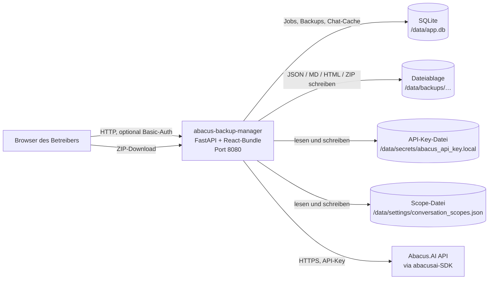

Belege: Port und Bindung `Dockerfile:29,35`; Volume `compose.yaml:22-23`; Pfade `backend/app/config.py:59-67`; SDK-Client `backend/app/security.py:69-73`.

### Komponenten

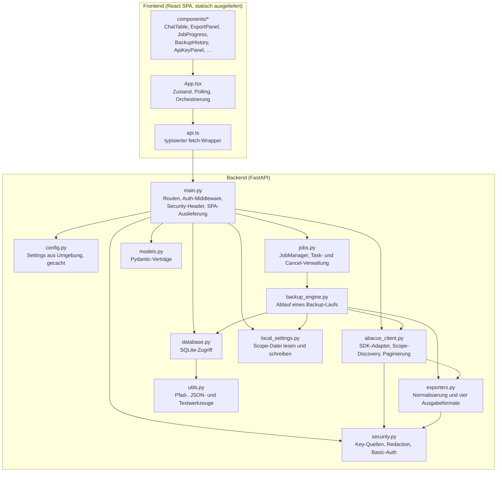

#### Verantwortlichkeit je Baustein

| Baustein | Verantwortung | Beleg |
|---|---|---|
| `main.py` | Definiert alle 14 API-Routen plus die Bundle-Auslieferung, die optionale Basic-Auth-Middleware, die Security-Header-Middleware, den Startup-Hook und die Auslieferung des React-Bundles inklusive SPA-Fallback | `backend/app/main.py:87-112,135-148,431-448` |
| `config.py` | Liest die gesamte Konfiguration einmalig aus der Umgebung in ein eingefrorenes `Settings`-Dataclass; leitet alle Datenpfade aus `APP_DATA_DIR` ab | `backend/app/config.py:11-76` |
| `security.py` | Einziger Ort, an dem API-Schlüssel gelesen, gespeichert, gelöscht und registriert werden; rekursive Schwärzung registrierter Geheimnisse; Konstantzeitvergleich für Basic-Auth | `backend/app/security.py:14-111` |
| `jobs.py` | Erzeugt Job-IDs, legt den Datensatz an, startet den Lauf als `asyncio`-Task, verwaltet `threading.Event`-Abbruchflaggen und markiert beim Start unterbrochene Jobs | `backend/app/jobs.py:15-60` |
| `backup_engine.py` | Der eigentliche Ablauf: Items auflösen, je Item Detail laden (timeout-geschützt), Formate schreiben, Manifest, Fehlerprotokoll, Übersichtsseite und ZIP erzeugen, Datenbank aktualisieren | `backend/app/backup_engine.py:52-237` |
| `abacus_client.py` | Kapselt das gesamte SDK-Verhalten: Methoden-Erkennung per `hasattr`, Aufruf mit den vom SDK tatsächlich unterstützten Parametern, Durchprobieren von Signaturvarianten, Paginierung und automatische Scope-Ermittlung | `backend/app/abacus_client.py:75-147,150-460` |
| `exporters.py` | Wandelt beliebige SDK-Objekte in einfache Datenstrukturen, erkennt die Nachrichtenliste heuristisch und erzeugt JSON, Markdown, zwei HTML-Varianten, Open-WebUI-JSON und das ZIP | `backend/app/exporters.py:38-78,566-728,731-767` |
| `database.py` | Sämtlicher SQLite-Zugriff über parametrisierte Statements; öffnet je Aufruf eine eigene Verbindung, seriaisiert Schreibzugriffe über ein `RLock` | `backend/app/database.py:12-248` |
| `local_settings.py` | Persistiert die manuell gepflegten Konversations-Scopes als JSON-Datei und führt sie mit den Umgebungsvorgaben zusammen | `backend/app/local_settings.py:12-51` |
| `models.py` | Alle Request- und Response-Verträge als Pydantic-Modelle, dazu `APP_NAME` und `APP_VERSION` | `backend/app/models.py:8-161` |
| `frontend/src/App.tsx` | Hält den gesamten Anwendungszustand, pollt laufende Jobs im Sekundentakt, schaltet zwischen den drei Ansichten | `frontend/src/App.tsx:39-101,196-253` |
| `frontend/src/api.ts` | Einziger Ort mit `fetch`-Aufrufen; relative Pfade, daher immer same-origin | `frontend/src/api.ts:13-101` |

### Verzeichnisstruktur

| Pfad | Inhalt |
|---|---|
| `backend/app/` | Das gesamte Python-Backend — elf Module, kein Unterpaket, keine Schichttrennung über Verzeichnisse hinweg |
| `backend/requirements.txt` | Vier direkte Abhängigkeiten als Versionsbereiche; **kein Lockfile** |
| `frontend/src/` | React-Quellcode: `App.tsx`, `api.ts`, `types.ts`, `main.tsx`, `index.css` |
| `frontend/src/components/` | Neun Präsentationskomponenten, jede genau ein Panel der Oberfläche |
| `frontend/dist/` | Lokales Build-Ergebnis des Bundles, **nicht versioniert** (`.gitignore:4`, Stand 2026-09-29); im Image wird es neu gebaut, nicht kopiert (`.dockerignore:6`) |
| `frontend/node_modules/` | Lokal installierte Abhängigkeiten; nicht Teil des Images (`.dockerignore:4-5`) |
| `docs/` | Diese Dokumentation und der Oberflächen-Screenshot `preview-ui.png` |
| `scripts/` | **Leer.** Keine Datei enthalten |
| Projektwurzel | `Dockerfile`, `compose.yaml`, `.env.example`, `.dockerignore`, `.gitignore`, `LICENSE`, `README.md`, `CHANGELOG.md`, `SECURITY.md`, `RELEASE_README.md`, `todo2026.md`, `MONETARISIERUNGSBEWERTUNG.md` |

Zur Laufzeit entsteht zusätzlich die Struktur unterhalb von `APP_DATA_DIR` (Default `/data`), beschrieben in [06-datenmodell.md](#dateiablage-je-sicherung).

### Nachträgliche Architekturentscheidungen (ADR)

Die folgenden Entscheidungen sind im Code klar erkennbar, aber nirgends im Repository als Entscheidung festgehalten.

#### ADR-1 — Duck-Typing gegen das Abacus-SDK statt fester Aufrufe

**Kontext:** Das `abacusai`-SDK ändert Methodennamen und Parameterbenennungen zwischen Versionen; dieselbe Funktion existiert mal mit `snake_case`-, mal mit `camelCase`-Parametern, mal gar nicht.

**Entscheidung:** Es gibt eine feste Liste von zehn Kandidatenmethoden. Vor jedem Zugriff wird per `hasattr` geprüft, ob die Methode existiert; die Parameter werden über `inspect.signature` gegen die tatsächliche Signatur gefiltert, und bei Misserfolg wird eine geordnete Liste von Aufrufvarianten durchprobiert.

**Konsequenz:** Die Anwendung überlebt SDK-Umbenennungen ohne Codeänderung und meldet fehlende Methoden als Warnung statt abzustürzen. Der Preis ist hoch: Ein Major-Release bricht nicht laut, sondern still — ein Backup kann leer bleiben, ohne dass ein Fehler geworfen wird. Zusätzlich vervielfacht die Variantensuche die API-Last genau im Fehlerfall, etwa bei einem Rate-Limit, und die einmal erfolgreiche Variante wird nicht gemerkt, sondern bei jedem Item neu gesucht.

**Beleg:** `backend/app/abacus_client.py:13-24,75-110,220-224,632-680`; Versionsbereich ohne Obergrenze in `backend/requirements.txt:4`.

#### ADR-2 — Alles in einem Container, Frontend als statisches Bundle aus demselben Origin

**Kontext:** Ein getrennt deployter SPA-Server hätte CORS, eine zweite Auth-Grenze und eine zweite Basis-URL erfordert.

**Entscheidung:** Ein Multi-Stage-Image baut das React-Bundle und kopiert es in das Python-Image; FastAPI liefert `/assets/*` über `StaticFiles` aus und beantwortet jeden unbekannten Pfad mit `index.html`. Das Frontend spricht die API ausschließlich über relative Pfade an.

**Konsequenz:** Es gibt **keine CORS-Konfiguration** — der im Portfolio verbreitete `allow_origins=["*"]`-Befund existiert hier schlicht nicht. Die Basic-Auth der Middleware schützt automatisch auch die Oberfläche. Nachteil: Frontend und Backend sind nur gemeinsam deploybar, und ein Frontend-Fix erzwingt einen kompletten Image-Neubau inklusive `npm ci`.

**Beleg:** `Dockerfile:1-20`, `backend/app/main.py:431-448`, `frontend/src/api.ts:18`.

#### ADR-3 — SQLite als reine Metadatenablage, Nutzdaten im Dateisystem

**Kontext:** Chatverläufe können sehr groß werden; sie müssen nach dem Entpacken auch ohne die Anwendung lesbar sein.

**Entscheidung:** In SQLite liegen ausschließlich Job-Status, Backup-Verweise mit Manifest und ein Chat-Listen-Cache. Die eigentlichen Exporte liegen als gewöhnliche Dateien in `/data/backups/<backup_id>/`, ergänzt um `manifest.json`, `errors.log`, `index.html` und optional `backup.zip`.

**Konsequenz:** Ein entpacktes Backup ist ohne die Anwendung vollständig auswertbar — man öffnet `index.html` im Browser. Das Restore-Verfahren ist damit trivial. Nachteil: Datenbank und Dateisystem können auseinanderlaufen. Bricht ein Job ab, bleibt ein Verzeichnis ohne Datenbankeintrag zurück, das weder gelistet noch über die API gelöscht werden kann; `mark_interrupted_jobs` räumt nur die Datenbankseite auf.

**Beleg:** `backend/app/database.py:20-58`, `backend/app/backup_engine.py:63-76,212-226`, `backend/app/database.py:70-87`.

#### ADR-4 — Geheimnisse zentral registrieren und rekursiv aus jeder Ausgabe schwärzen

**Kontext:** Ein Backup-Werkzeug schreibt alles, was die API liefert, ungefiltert auf die Platte — darunter potenziell der eigene API-Schlüssel, wenn er in einer Nachricht oder in einem Fehlertext auftaucht.

**Entscheidung:** Jeder API-Schlüssel wird an allen vier Eintrittspunkten in ein prozessweites Set registriert. Jede Ausgabefunktion — JSON, Markdown, HTML, Open WebUI, Fehlermeldungen an den Client — läuft durch `redact_secrets` bzw. `redact_secrets_from_text` und ersetzt jeden registrierten Wert durch `[REDACTED_SECRET]`.

**Konsequenz:** Der Schlüssel kann weder in einem Export noch in einer HTTP-Fehlermeldung landen. Der Preis ist ein prozessweiter, wachsender Set-Zustand und eine String-Ersetzung über jeden geschriebenen Text — bei großen Backups messbar, aber unkritisch. Grenze: Nur *registrierte* Werte werden geschwärzt; ein fremdes Geheimnis im Chatinhalt bleibt unberührt.

**Beleg:** `backend/app/security.py:14-18,25-32,35-43,54-98`; Anwendung in `backend/app/exporters.py:84,117,241,248,443`, `backend/app/main.py:211,276,358`.

#### ADR-5 — Backup-Job als `asyncio`-Task mit Thread-Auslagerung und hartem Timeout je SDK-Aufruf

**Kontext:** Das SDK ist synchron und blockierend; ein hängender Aufruf würde den gesamten Event-Loop und damit auch die Oberfläche blockieren.

**Entscheidung:** `POST /api/export` legt den Job an und kehrt sofort zurück. Der Lauf startet als `asyncio.create_task`, der die synchrone Engine über `asyncio.to_thread` ausführt. Innerhalb der Engine bekommt jeder einzelne SDK-Aufruf einen eigenen `ThreadPoolExecutor` mit 120-Sekunden-Timeout; bei Zeitüberschreitung wird `shutdown(wait=False)` gerufen, damit der hängende Thread den Job nicht blockiert.

**Konsequenz:** Die Oberfläche bleibt bedienbar, ein einzelner hängender Chat kostet höchstens 120 Sekunden, und betroffene Items landen in `timed_out_items` mit Retry-Schaltfläche. Nachteile: Der Fortschritt existiert nur im Prozess — ein Neustart bricht jeden laufenden Job ab (er wird beim nächsten Start als `failed` markiert); und der Erfolgspfad von `_call_with_timeout` fährt den Executor nie herunter, weil `return` im `try`-Block den `else`-Zweig überspringt.

**Beleg:** `backend/app/main.py:279-288`, `backend/app/jobs.py:26-43`, `backend/app/backup_engine.py:14-29,94-100,162-168`, `backend/app/database.py:70-87`.

#### ADR-6 — Kanonischer Auswahlschlüssel `type:deployment_id:id` statt roher Chat-ID

**Kontext:** Dieselbe Konversations-ID kann über mehrere Deployments und Scopes hinweg auftauchen, insbesondere weil organisationsweite Konversationen mit `include_org_level_conversations: True` in jeder Deployment-Abfrage erscheinen.

**Entscheidung:** Frontend und Backend bilden denselben Schlüssel `type:deployment_id_or_empty:id`; die Auswahl wird ausschließlich über diesen Schlüssel abgeglichen.

**Konsequenz:** Eine Einzelauswahl exportiert genau einen Eintrag statt aller Namensvettern. Der ursprüngliche Fehler ist im Changelog als behobener 1.0.0-Punkt dokumentiert. Offen bleibt die Kehrseite: Dieselbe organisationsweite Konversation kann unter zwei verschiedenen Scope-Zuordnungen als zwei Einträge gelten und doppelt exportiert werden.

**Beleg:** `backend/app/backup_engine.py:260-267`, `frontend/src/components/ChatTable.tsx:21-23`, `backend/app/abacus_client.py:292-296,436`.

### Marker in diesem Dokument

Keine — alle Aussagen sind mit Fundstelle belegt.

---

## 03 — Stack und Abhängigkeiten · app-abacus-chat-backup

Laufzeitumgebungen, direkte Abhängigkeiten mit aufgelösten Versionen, Lizenzübersicht und Bewertung gegen `ZIEL_LIZENZ`.

[← Zurück zum Index](#dokumentation--app-abacus-chat-backup)

### Laufzeitumgebungen

| Laufzeit | Version | Quelle |
|---|---|---|
| Python (Anwendung) | **3.11** (Debian-basiertes Slim-Image) | `Dockerfile:9` — `FROM python:3.11-slim` |
| Node.js (nur Build) | **20** (Debian Bookworm Slim) | `Dockerfile:1` — `FROM node:20-bookworm-slim AS frontend-build` |
| ASGI-Server | `uvicorn`, gestartet mit `--host 0.0.0.0 --port 8080` | `Dockerfile:35` |

Es gibt **keine** `.nvmrc`, kein `engines`-Feld in `frontend/package.json` und keine `python_requires`-Angabe. Die einzigen verbindlichen Versionsaussagen sind die beiden Basis-Images. Der lokale Entwicklungshost ist davon unabhängig; `README.md:35` nennt „Python 3.11+" und „Node.js 20+" als Anforderung.

> ⚠️ NICHT ERMITTELBAR — Quelle fehlt: Die genauen Patch-Versionen der Basis-Images (`python:3.11-slim`, `node:20-bookworm-slim`) und deren Digests. Beide Tags sind beweglich, und es liegt kein gebautes Image vor (`docker images` zeigt kein Abbild dieses Projekts). Ein Build würde `pip install` und `npm ci` und damit Netzwerkzugriff erfordern, was für diese Dokumentation ausgeschlossen ist.

### Backend

#### Tabelle 1a — Direkte Abhängigkeiten Backend

Quelle: `backend/requirements.txt:1-4`. **Es existiert kein Lockfile** (kein `uv.lock`, kein `poetry.lock`, kein `requirements.lock`, kein `constraints.txt`), und im Repository liegt keine virtuelle Umgebung. Die folgenden Angaben sind deshalb Versions*bereiche*, keine aufgelösten Versionen.

| Paket | Bereich | Aufgelöste Version | Zweck im Projekt | Lizenz (SPDX) | Scope | Ersetzbarkeit |
|---|---|---|---|---|---|---|
| `fastapi` | `>=0.115,<1.0` | ⚠️ unbekannt | Web-Framework: alle 14 Routen, Request-Validierung über Pydantic-Modelle, die beiden `@app.middleware("http")`-Schichten, `StaticFiles`-Mount und `FileResponse` für ZIP-Downloads (`backend/app/main.py:10-11,59,87,105,434-436`) | MIT (nicht verifiziert) | prod | **schwer** — Routen, Abhängigkeitsinjektion und Pydantic-Integration durchziehen `main.py` vollständig |
| `uvicorn[standard]` | `>=0.30,<1.0` | ⚠️ unbekannt | ASGI-Server, einziger Prozesseinstieg des Containers. Das Extra `standard` zieht `uvloop`, `httptools`, `websockets`, `watchfiles`, `python-dotenv` und `PyYAML` nach | BSD-3-Clause (nicht verifiziert) | prod | **leicht** — austauschbar gegen jeden ASGI-Server (Hypercorn, Granian); der Aufruf steht an genau einer Stelle (`Dockerfile:35`) |
| `pydantic` | `>=2.7,<3.0` | ⚠️ unbekannt | Sämtliche Request-/Response-Verträge in `models.py`, inklusive `field_validator` zur Normalisierung von Scope-Listen und `Literal`-Typen für Formate und Job-Status (`backend/app/models.py:5,67-83,96-109`) | MIT (nicht verifiziert) | prod | **schwer** — 13 Modellklassen, tief in FastAPI verwoben |
| `abacusai` | `>=1.4` | ⚠️ unbekannt | Der einzige Zugang zu den Nutzdaten: `ApiClient` wird mit dem API-Key erzeugt (`backend/app/security.py:69-73`), zehn Methoden werden dynamisch genutzt (`backend/app/abacus_client.py:13-24`), zusätzlich wird `abacusai.api_class.enums.DeploymentConversationType` für Fallback-Scopes importiert (`backend/app/abacus_client.py:604-608`) | ⚠️ unbekannt | prod | **schwer** — es gibt keine dokumentierte REST-Alternative; ein Ersatz bedeutet, das komplette Adaptermodul gegen rohes HTTP neu zu schreiben |

**Auffällig:** `abacusai` ist die einzige Abhängigkeit **ohne Obergrenze**, und zugleich diejenige, die per Introspektion angesprochen wird. Genau diese Kombination bricht bei einem Major-Release nicht laut, sondern still: Signaturvarianten passen nicht mehr, `hasattr` liefert `False`, und das Backup bleibt leer statt zu scheitern (`backend/app/abacus_client.py:75-97,220-224`). Der Befund ist im projekteigenen Review als offener Punkt notiert (`todo2026.md`, Abschnitt „Niedrig", Eintrag zu `backend/requirements.txt:4`).

> ⚠️ NICHT ERMITTELBAR — Quelle fehlt: Alle vier aufgelösten Backend-Versionen. Es gibt kein Lockfile, keine eingecheckte virtuelle Umgebung und kein gebautes Image; `pip install` ist für diese Dokumentation ausgeschlossen. Die tatsächlich installierten Versionen hängen davon ab, wann das Image zuletzt gebaut wurde.

> ⚠️ NICHT ERMITTELBAR — Quelle fehlt: Der vollständige transitive Abhängigkeitsbaum des Backends inklusive Lizenzen. `abacusai` zieht erfahrungsgemäß einen umfangreichen Datenanalyse-Unterbau nach; ohne Installation lässt sich weder die Paketliste noch deren Lizenzverteilung belegen.

> ⚠️ NICHT ERMITTELBAR — Quelle fehlt: Die Lizenz von `abacusai`. Das Paket liegt lokal nicht vor, und Netzwerkabfragen sind ausgeschlossen. **Konsequenz gegen `ZIEL_LIZENZ` (proprietär):** Eine unbekannte Lizenz ist nach dem Bewertungsmaßstab 🔴 zu behandeln — sie kann ein Copyleft oder eine kommerzielle Nutzungsgrenze enthalten. **Handlungsoption:** Beim nächsten Build `pip show abacusai` bzw. die `METADATA` im Image auslesen und das Ergebnis hier nachtragen; bis dahin gilt das Projekt als nicht weitergabefähig.

### Frontend

#### Tabelle 1b — Direkte Abhängigkeiten Frontend

Quelle: `frontend/package-lock.json` (`lockfileVersion: 3`, 182 Pakete im Baum). Die Versionen sind die **aufgelösten** Werte aus dem Lockfile, nicht die Bereiche aus `package.json`.

| Paket | Aufgelöste Version | Zweck im Projekt | Lizenz (SPDX) | Scope | Ersetzbarkeit |
|---|---|---|---|---|---|
| `react` | 18.3.1 | UI-Bibliothek; die gesamte Oberfläche ist eine Funktionskomponente mit Hooks, ohne Router und ohne State-Bibliothek (`frontend/src/App.tsx:1,39-101`) | MIT | prod | **schwer** — neun Komponenten und der gesamte Zustandsfluss |
| `react-dom` | 18.3.1 | Mountet die Anwendung per `createRoot` in `#root` (`frontend/src/main.tsx`) | MIT | prod | **schwer** — untrennbar von `react` |
| `lucide-react` | 0.468.0 | Icon-Set der Oberfläche, u. a. die vier Formatsymbole im Export-Panel (`frontend/src/components/ExportPanel.tsx:11-16`) | ISC | prod | **leicht** — reine Präsentation, ersetzbar durch Inline-SVG; senkt zugleich die Bundle-Größe |
| `vite` | 5.4.21 | Build-Werkzeug: erzeugt `frontend/dist/`; im Dev-Modus zusätzlich Proxy von `/api` auf `127.0.0.1:8080` (`frontend/vite.config.ts:6-11`) | MIT | dev | **mittel** — Ersatz möglich, erfordert aber neue Build- und Proxy-Konfiguration |
| `@vitejs/plugin-react` | 4.7.0 | JSX-Transformation und Fast Refresh im Vite-Build (`frontend/vite.config.ts:2,5`) | MIT | dev | **mittel** — an Vite gebunden |
| `typescript` | 5.9.3 | Typprüfung vor dem Build (`tsc -b && vite build`, `frontend/package.json:8`); `strict: true` (`frontend/tsconfig.json:10`) | **Apache-2.0** | dev | **mittel** — Aufgabe von TypeScript wäre ein Rückschritt, aber technisch möglich |
| `tailwindcss` | 3.4.19 | Sämtliches Styling erfolgt über Utility-Klassen direkt im JSX; es gibt keine eigenen CSS-Klassen außer in `index.css` | MIT | dev | **schwer** — jede Komponente ist vollständig in Tailwind-Klassen ausgedrückt |
| `postcss` | 8.5.13 | Verarbeitungskette für Tailwind und Autoprefixer (`frontend/postcss.config.js`) | MIT | dev | **leicht** — Infrastrukturbaustein von Tailwind |
| `autoprefixer` | 10.5.0 | Ergänzt Hersteller-Präfixe im erzeugten CSS | MIT | dev | **leicht** |
| `@types/react` | 18.3.28 | Typdefinitionen für React | MIT | dev | **leicht** |
| `@types/react-dom` | 18.3.7 | Typdefinitionen für React-DOM | MIT | dev | **leicht** |

Bemerkenswert: Die Laufzeitabhängigkeiten des Frontends bestehen aus genau **drei** Paketen. Alles Weitere ist Build-Werkzeug und landet nicht im ausgelieferten Bundle.

#### Tabelle 2 — Lizenzübersicht über den gesamten Frontend-Abhängigkeitsbaum

Quelle: Auswertung des `license`-Feldes aller 182 Einträge in `frontend/package-lock.json`.

| Lizenz | Anzahl Pakete | Beispielpakete | Bewertung gegen `ZIEL_LIZENZ` (proprietär) |
|---|---|---|---|
| MIT | 165 | `react`, `react-dom`, `vite`, `tailwindcss`, `postcss`, `@babel/core` | 🟢 unkritisch — Weitergabe nur mit Lizenztext und Copyright-Vermerk |
| ISC | 11 | `lucide-react`, `anymatch`, `glob-parent`, `electron-to-chromium` | 🟢 unkritisch — funktional äquivalent zu MIT |
| Apache-2.0 | 4 | `typescript`, `baseline-browser-mapping`, `didyoumean`, `ts-interface-checker` | 🟢 unkritisch, **aber NOTICE-Pflicht bei Weitergabe** (§4 der Lizenz). Alle vier sind reine Build-Zeit-Pakete und landen nicht im Bundle |
| BSD-3-Clause | 1 | `source-map-js` | 🟢 unkritisch — Namensnennung im Begleitmaterial |
| CC-BY-4.0 | 1 | `caniuse-lite` | 🟡 **Namensnennungspflicht** bei Weitergabe der enthaltenen Browser-Datenbank. Build-Zeit-Paket, wird nicht mit ausgeliefert. **Handlungsoption:** NOTICE-Eintrag, falls das Repository je weitergegeben wird |

**Kein GPL, kein LGPL, kein AGPL, kein MPL, kein `unknown`, kein Dual-Licensing und keine kommerzielle Lizenz mit Nutzungsgrenze im gesamten Frontend-Baum.** Das ist ein sauberes Ergebnis; der einzige Handlungspunkt ist eine NOTICE-Datei für Apache-2.0 und CC-BY-4.0, und auch der nur im Fall einer Weitergabe.

### Eigene Lizenz des Projekts

Das Repository enthält eine **MIT-Lizenz** (`LICENSE:1-21`, Copyright 2026 „Abacus Backup Chat Export Manager contributors"). Das steht in direktem Widerspruch zu `ZIEL_LIZENZ` = *proprietär / nicht zur Weitergabe*: MIT erlaubt jedem Empfänger ausdrücklich Nutzung, Änderung, Weitergabe und Unterlizenzierung. **Konsequenz:** Wer eine Kopie erhält, darf sie legal weiterverbreiten und kommerziell verwerten. **Handlungsoption:** Entweder die Zielvorgabe für dieses Projekt bewusst auf „offen" korrigieren — dazu passt, dass `SECURITY.md:11` von GitHub Security Advisories und öffentlichem Repository ausgeht — oder die `LICENSE` durch einen proprietären Text ersetzen und den README-Verweis (`README.md:132-134`) anpassen. Die Entscheidung gehört dokumentiert, nicht implizit gelassen.

### Veraltete und ungepflegte Pakete

> ⚠️ NICHT ERMITTELBAR — Quelle fehlt: Release-Daten der Pakete. Ein Lockfile enthält keine Zeitstempel, und Abfragen der Registry sind für diese Dokumentation ausgeschlossen. Die Prüfung „letzter Release älter als 24 Monate" lässt sich damit nicht belegen.

Belegbar ist stattdessen der **Stand der Major-Linien**:

| Paket | Aufgelöste Version | Beobachtung | Beleg |
|---|---|---|---|
| `react` / `react-dom` | 18.3.1 | 18.3.x ist die letzte Version der 18er-Linie; die 19er-Linie existiert und wird nicht genutzt | `frontend/package-lock.json`, `frontend/package.json:13-14` |
| `vite` | 5.4.21 | Aktuellster Stand der 5.x-Linie. Das projekteigene Review ordnet diese Linie als nicht mehr patchgepflegt ein und empfiehlt den Sprung auf eine neuere Major-Version | `todo2026.md`, Abschnitt „Niedrig", Eintrag zu `frontend/package.json:6-8,20` |
| `tailwindcss` | 3.4.19 | 3.x-Linie; die 4er-Linie mit anderer Konfigurationsform wird nicht genutzt | `frontend/package-lock.json` |

Praktische Einordnung zur Vite-Frage: Vite dient hier **ausschließlich dem Build**. Das Produktivartefakt ist statisches HTML/JS, das FastAPI ausliefert — der Vite-Dev-Server läuft im Container nie. Relevant bleibt, dass die Skripte `dev` und `preview` explizit auf `0.0.0.0` binden (`frontend/package.json:7,9`), was auf einem Entwicklungsrechner die Vorbedingung der bekannten Dev-Server-Schwachstellen dieser Familie erfüllt.

### Schwachstellen-Scan

**Nicht durchgeführt.** Weder `syft` noch `grype` sind auf dem Host verfügbar (`docs/_doc-spec.md`, Abschnitt „Verfügbare Toolchain"), und `npm audit` bzw. `pip-audit` würden Netzwerkzugriff erfordern. Es wird hier folglich **keine** Aussage über bekannte CVEs getroffen — weder positiv noch negativ.

### Marker in diesem Dokument

- ⚠️ NICHT ERMITTELBAR — Patch-Versionen und Digests der beiden Basis-Images (kein gebautes Image, Build netzwerkgebunden)
- ⚠️ NICHT ERMITTELBAR — aufgelöste Versionen der vier Backend-Abhängigkeiten (kein Python-Lockfile)
- ⚠️ NICHT ERMITTELBAR — transitiver Abhängigkeitsbaum des Backends inklusive Lizenzen
- ⚠️ NICHT ERMITTELBAR — Lizenz von `abacusai` (🔴-Bewertung bis zur Klärung)
- ⚠️ NICHT ERMITTELBAR — Release-Daten zur Beurteilung ungepflegter Pakete

---

## 04 — Container · app-abacus-chat-backup

Image-Aufbau, Laufzeitparameter, Ports, Volumes, Start- und Stoppverhalten sowie die Compose-Topologie.

[← Zurück zum Index](#dokumentation--app-abacus-chat-backup)

> **Quelle aller Angaben in diesem Dokument: `Dockerfile` und `compose.yaml`, nicht ein gebautes Image.** Auf dem Host existiert kein Abbild dieses Projekts (`docker images` liefert keinen Treffer), und ein Build würde `npm ci` und `pip install` und damit Netzwerkzugriff erfordern, was für diese Dokumentation ausgeschlossen ist. Überall dort, wo die Spezifikation Angaben aus dem Image verlangt (Digest, Systempakete, UID/GID, Layer-Größen), steht ein Marker.

> **Stand-Hinweis (aktualisiert 2026-09-29):** Die Härtungen `USER app`, die Loopback-Bindung des Ports und `no-new-privileges` sind inzwischen **committet**; der Arbeitsbaum war zum QA-Audit am 2026-09-29 sauber.

### Basis-Images

| Stage | Image | Zweck | Beleg |
|---|---|---|---|
| `frontend-build` | `node:20-bookworm-slim` | Baut das React-Bundle | `Dockerfile:1` |
| Runtime (unbenannt) | `python:3.11-slim` | Führt die Anwendung aus; erhält das fertige Bundle per `COPY --from` | `Dockerfile:9,20` |

**Betriebssystem:** Beide Images sind Debian-basiert. `node:20-bookworm-slim` nennt Debian 12 („Bookworm") im Tag. `python:3.11-slim` trägt keine Distributionsangabe im Tag — der `slim`-Tag der offiziellen Python-Images folgt dem jeweils aktuellen Debian-Stable, ist aber ohne Image-Inspektion nicht belegbar.

> ⚠️ NICHT ERMITTELBAR — Quelle fehlt: SHA-256-Digests beider Basis-Images sowie die exakte Debian-Version des Runtime-Images. Beide Tags sind beweglich; ohne `docker image inspect` auf einem gebauten Abbild ist der tatsächlich verwendete Stand nicht bestimmbar. **Handlungsoption:** Beide `FROM`-Zeilen auf `@sha256:…` pinnen — dann ist der Stand reproduzierbar und dokumentierbar.

### Multi-Stage-Aufbau

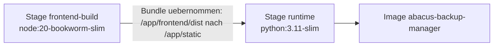

| Stage | Schritte | Beleg |
|---|---|---|
| **1 — `frontend-build`** | `WORKDIR /app/frontend`; nur `package*.json` kopieren; `npm ci --no-audit --no-fund`; dann den restlichen Frontend-Quellcode kopieren; `npm run build` (= `tsc -b && vite build`) | `Dockerfile:1-7`, `frontend/package.json:8` |
| **2 — Runtime** | `ENV` setzen; `WORKDIR /app`; nur `requirements.txt` kopieren; `pip install --no-cache-dir`; Anwendungscode nach `/app/app`; Bundle aus Stage 1 nach `/app/static`; `/data/backups` anlegen; unprivilegierten Benutzer anlegen und Besitz übertragen; `USER app`; `EXPOSE`, `HEALTHCHECK`, `CMD` | `Dockerfile:9-35` |

Die Reihenfolge ist in beiden Stages Cache-freundlich: Erst die Manifestdatei, dann die Installation, dann der Quellcode. Eine Codeänderung invalidiert damit nicht die Installationsschicht.

### Im Image installierte Systempakete

> ⚠️ NICHT ERMITTELBAR — Quelle fehlt: Liste der Systempakete mit Version und Lizenz. Das Dockerfile installiert **keine** zusätzlichen Systempakete — es gibt kein `apt-get install`. Die vorhandenen Pakete stammen ausschließlich aus dem Basis-Image `python:3.11-slim`; sie ließen sich nur per `dpkg -l` innerhalb eines gebauten Images ermitteln.

Belegbar ist die Konsequenz dieses Verzichts: Das Image bringt **weder `curl` noch `wget`** mit — deshalb ist der Healthcheck als Python-Einzeiler formuliert und im Dockerfile ausdrücklich so begründet (`Dockerfile:30-31`).

### Laufzeitparameter

| Parameter | Wert | Beleg |
|---|---|---|
| `WORKDIR` | `/app` | `Dockerfile:15` |
| Benutzer | `app`, angelegt per `adduser --system --group app`, danach `USER app` | `Dockerfile:25-27` |
| UID / GID | ⚠️ siehe Marker unten | — |
| `CMD` | `["uvicorn", "app.main:app", "--host", "0.0.0.0", "--port", "8080"]` (Exec-Form) | `Dockerfile:35` |
| `ENTRYPOINT` | nicht gesetzt — der `CMD` ist der Prozess | kein `ENTRYPOINT` im `Dockerfile` |
| `ENV` im Image | `PYTHONDONTWRITEBYTECODE=1`, `PYTHONUNBUFFERED=1`, `APP_STATIC_DIR=/app/static` | `Dockerfile:11-13` |
| Besitzverhältnisse | `chown -R app:app /data /app` vor dem Benutzerwechsel | `Dockerfile:26` |

> ⚠️ NICHT ERMITTELBAR — Quelle fehlt: UID und GID des Benutzers `app`. `adduser --system` vergibt die ID dynamisch aus dem Systembereich (unter Debian typischerweise 100–999); der konkrete Wert steht erst im gebauten Image in `/etc/passwd`. **Relevanz:** Für Bind-Mounts auf einem Host müsste die ID bekannt sein, um Schreibrechte zu setzen. Der Standardbetrieb nutzt ein benanntes Docker-Volume, bei dem Docker die Rechte übernimmt — dort ist die ID unkritisch. **Handlungsoption:** Feste IDs vergeben (`adduser --system --uid 10001 --group --gid 10001 app`).

`PYTHONUNBUFFERED=1` ist die Voraussetzung dafür, dass Ausgaben ungepuffert in `docker logs` erscheinen — ohne diese Variable würde die Startmeldung zur Basic-Auth erst verzögert sichtbar (`backend/app/main.py:126-132`).

### Ports

| Port | Protokoll | Zweck | Veröffentlichung | Beleg |
|---|---|---|---|---|
| 8080 | TCP/HTTP | Einziger Port: REST-API **und** React-Oberfläche aus demselben Origin | `"127.0.0.1:8080:8080"` — nur Loopback des Hosts | `Dockerfile:29,35`, `compose.yaml:9` |

Der Prozess selbst bindet auf `0.0.0.0` (`Dockerfile:35`), ist also innerhalb des Container-Netzes von überall erreichbar. Die Begrenzung entsteht **ausschließlich** durch das Host-Portmapping. Die Compose-Datei erklärt das im Kommentar ausdrücklich: Eine Änderung auf `"8080:8080"` ist nur zusammen mit gesetzter Basic-Auth oder hinter einem Reverse-Proxy vorgesehen (`compose.yaml:6-9`).

### Volumes und Mounts

| Mount | Quelle | Ziel | Inhalt | Rechte | Persistenzbedarf |
|---|---|---|---|---|---|
| `abacus_backup_data` | benanntes Docker-Volume | `/data` | SQLite-Datenbank `app.db`, alle Sicherungen unter `backups/`, die API-Key-Datei unter `secrets/`, die Scope-Datei unter `settings/` | schreibend (zwingend) | **hoch** — hier liegen die einzigen Nutzdaten. Ein Verlust bedeutet Verlust aller Sicherungen **und** des gespeicherten API-Schlüssels |

Belege: `compose.yaml:22-23,44-45`; Unterverzeichnisse aus `backend/app/config.py:59-67`; Anlage beim Start in `backend/app/main.py:139-142`.

Es gibt **keinen** weiteren Mount — insbesondere keinen Bind-Mount von Quellcode und keinen Docker-Socket.

### Healthcheck

| Ebene | Definition | Beleg |
|---|---|---|
| Image | `HEALTHCHECK --interval=30s --timeout=3s --start-period=20s --retries=3` mit `python -c "import urllib.request; urllib.request.urlopen('http://127.0.0.1:8080/api/health', timeout=2)"` | `Dockerfile:32-33` |
| Compose | identische Parameter, Test in Exec-Form | `compose.yaml:24-29` |

Die Sonde funktioniert, weil `/api/health` als einziger Pfad von der Basic-Auth ausgenommen ist (`backend/app/main.py:68`). Ein Nicht-2xx-Status — insbesondere die 503, die der Endpunkt bei fehlgeschlagenem SQLite-Ping liefert (`backend/app/main.py:183-187`) — lässt `urlopen` eine Ausnahme werfen und markiert den Container als `unhealthy`. Der Healthcheck ist damit **kein** reiner Prozess-Lebendtest, sondern prüft tatsächlich die Datenbank.

### Ressourcenbedarf

> **Geschätzt, nicht gemessen.** Es liegt kein laufender Container vor; es wurden keine `docker stats` erhoben.

| Ressource | Schätzung | Begründung aus dem Code |
|---|---|---|
| RAM Leerlauf | 120–250 MB | Ein Uvicorn-Prozess mit FastAPI und Pydantic; `abacusai` zieht erfahrungsgemäß einen umfangreichen Unterbau nach, dessen Import allein den Grundbedarf bestimmt |
| RAM unter Last | deutlich höher, nach oben offen | Ein Backup-Lauf hält den vollständigen Detaildatensatz **einer** Konversation im Speicher (`backend/app/backup_engine.py:94`), zusätzlich sammelt er bei aktivem Open-WebUI-Format **alle** konvertierten Chats des Laufs in einer Liste bis zum Jobende (`backend/app/backup_engine.py:70,132,208-211`). Bei vielen großen Konversationen wächst dieser Puffer linear mit |
| CPU Leerlauf | nahe null | Kein Hintergrundjob, kein Poller, kein Scheduler im Backend |
| CPU unter Last | 1 Kern, überwiegend wartend | Der Lauf ist streng sequenziell und größtenteils I/O-gebunden; rechenintensiv sind nur die Markdown-/HTML-Erzeugung und die ZIP-Kompression (`backend/app/exporters.py:720-728`) |
| Plattenbedarf | linear zur Menge der Chats, **ohne Obergrenze** | Jeder Lauf legt ein neues Verzeichnis an; bei `zip: true` liegt das Material zusätzlich als ZIP **im selben Verzeichnis** (`backend/app/exporters.py:722`) — also doppelt. Es gibt keine Rotation und kein Aufräumen |

Es sind **keine** Ressourcengrenzen definiert: `compose.yaml` enthält weder `mem_limit` noch `cpus` noch einen `deploy.resources`-Block.

### Image-Größe und Layer

> ⚠️ NICHT ERMITTELBAR — Quelle fehlt: Gesamtgröße des Images und Größe je Layer. Erfordert `docker history` bzw. `docker image inspect` auf einem gebauten Abbild; es liegt keines vor.

Belegbar ist, **welche** Schichten die Größe bestimmen — die drei größten sind nach Dockerfile-Struktur eindeutig:

1. Das Basis-Image `python:3.11-slim` selbst (`Dockerfile:9`).
2. `RUN pip install --no-cache-dir -r requirements.txt` (`Dockerfile:17`) — vier Pakete samt transitivem Baum, darunter `abacusai`; mit Abstand die größte selbst erzeugte Schicht.
3. `COPY --from=frontend-build /app/frontend/dist /app/static` (`Dockerfile:20`) — ein lokaler Vergleichsbuild vom 2026-05-16 maß 199 624 Byte JavaScript und 17 204 Byte CSS, also rund 220 KB (`frontend/dist/` ist seitdem nicht mehr versioniert). Verglichen mit Schicht 2 vernachlässigbar, aber die drittgrößte selbst erzeugte.

Der Anwendungscode (`Dockerfile:19`) umfasst rund 3 000 Zeilen Python und liegt im niedrigen dreistelligen Kilobyte-Bereich. `--no-cache-dir` beim `pip install` und die `.dockerignore` (schließt `.git`, `.env`, `node_modules`, `dist`, `__pycache__`, `data`, `backups` aus — `.dockerignore:1-12`) verhindern die üblichen Größentreiber.

### Startup-Sequenz

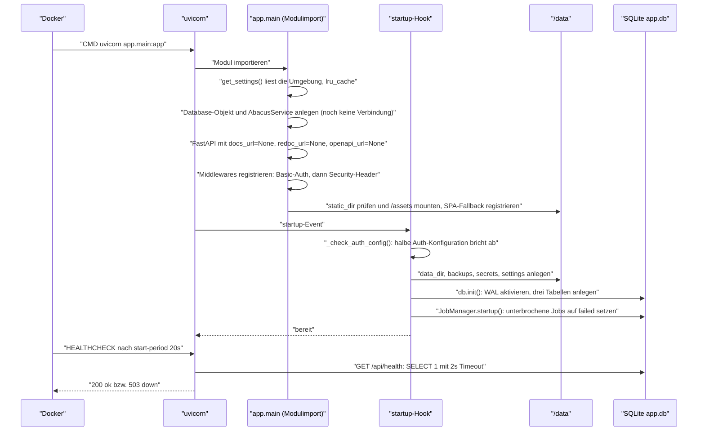

Belege: `backend/app/main.py:50-52,59,87,105,115-148,431-448`; `backend/app/database.py:17-58`; `backend/app/jobs.py:23-24`; `Dockerfile:32-33`.

Wichtige Eigenschaften dieser Sequenz:

- **Keine Datenbankmigration**, nur `CREATE TABLE IF NOT EXISTS`. Eine ältere Datenbank wird nicht angepasst (`backend/app/database.py:20-58`).
- **Keine Verbindung zu Abacus.AI beim Start.** Der `AbacusService` wird leer erzeugt; verbunden wird erst beim ersten Aufruf, der es erfordert (`backend/app/main.py:348-373`).
- **Fail-fast nur bei halb konfigurierter Auth.** Ist genau eine der beiden Basic-Auth-Variablen gesetzt, wirft der Startup-Hook einen `RuntimeError` und der Container startet nicht. Sind **beide** leer, startet er mit einer Warnzeile und offener API (`backend/app/main.py:115-132`).
- **Kein Warm-up, kein Vorladen.** Die Chatliste wird erst auf Anforderung geholt.

### Shutdown-Verhalten

| Aspekt | Verhalten | Beleg |
|---|---|---|
| Signalempfänger | `uvicorn` läuft als PID 1 (Exec-Form des `CMD`) und empfängt SIGTERM direkt — kein Shell-Wrapper, der das Signal schlucken würde | `Dockerfile:35` |
| Anwendungseigener Shutdown-Hook | **Keiner.** Es gibt kein `@app.on_event("shutdown")` und keinen `lifespan`-Kontextmanager | `backend/app/main.py` enthält nur `@app.on_event("startup")` (Zeile 135) |
| Laufende Backup-Jobs | Werden **nicht** sauber beendet. Der Lauf steckt in `asyncio.to_thread` und damit in einem Nicht-Daemon-Thread; das Abbruchflag wird beim Herunterfahren nicht gesetzt | `backend/app/jobs.py:35-43`, `backend/app/backup_engine.py:85-86` |
| Zustand nach hartem Stopp | Der Job bleibt in der Datenbank auf `queued`/`running` stehen und wird **beim nächsten Start** auf `failed` gesetzt, mit dem Vermerk „Job was interrupted by a container restart or process exit." | `backend/app/database.py:70-87` |
| Dateireste | Das bereits angelegte Backup-Verzeichnis bleibt liegen — ohne Datenbankeintrag. Es erscheint in keiner Liste und lässt sich über die API nicht löschen | `backend/app/backup_engine.py:63-76` gegenüber `220-226` |
| Datenbankintegrität | SQLite läuft im WAL-Modus; ein harter Abbruch verliert höchstens die letzte nicht abgeschlossene Transaktion | `backend/app/database.py:22` |

### Compose-Topologie

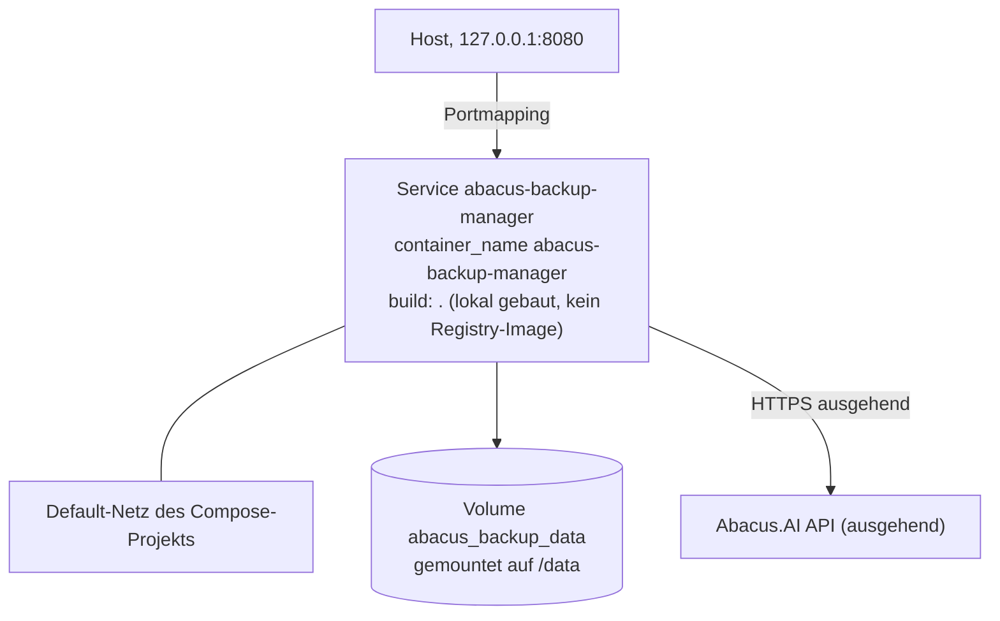

| Eigenschaft | Wert | Beleg |
|---|---|---|
| Anzahl Dienste | **einer** — es gibt keine Datenbank, keinen Cache, keinen Proxy als eigenen Container | `compose.yaml:1-42` |
| Startreihenfolge | Nicht zutreffend — es gibt keine `depends_on`-Beziehung, weil nur ein Dienst existiert | `compose.yaml` enthält keinen `depends_on`-Block |
| Netzwerke | Kein `networks`-Block; Compose legt das implizite Default-Netz des Projekts an | `compose.yaml` |
| Image-Herkunft | `build: .` — es wird lokal gebaut, kein Tag aus einer Registry gezogen | `compose.yaml:3` |
| Restart-Policy | **Nicht gesetzt.** Der Container startet nach einem Host-Neustart nicht von selbst | kein `restart:`-Eintrag in `compose.yaml` |
| Härtung | `security_opt: no-new-privileges:true` | `compose.yaml:10-11` |
| Ressourcengrenzen | keine | kein `deploy`/`mem_limit` in `compose.yaml` |

#### HomeLAB_UX-Integration

Der Dienst trägt zwölf `homelab.*`-Labels und ist damit auf die Auto-Discovery des Dashboards `app-homelabux` ausgelegt (`compose.yaml:30-42`): `homelab.enable=true`, `homelab.port=8080`, `homelab.health=/api/health`, `homelab.group=Tools`, dazu Name, Slug, Beschreibung, Icon, Tags, Reihenfolge und Sichtbarkeit. `homelab.version` wird aus der Compose-Variablen `${APP_VERSION:-dev}` interpoliert — diese Variable wird von der Anwendung selbst **nicht** gelesen; sie existiert ausschließlich für dieses Label.

Damit die Health-Abfrage des Dashboards funktioniert, muss `/api/health` ohne Anmeldung erreichbar bleiben — genau dafür existiert die Ausnahmeliste in `backend/app/main.py:66-68`, die im Code auch so begründet ist.

### Marker in diesem Dokument

- ⚠️ NICHT ERMITTELBAR — Digests beider Basis-Images und exakte Debian-Version des Runtime-Images
- ⚠️ NICHT ERMITTELBAR — Systempakete im Image mit Version und Lizenz
- ⚠️ NICHT ERMITTELBAR — UID und GID des Benutzers `app`
- ⚠️ NICHT ERMITTELBAR — Image-Gesamtgröße und Größe je Layer

---

## 05 — API · app-abacus-chat-backup

Bereitgestellte HTTP-Endpunkte, konsumierte externe Schnittstellen und alle sonstigen Ein- und Ausgabewege.

[← Zurück zum Index](#dokumentation--app-abacus-chat-backup)

Maschinenlesbare Beschreibung der bereitgestellten Endpunkte: [openapi.yaml](openapi.yaml) (OpenAPI 3.1, aus dem Code erzeugt — im Projekt existierte keine Spezifikation).

### Bereitgestellte Endpunkte

Alle Endpunkte liegen unter demselben Origin wie die Oberfläche. Die interaktive Dokumentation ist **abgeschaltet**: `docs_url=None, redoc_url=None, openapi_url=None` — im Code damit begründet, dass sie bei deaktivierter Basic-Auth die vollständige API-Oberfläche offenlegen würde (`backend/app/main.py:57-59`).

| Methode | Pfad | Zweck | Auth | Request | Response | Fehlercodes | Idempotenz | Rate Limit |
|---|---|---|---|---|---|---|---|---|
| `GET` | `/api/health` | Liveness und DB-Ping; liefert `status`, `version`, `uptime_s`, `checks[]`, optional `commit` | **öffentlich** (einziger Pfad in der Ausnahmeliste) | — | JSON, `Cache-Control: no-store` | `503` wenn der SQLite-Ping fehlschlägt | ja | keiner |
| `POST` | `/api/connect` | Verbindung zu Abacus.AI aufbauen; optional API-Key aus der Oberfläche übernehmen und lokal speichern | Basic (wenn aktiv) | `ConnectRequest` (optional, Default leer) | `ConnectionResult` | `400` Verbindung fehlgeschlagen oder `remember_locally` ohne Key; `403` UI-Key-Eingabe bzw. Persistenz deaktiviert; `422` Schemafehler | **nein** — schreibt bei `remember_locally` die Key-Datei | keiner |
| `GET` | `/api/status` | Zustandsbild für die Oberfläche: Key-Quellen, Verbindungsstatus, wirksame und gespeicherte Scopes, Datenverzeichnis. **Nebenwirkung:** versucht eine stille Verbindung und ggf. eine Scope-Discovery | Basic | — | `StatusResponse` | — (Fehler werden verschluckt) | nein (Nebenwirkung) | keiner |
| `DELETE` | `/api/api-key` | Löscht die lokal gespeicherte API-Key-Datei | Basic | — | `{"deleted": bool}` | — | ja | keiner |
| `GET` | `/api/conversation-scopes` | Liest die manuell gepflegten Scopes aus der JSON-Datei | Basic | — | `ConversationScopes` | — | ja | keiner |
| `PUT` | `/api/conversation-scopes` | Überschreibt die Scope-Datei vollständig; normalisiert Strings, Listen und Trennzeichen | Basic | `ConversationScopes` | `ConversationScopes` (normalisiert) | `422` Schemafehler | ja (voller Ersatz) | keiner |
| `GET` | `/api/chats` | Listet Konversationen. Ohne `refresh` aus dem SQLite-Cache (Antwort trägt dann die Warnung „Loaded from local cache."), sonst frisch von der API inklusive Cache-Aktualisierung | Basic | Query: `include_ai_chat` (bool, Default `true`), `include_deployments` (bool, Default `true`), `refresh` (bool, Default `false`) | `ChatListResponse` | `400` nicht verbunden oder SDK-Fehler | `GET`, aber **nicht** nebenwirkungsfrei: `refresh=true` ersetzt den Cache | keiner |
| `POST` | `/api/export` | Startet einen Backup-Job und liefert sofort dessen ID zurück | Basic | `ExportRequest` | `ExportStartResponse` | `400` `mode=selected` ohne `chat_ids`, leere `formats`, oder nicht verbunden; `503` Job-Manager noch nicht bereit; `422` Schemafehler | **nein** — jeder Aufruf erzeugt einen neuen Job und ein neues Verzeichnis | keiner |
| `GET` | `/api/jobs/{job_id}` | Status, Fortschritt, Fehlerliste und Ergebnis eines Jobs | Basic | Pfad: `job_id` | `BackupJob` | `404` unbekannte Job-ID | ja | keiner — die Oberfläche pollt im **Sekundentakt** |
| `POST` | `/api/jobs/{job_id}/cancel` | Setzt das Abbruchflag und markiert den Job als `cancelled`, sofern er noch läuft | Basic | Pfad: `job_id` | `{"cancelled": true}` | `404` unbekannte Job-ID | ja | keiner |
| `GET` | `/api/backups` | Listet alle Sicherungen, absteigend nach Erstellungszeit, mit Größe und Download-URL | Basic | — | `BackupListResponse` | — | ja | keiner |
| `GET` | `/api/backups/{backup_id}/manifest` | Liefert `manifest.json` von der Platte; existiert die Datei nicht, das in der Datenbank hinterlegte Manifest | Basic | Pfad: `backup_id` | JSON (Manifest) | `404` unbekannte ID; `400` Pfad außerhalb des Backup-Wurzelverzeichnisses | ja | keiner |
| `GET` | `/api/backups/{backup_id}/download` | Liefert das ZIP; erzeugt es beim ersten Aufruf, falls es noch nicht existiert, und schreibt den Pfad zurück in die Datenbank | Basic | Pfad: `backup_id` | `application/zip`, Dateiname `{backup_id}.zip` | `404` unbekannte ID; `400` Pfadprüfung fehlgeschlagen | ja im Ergebnis, **nein** im Effekt (erzeugt ggf. das ZIP) | keiner |
| `DELETE` | `/api/backups/{backup_id}` | Löscht Verzeichnis **und** Datenbankeintrag; verlangt eine ausdrückliche Bestätigung | Basic | Pfad: `backup_id`; Query: `confirm` (bool, Pflicht `true`) | `{"deleted": true}` | `400` ohne `confirm=true`; `404` unbekannte ID; `400` Pfadprüfung fehlgeschlagen | ja | keiner |
| `GET` | `/assets/{datei}` | Statische Bundle-Dateien, nur gemountet, wenn `APP_STATIC_DIR/assets` existiert | Basic | — | JS/CSS | `404` | ja | keiner |
| `GET` | `/{beliebiger-pfad}` | SPA-Fallback: existiert die Datei unterhalb von `APP_STATIC_DIR`, wird sie geliefert, sonst `index.html` | Basic | — | HTML bzw. Datei | `404` bei Pfad außerhalb des Wurzelverzeichnisses | ja | keiner |

Belege in Reihenfolge: `backend/app/main.py:168-187, 190-211, 214-234, 237-240, 243-245, 248-250, 253-276, 279-288, 291-296, 299-304, 307-309, 312-318, 321-333, 336-345, 431-448`.

#### Anmerkungen zu einzelnen Endpunkten

**`GET /api/status` hat Nebenwirkungen.** Der Handler versucht zunächst eine stille Verbindung (`_try_connect_silently`) und startet, falls verbunden und noch kein Scope bekannt ist, eine vollständige Scope-Discovery über die Abacus-API. Schlägt eine der beiden Aktionen fehl, wird die Ausnahme kommentarlos verschluckt (`backend/app/main.py:214-224,361-373`). Ein scheinbar harmloser Statusabruf kann damit mehrere API-Aufrufe an Abacus.AI auslösen.

**`GET /api/chats` liefert standardmäßig veraltete Daten.** Ist der Cache gefüllt, wird er ohne Altersprüfung zurückgegeben — es gibt **keine TTL**. Der einzige Hinweis ist die Warnung „Loaded from local cache." in der Antwort (`backend/app/main.py:259-263`). Nur `refresh=true` erzwingt einen frischen Abruf.

**Die Filterparameter wirken unterschiedlich.** Bei einem Cache-Treffer filtert `_filter_items` lokal; bei einem Frischabruf werden `include_ai_chat` und `include_deployments` an die Ladelogik durchgereicht und entscheiden, welche SDK-Aufrufe überhaupt stattfinden (`backend/app/main.py:262,267-272`).

**`chat_ids` sind keine reinen IDs.** Für `mode=selected` erwartet das Backend den kanonischen Schlüssel `type:deployment_id_or_empty:id`, denselben, den das Frontend über `chatSelectionKey` bildet. Eine nackte Konversations-ID trifft nichts (`backend/app/backup_engine.py:260-267`, `frontend/src/components/ChatTable.tsx:21-23`).

**Nicht alle `ExportRequest`-Felder sind über die Oberfläche erreichbar.** `deployment_ids`, `external_application_ids`, `conversation_types` und `types` existieren im Modell und werden serverseitig ausgewertet (`backend/app/backup_engine.py:240-251,270-275`), das Frontend sendet aber nur `mode`, `chat_ids`, ein festes `types`-Paar, `formats` und `zip` (`frontend/src/api.ts:69-79`). Ein API-Aufruf von Hand kann den Suchbereich also feiner steuern als die Oberfläche.

### Authentifizierung

| Aspekt | Umsetzung | Beleg |
|---|---|---|
| Verfahren | HTTP Basic Authentication, ein einziges Zugangspaar aus der Umgebung | `backend/app/config.py:74-75`, `backend/app/main.py:87-100` |
| Aktivierung | Nur wenn **beide** Variablen gesetzt sind; sonst ist die gesamte API offen | `backend/app/config.py:29-31` |
| Halbe Konfiguration | Startet **nicht** — `RuntimeError` im Startup-Hook mit Nennung der fehlenden Variablen | `backend/app/main.py:115-125` |
| Ausnahmen | Genau ein Pfad: `/api/health`, als `frozenset` mit Begründung (HomeLAB_UX-Polling, Container-Healthcheck) | `backend/app/main.py:66-68` |
| Vergleich | `hmac.compare_digest` für Benutzername und Passwort auf UTF-8-Bytes — Zugangsdaten mit Umlauten ergeben seit 2026-09-29 `401` statt `500` | `backend/app/security.py:111-114` |
| Antwort bei Fehlschlag | `401` mit `WWW-Authenticate: Basic` und dem Text „Authentication required" | `backend/app/main.py:95-99` |
| Granularität | Keine — es gibt keine Rollen und keine endpunktweise Prüfung; wer authentifiziert ist, darf alles | keine weitere Prüfung in den Handlern |

### CORS

**Nicht vorhanden — und das ist hier korrekt.** Es gibt keine `CORSMiddleware`, keinen `allow_origins`-Eintrag und keine Header-Manipulation für Cross-Origin-Anfragen. Grund: Das Frontend wird als statisches Bundle aus demselben Origin ausgeliefert (`Dockerfile:20`, `backend/app/main.py:431-448`) und ruft die API ausschließlich über relative Pfade auf (`frontend/src/api.ts:18`). Der im Portfolio verbreitete Befund `allow_origins=["*"]` existiert in diesem Projekt nicht.

Im Entwicklungsbetrieb löst der Vite-Dev-Server das Problem per Proxy statt per CORS: `/api` wird auf `http://127.0.0.1:8080` weitergeleitet (`frontend/vite.config.ts:8-10`).

### Versionierung und Pagination

| Thema | Stand |
|---|---|
| API-Versionierung | **Keine.** Kein `/v1`-Präfix, kein `Accept-Version`-Header, keine Deprecation-Kennzeichnung. Die Anwendungsversion ist als `APP_VERSION = "1.0.0"` fest im Code hinterlegt (`backend/app/models.py:9`) und erscheint nur in `/api/health` und im Backup-Manifest |
| Pagination der eigenen API | **Keine.** `/api/chats` und `/api/backups` liefern immer die vollständige Liste; Seitenaufteilung findet ausschließlich im Browser statt (10/50/100 Zeilen, `frontend/src/components/ChatTable.tsx:18-19`) |
| Sortierung | `/api/backups` sortiert serverseitig nach `created_at DESC` (`backend/app/database.py:165`); `/api/chats` sortiert im Cache-Fall nach `updated_at DESC, created_at DESC` (`backend/app/database.py:231`), im Frischabruf gar nicht |

### Sicherheitsheader

Eine zweite Middleware setzt auf **jede** Antwort — auch auf die 401 der Auth-Schicht, da sie äußer registriert ist — folgende Header per `setdefault` (`backend/app/main.py:73-84,105-112`):

| Header | Wert |
|---|---|
| `Content-Security-Policy` | `default-src 'self'; script-src 'self'; style-src 'self' 'unsafe-inline'; img-src 'self' data:; font-src 'self' data:; connect-src 'self'; object-src 'none'; base-uri 'self'; form-action 'self'; frame-ancestors 'none'` |
| `X-Content-Type-Options` | `nosniff` |
| `X-Frame-Options` | `DENY` |
| `Referrer-Policy` | `no-referrer` |

`'unsafe-inline'` ist auf `style-src` beschränkt und im Code mit den Inline-Style-Attributen von React begründet; `script-src` bleibt auf `'self'`.

### Konsumierte externe API

Es gibt genau **einen** externen Dienst.

| Merkmal | Angabe |
|---|---|
| Anbieter | Abacus.AI |
| Zugriffsweg | Ausschließlich über das offizielle Python-SDK `abacusai`; der `ApiClient` wird mit dem API-Key erzeugt (`backend/app/security.py:69-73`) |
| Endpunkte | ⚠️ siehe Marker — der Code kennt nur SDK-**Methoden**, keine URLs |
| Auth-Verfahren | API-Key, an den SDK-Konstruktor übergeben. Herkunft in dieser Reihenfolge: Eingabe in der Oberfläche → Umgebungsvariable `ABACUS_API_KEY` → lokal gespeicherte Datei (`backend/app/abacus_client.py:176-178`) |
| Kosten / Kontingent | ⚠️ siehe Marker |
| Rate Limit | ⚠️ siehe Marker |
| Verhalten bei Ausfall | **Kein Retry, kein Backoff, keine Auswertung von `Retry-After`, kein Circuit Breaker.** Ein Fehler je Item wird protokolliert, der Lauf macht mit dem nächsten Item weiter. Einziger Schutzmechanismus ist ein **Timeout von 120 Sekunden** je SDK-Aufruf; danach gilt das Item als übersprungen und landet in `timed_out_items` (`backend/app/backup_engine.py:9,94-100,162-168`) |
| Lastverstärkung im Fehlerfall | `try_call_variants` probiert bei **jedem** Fehler die nächste Signaturvariante, nicht nur bei Signaturfehlern. Trifft ein Rate-Limit, steigt die Anfragezahl je Item auf die Zahl der Varianten (`backend/app/abacus_client.py:100-110`) |
| Datenschutzrelevanz | **Hoch.** Übertragen wird der API-Key; zurück kommen vollständige Chatverläufe mit allem, was Nutzer je in einen KI-Chat geschrieben haben. Details in [11-sicherheit-compliance.md](#verarbeitung-personenbezogener-daten) |

#### Genutzte SDK-Methoden

Alle zehn Methoden werden vor dem Aufruf per `hasattr` geprüft; fehlt eine, entsteht eine Warnung statt eines Fehlers (`backend/app/abacus_client.py:13-24,220-224`).

| Methode | Verwendung | Fundstelle |
|---|---|---|
| `suggest_abacus_apis` | **Verbindungstest** beim Connect; fehlt sie, wird nur eine Warnung erzeugt und der Client trotzdem als verbunden geführt | `backend/app/abacus_client.py:187-204` |
| `list_chat_sessions` | Auflisten der allgemeinen KI-Chats, mit Paginierung | `backend/app/abacus_client.py:262-273` |
| `get_chat_session` | Volldetails eines KI-Chats; fünf Parametervarianten | `backend/app/abacus_client.py:301-314` |
| `export_chat_session` | SDK-eigener HTML-Export eines KI-Chats | `backend/app/abacus_client.py:327-339` |
| `list_projects` | Erster Schritt der Deployment-Discovery (max. 100 Projekte, eine Seite) | `backend/app/abacus_client.py:374-379` |
| `list_deployments` | Zweiter Schritt: Deployments je Projekt, bis zu fünf Seiten | `backend/app/abacus_client.py:390-395` |
| `list_external_applications` | Discovery der External-Application-IDs, eine Seite | `backend/app/abacus_client.py:409-413` |
| `list_deployment_conversations` | Auflisten der Deployment-Konversationen je Scope, mit `limit: 600` und `include_org_level_conversations: True` | `backend/app/abacus_client.py:430-443` |
| `get_deployment_conversation` | Volldetails einer Deployment-Konversation; kombiniert ID-, Scope- und Detailvarianten mit `limit: 5000` und `include_all_versions: True` | `backend/app/abacus_client.py:316-322,669-680` |
| `export_deployment_conversation` | SDK-eigener HTML-Export einer Deployment-Konversation | `backend/app/abacus_client.py:341-347` |

Zusätzlich wird die Enum-Klasse `abacusai.api_class.enums.DeploymentConversationType` importiert, um Konversationstypen als Fallback-Scopes zu erhalten; schlägt der Import fehl, greift eine im Code fest hinterlegte Liste von 18 Typnamen (`backend/app/abacus_client.py:604-629`).

> ⚠️ NICHT ERMITTELBAR — Quelle fehlt: Konkrete HTTP-Endpunkte, Basis-URL, Rate Limits, Kontingente und Kosten der Abacus.AI-API. Der Code spricht ausschließlich SDK-Methoden an; die zugehörigen URLs stehen im Paket `abacusai`, das lokal nicht installiert ist. Netzwerkabfragen und `pip install` sind für diese Dokumentation ausgeschlossen.

### Weitere Schnittstellen

| Art | Vorhanden? | Details |
|---|---|---|
| MQTT | nein | keine Bibliothek, kein Client im Code |
| WebSocket / SSE | nein | Fortschritt wird per Polling im Sekundentakt geholt (`frontend/src/App.tsx:84-96`); das `websockets`-Paket kommt nur als Extra von `uvicorn[standard]` mit und wird nicht genutzt |
| Message Queue | nein | Jobs laufen prozessintern über `asyncio`-Tasks (`backend/app/jobs.py:31-33`) |
| Cron / Scheduler | nein | kein Zeitplan im Repository |
| Webhooks | nein | weder eingehend noch ausgehend |
| CLI-Kommandos | nein | einziger Einstiegspunkt ist der Uvicorn-Start (`Dockerfile:35`); `scripts/` ist leer |
| Dateiimport | nein | es gibt keinen Upload-Endpunkt |
| **Dateiexport** | **ja** | Der eigentliche Zweck: je Konversation `*.json`, `*.md`, `*_Konversation.html`, optional `*_html.html`/`*_html.meta.json` und `*_openwebui.json`; je Lauf `manifest.json`, `errors.log`, `index.html`, optional `openwebui_import.json` und `backup.zip` (`backend/app/backup_engine.py:110-172,196-218`) |
| **Konfigurationsdateien** | **ja** | `/data/settings/conversation_scopes.json` wird gelesen und über `PUT /api/conversation-scopes` geschrieben; `/data/secrets/abacus_api_key.local` wird über `POST /api/connect` geschrieben und über `DELETE /api/api-key` gelöscht (`backend/app/local_settings.py:12-25`, `backend/app/security.py:35-51`) |

### Marker in diesem Dokument

- ⚠️ NICHT ERMITTELBAR — konkrete HTTP-Endpunkte, Rate Limits, Kontingente und Kosten der Abacus.AI-API (nur SDK-Methoden im Code, Paket lokal nicht vorhanden)

---

## 06 — Datenmodell · app-abacus-chat-backup

SQLite-Schema, Dateiablage, Zwischenspeicher, Migrationsmechanismus und Löschkonzept — mit besonderem Blick auf personenbezogene Daten.

[← Zurück zum Index](#dokumentation--app-abacus-chat-backup)

### Überblick der Speicherorte

Alles liegt unterhalb von `APP_DATA_DIR` (Default `/data`), im Containerbetrieb im benannten Volume `abacus_backup_data`.

| Pfad | Inhalt | Erzeugt in |
|---|---|---|
| `/data/app.db` | SQLite-Datenbank mit drei Tabellen | `backend/app/config.py:63`, `backend/app/database.py:17-58` |
| `/data/backups/<backup_id>/` | Eine Sicherung: Exportdateien, Manifest, Fehlerprotokoll, Übersichtsseite, optional ZIP | `backend/app/backup_engine.py:64-66` |
| `/data/secrets/abacus_api_key.local` | Der lokal gespeicherte Abacus-API-Schlüssel, Klartext, `chmod 0600` | `backend/app/config.py:66`, `backend/app/security.py:35-43` |
| `/data/settings/conversation_scopes.json` | Manuell gepflegte Suchbereiche | `backend/app/config.py:67`, `backend/app/local_settings.py:20-25` |

Alle vier Verzeichnisse werden beim Start angelegt (`backend/app/main.py:139-142`).

### ER-Diagramm

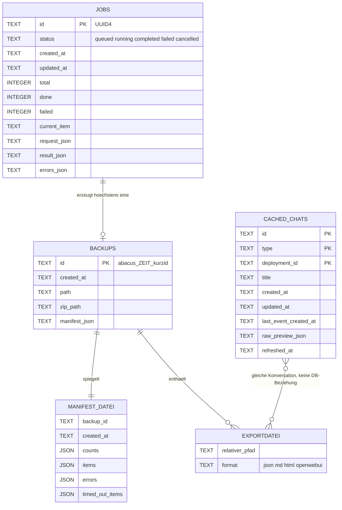

**Wichtig:** Es gibt in der Datenbank **keine einzige Fremdschlüsselbeziehung**. Die Verbindung zwischen `jobs` und `backups` besteht nur indirekt darüber, dass die Backup-ID die ersten acht Zeichen der Job-UUID enthält (`backend/app/backup_engine.py:63`, `backend/app/utils.py:21-23`). Ein `PRAGMA foreign_keys` wird nirgends gesetzt.

### Tabelle `jobs`

Zweck: Fortschritt und Ergebnis eines Backup-Laufs, überlebt einen Neustart.

| Feld | Typ | Constraints | Index | Fachliche Bedeutung |
|---|---|---|---|---|
| `id` | TEXT | PRIMARY KEY | implizit | UUID4, in `jobs.py:27` erzeugt und dem Client zurückgegeben |
| `status` | TEXT | NOT NULL | — | `queued` → `running` → `completed` \| `failed` \| `cancelled` |
| `created_at` | TEXT | NOT NULL | — | UTC-ISO-8601 ohne Mikrosekunden (`utils.py:11-12`) |
| `updated_at` | TEXT | NOT NULL | — | Bei **jedem** `update_job` neu gesetzt (`database.py:102`) |
| `total` | INTEGER | NOT NULL DEFAULT 0 | — | Anzahl aufgelöster Items zu Beginn des Laufs |
| `done` | INTEGER | NOT NULL DEFAULT 0 | — | Verarbeitete Items; Grundlage der Prozentanzeige |
| `failed` | INTEGER | NOT NULL DEFAULT 0 | — | Items ohne geschriebene Datei **oder** mit fehlgeschlagenem/abgelaufenem Detail-Abruf — seit 2026-09-29 zählt auch ein Item, für das nur eine Stub-JSON aus der Vorschau entstand, als Fehler (`backup_engine.py:93-97,177-178`) |
| `current_item` | TEXT | — | — | `"<type>:<id>"` während der Verarbeitung, sonst `NULL` |
| `request_json` | TEXT | NOT NULL | — | Der vollständige `ExportRequest` als JSON |
| `result_json` | TEXT | — | — | Bei Erfolg: `backup_id`, `backup_path`, `zip_path`, `download_url`, `timed_out_items` |
| `errors_json` | TEXT | NOT NULL DEFAULT '[]' | — | Fortlaufende Liste aller Fehlertexte des Laufs |

Beleg: `backend/app/database.py:23-35`. Die `percent`-Angabe der API ist berechnet, nicht gespeichert (`database.py:131`).

### Tabelle `backups`

Zweck: Verzeichnis aller Sicherungen mit eingebettetem Manifest.

| Feld | Typ | Constraints | Index | Fachliche Bedeutung |
|---|---|---|---|---|
| `id` | TEXT | PRIMARY KEY | implizit | `abacus_<YYYY-MM-DD>_<HH-MM-SS>_<8 Zeichen Job-ID>` |
| `created_at` | TEXT | NOT NULL | — | Zeitpunkt des Jobstarts, nicht des Abschlusses |
| `path` | TEXT | NOT NULL | — | Absoluter Pfad des Backup-Verzeichnisses |
| `zip_path` | TEXT | — | — | `NULL`, wenn der Job ohne `zip` lief; wird beim ersten Download nachgetragen (`main.py:327-328`) |
| `manifest_json` | TEXT | NOT NULL | — | Vollständiges Manifest als JSON — eine **Kopie** der Datei auf der Platte |

Beleg: `backend/app/database.py:37-43`. Die Sortierung `ORDER BY created_at DESC` läuft ohne Index über die vollständige Tabelle (`database.py:165`) — bei der zu erwartenden Zeilenzahl unkritisch.

`size_bytes` in der API-Antwort ist **nicht** gespeichert, sondern wird bei jedem Aufruf von `GET /api/backups` durch rekursives Aufsummieren des Verzeichnisses berechnet (`backend/app/utils.py:93-104`, aufgerufen in `database.py:179`). Bei vielen großen Sicherungen wird dieser Endpunkt entsprechend langsam.

### Tabelle `cached_chats`

Zweck: Zwischenspeicher der Konversationsliste, damit die Oberfläche nicht bei jedem Öffnen die Abacus-API befragen muss.

| Feld | Typ | Constraints | Index | Fachliche Bedeutung |
|---|---|---|---|---|
| `id` | TEXT | NOT NULL, Teil des PK | PK-Index | Konversations-ID aus der API |
| `type` | TEXT | NOT NULL, Teil des PK | PK-Index | `ai_chat` oder `deployment_conversation` |
| `deployment_id` | TEXT | NOT NULL DEFAULT '', Teil des PK | PK-Index | Leerstring statt `NULL`, damit der zusammengesetzte Primärschlüssel greift |
| `title` | TEXT | — | — | Anzeigename; kann **personenbezogene Inhalte** enthalten, weil Chattitel oft aus der ersten Nutzerfrage entstehen |
| `created_at` | TEXT | — | — | Rohwert aus der API, nicht normalisiert |
| `updated_at` | TEXT | — | — | Rohwert aus der API |
| `last_event_created_at` | TEXT | — | — | Zeitpunkt der letzten Nachricht |
| `raw_preview_json` | TEXT | — | — | Flache Vorschau der Rohdaten: bis zu 24 Schlüssel, Strings auf 300 Zeichen gekürzt (`utils.py:69-90`). **Kann Gesprächsinhalte enthalten** |
| `refreshed_at` | TEXT | NOT NULL | — | Zeitpunkt der letzten vollständigen Ersetzung — wird **nirgends ausgewertet** |

Beleg: `backend/app/database.py:45-56`.

**Der zusammengesetzte Primärschlüssel `(id, type, deployment_id)` entspricht exakt dem kanonischen Auswahlschlüssel des Frontends** (`frontend/src/components/ChatTable.tsx:21-23`) — dieselbe Konversations-ID unter zwei Deployments ist bewusst zwei Zeilen.

**Es gibt keine TTL.** `replace_cached_chats` löscht die Tabelle vollständig und schreibt sie neu — der einzige Auslöser ist `GET /api/chats?refresh=true` (`database.py:205-227`, `main.py:259,273`). Ohne `refresh` liefert die API den Cache unabhängig von seinem Alter und markiert das nur über die Warnung „Loaded from local cache." (`main.py:263`).

### Dateiablage je Sicherung

```text
/data/backups/abacus_2026-07-30_09-14-22_1a2b3c4d/
├── ai_chat_sessions/
│   ├── <Titel>_<kurzid>.json                 # Rohdaten, vollstaendig
│   ├── <Titel>_<kurzid>.md                   # Markdown-Transkript
│   ├── <Titel>_<kurzid>_Konversation.html    # lesbares Gespraechsprotokoll, A4-druckfaehig
│   ├── <Titel>_<kurzid>_html.html            # SDK-eigener HTML-Export (nur wenn nicht HTML-only)
│   ├── <Titel>_<kurzid>_html.meta.json       # Sidecar, wenn das SDK ein Objekt statt HTML liefert
│   └── <Titel>_<kurzid>_openwebui.json       # nur bei Format "openwebui"
├── deployment_conversations/                 # gleiche Dateistruktur
├── manifest.json                             # vollstaendige Metadaten des Laufs
├── errors.log                                # alle Fehlertexte, zeilenweise
├── index.html                                # navigierbare Uebersicht mit relativen Links
├── openwebui_import.json                     # Sammeldatei fuer Bulk-Import (nur bei "openwebui")
└── backup.zip                                # Archiv des gesamten Ordners, im Ordner selbst
```

Belege: `backend/app/backup_engine.py:64-66,90,112,119,133-137,147-156,163,209-218`; Dateinamensbildung `backend/app/backup_engine.py:288-291` mit `safe_filename` (ASCII-Normalisierung, Reduktion auf `[A-Za-z0-9_.-]`, maximal 90 Zeichen) und `short_id` (erste acht Zeichen ohne Bindestriche).

Das ZIP wird **innerhalb** des Verzeichnisses erzeugt, das es archiviert (`backend/app/exporters.py:722`); die Schleife überspringt die Zieldatei selbst (Zeile 725). Praktische Folge: Der Platzbedarf einer Sicherung ist rund das Doppelte der reinen Exportdaten.

#### Struktur von `manifest.json`

| Feld | Bedeutung |
|---|---|
| `backup_id`, `created_at`, `app`, `app_version` | Kopfdaten; `app_version` = `1.0.0` aus `models.py:9` |
| `request` | Der ursprüngliche `ExportRequest` |
| `counts` | `ai_chat`, `deployment_conversation`, `total`, `processed`, `failed`, optional `openwebui_chats` |
| `items[]` | Je Konversation: `id`, `type`, `deployment_id`, `title`, `files[]` (relative Pfade), `export_stats`, `errors[]` |
| `errors[]` | Alle Fehler des Laufs |
| `timed_out_items[]` | Items, die in einen 120-Sekunden-Timeout liefen, mit `step` (`detail` oder `html_export`) |
| `index_html` | Fest `"index.html"` |
| `openwebui_import` | Relativer Pfad der Sammeldatei, nur bei Open-WebUI-Export |

Beleg: `backend/app/backup_engine.py:177-211`.

`export_stats` je Item ist die eingebaute Vollständigkeitskontrolle: `extracted_messages`, `history_items`, `total_events`, `complete_by_total_events` und die Metadaten des Abrufs (`backend/app/exporters.py:120-138`, `backend/app/abacus_client.py:358-367`). Liegt `complete_by_total_events` auf `false`, schreibt die Engine zusätzlich einen Warntext in die Fehlerliste des Items (`backend/app/backup_engine.py:103-108`).

### Weitere persistente Dateien

| Datei | Format | Inhalt | Rechte | Beleg |
|---|---|---|---|---|
| `/data/secrets/abacus_api_key.local` | Klartext, eine Zeile | Der Abacus-API-Schlüssel | `chmod 0600`, Fehler beim Setzen werden stillschweigend ignoriert | `backend/app/security.py:35-43` |
| `/data/settings/conversation_scopes.json` | JSON | `deployment_ids`, `external_application_ids`, `conversation_types` | Standardrechte | `backend/app/local_settings.py:20-25` |

Beide Dateien werden bei jedem Schreibvorgang vollständig ersetzt; es gibt kein Merge und keine Historie.

### Migrationsmechanismus

**Keiner.** `Database.init()` führt ein einziges `executescript` mit `PRAGMA journal_mode=WAL` und drei `CREATE TABLE IF NOT EXISTS` aus (`backend/app/database.py:17-58`). Es gibt:

- kein Alembic, kein Prisma, kein EF, keine SQL-Migrationsdateien;
- keine `PRAGMA user_version`-Auswertung;
- kein `ALTER TABLE` im gesamten Repository.

**Konsequenz:** Eine bestehende Datenbank erhält bei einem Update keine neu hinzugekommenen Spalten. Der Fehler zeigt sich nicht beim Start, sondern zur Laufzeit als SQL-Fehler beim ersten Zugriff auf die fehlende Spalte. Bei einem Werkzeug, dessen Datenbank rein sekundäre Metadaten hält, ist der Ausweg allerdings billig: Datenbank löschen, Sicherungen bleiben als Dateien erhalten — nur die Backup-Liste in der Oberfläche ist dann leer.

**Seed-Daten:** Keine. Es werden keine Zeilen beim Start eingefügt.

### Zwischenspeicher

| Schicht | Inhalt | Invalidierung | TTL |
|---|---|---|---|
| SQLite `cached_chats` | Vollständige Konversationsliste | **Nur manuell** über `refresh=true`; ersetzt die Tabelle vollständig | **keine** |
| `lru_cache` auf `get_settings()` | Das eingefrorene `Settings`-Objekt | nur durch Prozessneustart | Prozesslaufzeit (`backend/app/config.py:57`) |
| `AbacusService._discovered_conversation_scopes` | Automatisch entdeckte Suchbereiche, im Prozessspeicher | Bei jedem erfolgreichen `connect_with_fallback` auf `None` gesetzt; sonst nur mit `force=True` | Prozesslaufzeit (`backend/app/abacus_client.py:157,211,226-228`) |
| `_SECRET_VALUES` | Menge registrierter Geheimnisse für die Schwärzung | **nie** — Einträge werden nur hinzugefügt, auch beim Löschen der Key-Datei nicht entfernt | Prozesslaufzeit (`backend/app/security.py:11,54-58`) |
| Browser-Zustand | Chatliste, Auswahl, Job, Backups | React-State, kein `localStorage`, kein `sessionStorage` | Seitenaufbau (`frontend/src/App.tsx:40-50`) |

Kein Redis, kein Memcached, kein HTTP-Cache-Header außer `Cache-Control: no-store` auf `/api/health`.

### Personenbezogene Daten

Dies ist der sensibelste Punkt des Projekts: Das Werkzeug speichert vollständige Chatverläufe. Was ein Nutzer je in einen KI-Chat geschrieben hat — Namen, Adressen, Gesundheits- oder Vertragsangaben, Quellcode, Geschäftsgeheimnisse — landet unverändert auf der Platte.

| Datenart | Wo gespeichert | Format | Aufbewahrung | Löschweg |
|---|---|---|---|---|
| **Vollständiger Chatverlauf** (Nutzerfragen, Antworten, Zeitstempel, Modellnamen) | `/data/backups/<id>/*/*.json`, `*.md`, `*_Konversation.html`, `*_openwebui.json`, zusätzlich im ZIP | Klartext, unverschlüsselt | **unbegrenzt** — es gibt keine Retention, keine Rotation, keinen Aufräumjob | Nur manuell: `DELETE /api/backups/{id}?confirm=true` oder Löschen des Verzeichnisses |
| **Chattitel und Vorschau** | Tabelle `cached_chats` (`title`, `raw_preview_json`) und `manifest.json` | Klartext | Bis zum nächsten `refresh=true` bzw. unbegrenzt im Manifest | Tabelle wird beim Refresh geleert; Manifest nur mit der Sicherung |
| **Metadaten** (Konversations-IDs, Deployment-IDs, Zeitstempel) | `jobs`, `backups`, `cached_chats`, `manifest.json`, `errors.log`, `index.html` | Klartext | unbegrenzt | mit der jeweiligen Sicherung |
| **Fehlertexte** (können Titel und IDs enthalten) | `errors_json` in `jobs`, `errors.log`, `index.html` | Klartext, um registrierte Geheimnisse bereinigt | unbegrenzt | mit der jeweiligen Sicherung |
| **Abacus-API-Schlüssel** | `/data/secrets/abacus_api_key.local` | Klartext, `0600` | bis zum Löschen | `DELETE /api/api-key` (`backend/app/main.py:237-240`) |
| **Basic-Auth-Zugangsdaten** | ausschließlich Prozessumgebung | Klartext | Prozesslaufzeit | Neustart mit anderer Konfiguration |

#### Bewertung des Löschkonzepts

| Anforderung | Stand |
|---|---|
| Löschung einer einzelnen Sicherung | **vorhanden** — Verzeichnis wird per `shutil.rmtree` entfernt, Datenbankeintrag gelöscht (`backend/app/main.py:336-345`) |
| Bestätigungspflicht | **vorhanden** — ohne `?confirm=true` antwortet die API mit 400 |
| Pfadprüfung vor dem Löschen | **vorhanden** — `_safe_backup_path` prüft per `relative_to`, dass der Pfad innerhalb von `/data/backups` liegt (`backend/app/main.py:414-421`) |
| Automatische Aufbewahrungsfrist | **fehlt vollständig.** Kein Höchstalter, keine Höchstzahl, kein Aufräumen beim Start |
| Löschung einzelner Konversationen aus einer Sicherung | **fehlt** — Granularität ist die gesamte Sicherung |
| Verschlüsselung at rest | **fehlt** — alle Dateien liegen im Klartext im Volume |
| Verwaiste Verzeichnisse | **werden nicht aufgeräumt.** Bricht ein Job ab, existiert das Verzeichnis bereits, der Datenbankeintrag aber noch nicht. Das Verzeichnis erscheint danach in keiner Liste und lässt sich über die API weder herunterladen noch löschen; nur `mark_interrupted_jobs` räumt die Datenbankseite auf (`backend/app/backup_engine.py:63-76` gegenüber `220-226`, `backend/app/database.py:70-87`) |
| Löschung des Chat-Caches | Indirekt über `GET /api/chats?refresh=true`; einen eigenen Endpunkt zum Leeren gibt es nicht |
| Löschung von Jobzeilen | **kein Weg.** Die Tabelle `jobs` wächst mit jedem Lauf; es gibt kein `DELETE FROM jobs` im gesamten Code |

Die rechtliche Einordnung dieser Daten — Verarbeitungszweck, Rechtsgrundlage-Kandidat, Auftragsverarbeiter — steht in [11-sicherheit-compliance.md](#verarbeitung-personenbezogener-daten).

### Nebenläufigkeit und Konsistenz

| Aspekt | Umsetzung | Beleg |
|---|---|---|
| Verbindungsmodell | Jede Operation öffnet eine **eigene** SQLite-Verbindung mit `timeout=30` und `check_same_thread=False` | `backend/app/database.py:60-63` |
| Schreibserialisierung | Ein prozessweites `RLock` um alle schreibenden Methoden | `backend/app/database.py:15,90,112,154,198,202,207` |
| Journal-Modus | WAL — Leser blockieren Schreiber nicht | `backend/app/database.py:22` |
| Transaktionsgrenzen | Implizit je `with self._connect()`-Block; es gibt keine explizite Transaktion über mehrere Methoden hinweg | durchgängig in `database.py` |
| Zweite `Database`-Instanz | Die Backup-Engine erzeugt im Worker-Thread eine **eigene** Instanz auf dieselbe Datei — mit **eigenem** Lock. Zwischen API-Thread und Worker-Thread besteht daher keine gemeinsame Sperre; die Serialisierung übernimmt allein SQLite mit `timeout=30` | `backend/app/backup_engine.py:60-61` gegenüber `backend/app/main.py:51` |
| Schreiblast | `update_job` wird je Item mehrfach aufgerufen und öffnet jedes Mal eine neue Verbindung — bei tausenden Items ebenso viele Verbindungsaufbauten | `backend/app/backup_engine.py:87,189`, `backend/app/database.py:99-113` |

### Marker in diesem Dokument

Keine — alle Aussagen sind mit Fundstelle belegt.

---

## 07 — Prozesse · app-abacus-chat-backup

Die fachlichen Hauptabläufe als Sequenzdiagramm mit Prosa, dazu Zustandsautomat, Nebenläufigkeit und Abbruchverhalten.

[← Zurück zum Index](#dokumentation--app-abacus-chat-backup)

Die Anwendung kennt **keine** zeitgesteuerten Abläufe. Jeder der folgenden Prozesse wird durch eine Aktion in der Oberfläche ausgelöst.

### Prozess 1 — Verbinden und Auflösung des API-Schlüssels

**Auslöser:** Klick auf „Connect" im Panel **Settings**, oder implizit jeder Aufruf, der eine Verbindung benötigt.

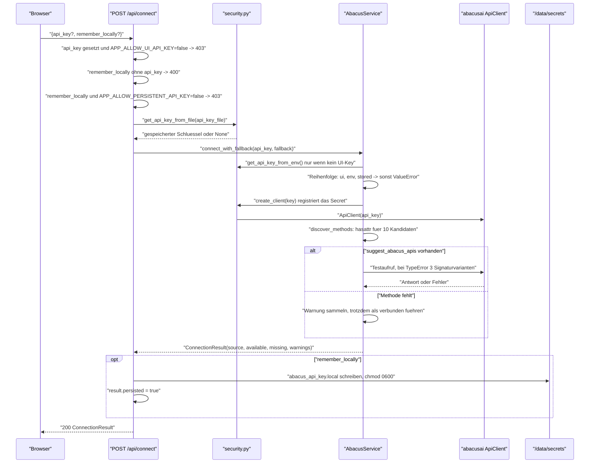

**Schritte und Datenfluss.** Die Vorrangfolge der Schlüsselquellen ist eindeutig: ein in der Oberfläche eingegebener Schlüssel schlägt die Umgebungsvariable `ABACUS_API_KEY`, diese schlägt die gespeicherte Datei (`backend/app/abacus_client.py:176-178`). Der gewählte Schlüssel wird beim Erzeugen des SDK-Clients registriert und ist ab diesem Moment aus jeder Ausgabe geschwärzt (`backend/app/security.py:69-73`).

**Verbindungstest.** Als Lebendprobe dient `suggest_abacus_apis` mit einer festen Beispielabfrage. Der erste Versuch nutzt Positionsargumente; nur bei `TypeError` werden drei benannte Varianten durchprobiert (`backend/app/abacus_client.py:187-200`). Ein anderer Fehler führt zu `RuntimeError("Abacus connection test failed: …")` und damit zu HTTP 400.

**Fehlerverhalten.** Jede Ausnahme wird durch `safe_error` geschickt, das den registrierten Schlüssel aus dem Text entfernt, den Rest aber unverändert an den Client durchreicht (`backend/app/security.py:97-98`, `backend/app/main.py:210-211`). Es gibt **keinen** Retry.

**Endzustände:** verbunden (`_client` gesetzt, `source` ∈ {`ui`, `env`, `stored`}) · nicht verbunden mit HTTP 400 · abgelehnt mit 403 wegen deaktivierter Funktion.

**Stiller Verbindungsversuch.** `GET /api/status` ruft `_try_connect_silently` auf: Existiert weder Umgebungs- noch Dateischlüssel, passiert nichts; sonst wird verbunden und jeder Fehler kommentarlos verschluckt (`backend/app/main.py:361-373`). `_ensure_connected` verhält sich gleich, meldet aber Fehler als HTTP 400 (`backend/app/main.py:348-358`).

### Prozess 2 — Konversationen auflisten und Suchbereiche ermitteln

**Auslöser:** Klick auf „Laden" oder „Aktualisieren" in der Chat-Tabelle.

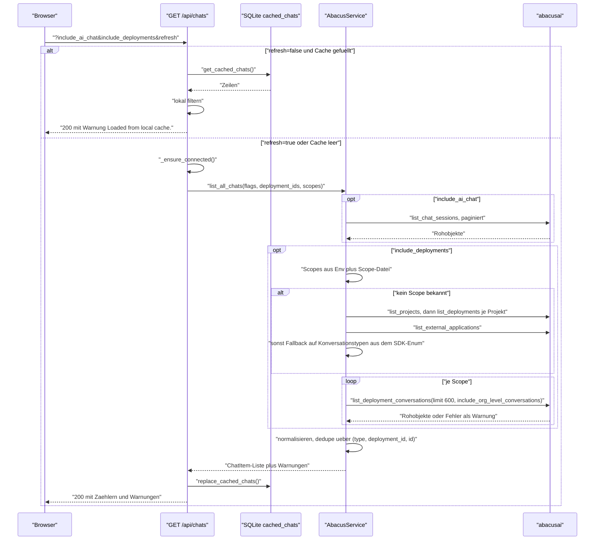

**Normalisierung.** Die Rohobjekte des SDK sind uneinheitlich benannt. Für ID, Titel, Zeitstempel und Nachrichtenzahl existiert je eine Liste von Kandidatenschlüsseln in `snake_case` und `camelCase`; der erste vorhandene gewinnt (`backend/app/abacus_client.py:26-55,504-536`). Findet sich **keine** ID, wird eine Ersatz-ID aus einem SHA-256-Digest der Vorschau gebildet und das Item als `exportable=false` markiert — es erscheint in der Liste, kann aber nicht exportiert werden (`backend/app/abacus_client.py:514-520`).

**Paginierung.** `iter_paginated_results` blättert maximal 50 Seiten weit und beendet die Schleife auf drei Wegen: über ein Fortsetzungstoken (mit Schutz gegen wiederkehrende Tokens), über ein `has_more`-Flag mit Offset-Erhöhung, oder — als Standardfall — nach der ersten Seite (`backend/app/abacus_client.py:113-147`). **Genau hier liegt das größte fachliche Risiko dieses Werkzeugs:** Liefert eine SDK-Methode eine nackte Liste ohne Token und ohne `has_more`, bricht die Schleife nach Seite 1 ab. `list_chat_sessions` wird ohne explizites `limit` aufgerufen (`backend/app/abacus_client.py:265-268`) — greift serverseitig ein Standardlimit, fehlen ältere Chats im Backup, ohne dass eine Warnung entsteht.

**Automatische Scope-Ermittlung.** Ohne vorgegebene Scopes läuft eine dreistufige Suche: erst Projekte (eine Seite, maximal 100) und dazu je Projekt die Deployments (bis fünf Seiten), dann externe Anwendungen (eine Seite), und falls beides leer bleibt, die Konversationstypen aus dem SDK-Enum als Fallback mit entsprechender Warnung (`backend/app/abacus_client.py:226-246,370-422`). Das Ergebnis wird im Prozessspeicher gehalten, bis eine neue Verbindung es zurücksetzt.

**Fehlerverhalten.** Fehler je Scope beenden den Ablauf nicht, sondern werden als Warnung gesammelt und mit der Antwort ausgeliefert (`backend/app/abacus_client.py:448-455`). Eine leere Liste mit Warnungen ist damit ein realistischer und für den Nutzer sichtbarer Ausgang.

**Endzustände:** Liste aus dem Cache · frisch geladene Liste plus ersetzter Cache · HTTP 400 bei fehlender Verbindung.

### Prozess 3 — Backup-Lauf

Der Kernprozess. **Auslöser:** Klick auf „Export starten".

```mermaid
sequenceDiagram
  participant U as "Browser"
  participant API as "POST /api/export"
  participant JM as "JobManager"
  participant EN as "run_backup_job (Worker-Thread)"
  participant SVC as "AbacusService"
  participant EX as "exporters.py"
  participant FS as "/data/backups"
  participant DB as "SQLite"

  U->>API: "ExportRequest"
  API->>API: "mode=selected ohne chat_ids -> 400; leere formats -> 400"
  API->>API: "_ensure_connected()"
  API->>JM: "start_export(request)"
  JM->>DB: "create_job(uuid, request) Status queued"
  JM->>JM: "cancel_event anlegen, asyncio.create_task"
  JM-->>API: "job_id"
  API-->>U: "200 {job_id}"

  JM->>EN: "asyncio.to_thread(run_backup_job)"
  EN->>FS: "Backup-Verzeichnis, zwei Unterordner, leere errors.log"
  EN->>DB: "Status running, current_item Loading chats"
  EN->>SVC: "_resolve_items: list_all_chats plus Auswahlfilter"
  EN->>DB: "total setzen"

  loop "je Konversation"
    EN->>EN: "cancel_event gesetzt? dann Schleife verlassen"
    EN->>DB: "current_item = type:id"
    EN->>SVC: "get_chat_detail, Timeout 120s"
    alt "Timeout"
      EN->>EN: "Fehlertext, Eintrag in timed_out_items, detail bleibt Vorschau"
    else "Fehler"
      EN->>EN: "Fehlertext, detail bleibt Vorschau"
    end
    EN->>EX: "conversation_export_stats(detail)"
    opt "complete_by_total_events = false"
      EN->>EN: "Warnung History may be incomplete"
    end
    opt "json"
      EN->>FS: "write_json, geschwaerzt"
    end
    opt "markdown"
      EN->>FS: "write_markdown aus bester Nachrichtenliste"
    end
    opt "openwebui"
      EN->>FS: "Einzeldatei schreiben, Chat fuer Sammeldatei merken"
    end
    opt "html"
      EN->>FS: "Konversation.html (lokal, ohne SDK)"
      opt "nicht HTML-only"
        EN->>SVC: "export_chat_html, Timeout 120s"
        EN->>FS: "SDK-Export bzw. meta.json"
      end
    end
    EN->>EN: "keine Datei oder Detail fehlgeschlagen? failed erhoehen"
    EN->>DB: "done, failed, errors_json aktualisieren"
  end

  EN->>FS: "manifest.json, errors.log, index.html"
  opt "zip=true"
    EN->>FS: "backup.zip im Backup-Ordner"
  end
  EN->>DB: "insert_backup, Job auf completed bzw. cancelled"
  U->>API: "GET /api/jobs/{id} im Sekundentakt bis Endzustand"
```

**Auflösung der Items.** Bei `mode=all` werden alle exportierbaren Konversationen genommen. Bei `mode=selected` wird ausschließlich über den kanonischen Schlüssel `type:deployment_id_or_empty:id` abgeglichen — eine nackte ID trifft bewusst nichts, weil dieselbe ID in mehreren Deployments vorkommen kann (`backend/app/backup_engine.py:252-267`). Die Suchbereiche stammen aus dem Request, sonst aus Umgebung und Scope-Datei (`backend/app/backup_engine.py:243-251`).

**HTML-Sonderregel.** Ist `html` das **einzige** angeforderte Format, entsteht nur das lokal erzeugte Gesprächsprotokoll `*_Konversation.html` und der SDK-Export unterbleibt. Der Grund steht als Kommentar im Code: Das Transkript wird zuerst geschrieben, damit ein hängender SDK-Export nicht verhindert, dass überhaupt eine lesbare HTML-Datei entsteht (`backend/app/backup_engine.py:142-172`).

**Nachrichtenerkennung.** Die Exporter kennen das Antwortformat nicht, sondern suchen es: `_find_message_lists` durchsucht die Struktur bis Tiefe 12 nach Listen unter zwölf bekannten Schlüsseln, bewertet jede Kandidatenliste nach Anteil an Rolle, Inhalt und Zeitstempel und nimmt die beste (`backend/app/exporters.py:731-767`). Findet sich der sichtbare Text nicht im Feld `text`, wird zusätzlich die verschachtelte `segments`-Struktur rekursiv abgeflacht (`backend/app/exporters.py:778-842`).

**Fehler- und Wiederholungsverhalten.** Es gibt **keinen** Retry. Jeder Fehler ist itembezogen: Fehlertext in die Item-Liste, Lauf geht weiter. Ein Timeout beendet nur den betroffenen Aufruf. Wiederholung ist eine **Nutzeraktion** — die Oberfläche bietet nach dem Lauf die Schaltfläche „Retry timed-out items", die einen neuen Job mit genau diesen Items startet (`frontend/src/App.tsx:161-177`).

**Fehlerzählung.** `failed` wird erhöht, wenn für ein Item keine Datei geschrieben wurde **oder** der Detailabruf scheiterte bzw. in den Timeout lief (`backend/app/backup_engine.py:93-97,177-178`, Flag `detail_ok`). Bis zum QA-Audit am 2026-09-29 zählte ein Item mit bloßer Stub-JSON aus der Vorschau als Erfolg; dieser blinde Fleck ist behoben.

**Abbruch mitten im Lauf.** Das Abbruchflag wird **zwischen** zwei Items geprüft (`backend/app/backup_engine.py:85-86`); das laufende Item wird zu Ende verarbeitet. Nach dem Verlassen der Schleife läuft der reguläre Abschluss vollständig durch: Manifest, Fehlerprotokoll, Übersichtsseite, ZIP und Datenbankeintrag entstehen auch bei `cancelled` (`backend/app/backup_engine.py:191-234`). **Ein abgebrochener Lauf hinterlässt also eine gültige, aber unvollständige Sicherung.**

**Prozessabbruch mitten im Lauf.** Stirbt der Container, bleibt das Verzeichnis ohne Datenbankeintrag zurück und ist über die API weder sichtbar noch löschbar; der Job wird beim nächsten Start auf `failed` gesetzt (`backend/app/database.py:70-87`). Details in [10-betrieb.md](#störungsbilder).

**Endzustände:** `completed` · `cancelled` · `failed` (Ausnahme außerhalb der Item-Schleife, `backend/app/backup_engine.py:235-237`).

### Prozess 4 — Sicherung herunterladen und löschen

**Auslöser:** Klick auf „Download" oder „Löschen" in der Backup-Historie.

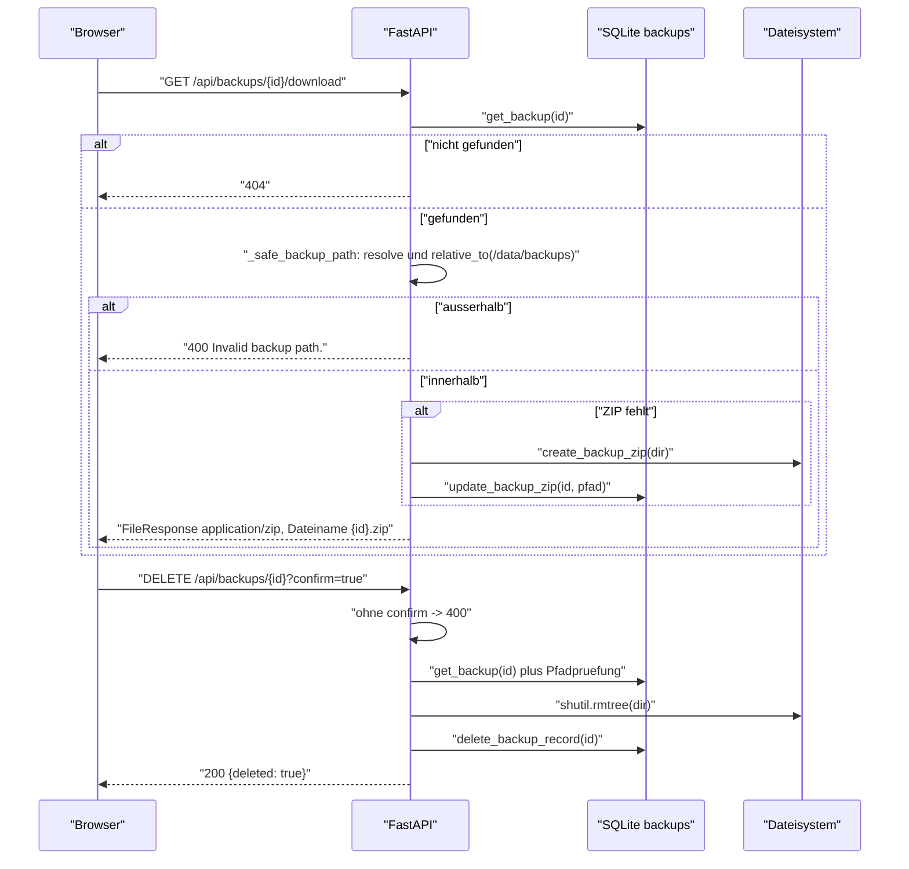

**Nachträgliche ZIP-Erzeugung.** Lief der Job mit `zip: false`, entsteht das Archiv beim ersten Download — synchron, im Request. Bei einer großen Sicherung blockiert dieser Request entsprechend lange; es gibt weder Fortschrittsanzeige noch Timeout (`backend/app/main.py:325-328`).

**Pfadschutz.** Beide Endpunkte prüfen den in der Datenbank gespeicherten Pfad gegen das Backup-Wurzelverzeichnis, bevor sie ihn benutzen. Da die Backup-ID nur als Datenbankschlüssel und nie als Pfadbestandteil aus dem Request verwendet wird, ist Path Traversal über die URL nicht möglich (`backend/app/main.py:406-421`).

**Fehler- und Endzustände:** Datei geliefert · 404 unbekannte ID · 400 Pfadprüfung fehlgeschlagen · 400 fehlende Bestätigung. Ein Löschen entfernt Verzeichnis **und** Datenbankeintrag; ein Restore aus dem Papierkorb existiert nicht.

### Zustandsautomat eines Jobs

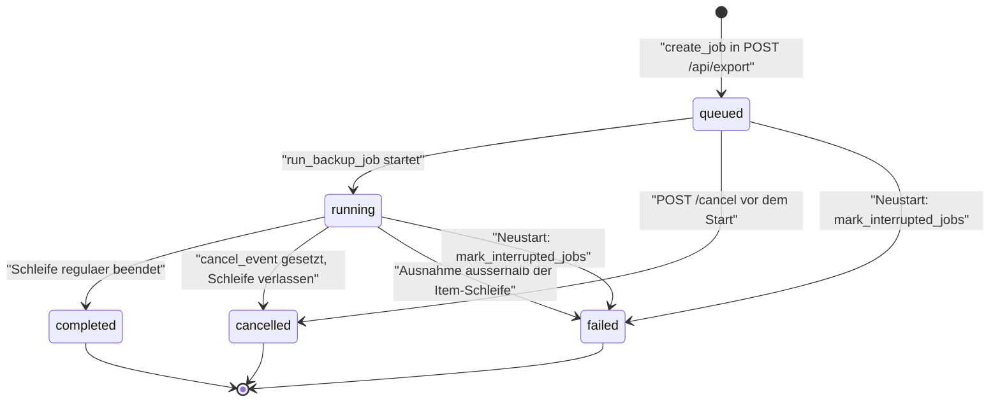

| Übergang | Auslöser | Beleg |
|---|---|---|
| → `queued` | `create_job` beim Anlegen | `backend/app/database.py:88-97` |
| `queued` → `running` | Erstes `update_job` in der Engine | `backend/app/backup_engine.py:77` |
| `running` → `completed` | Schleife regulär beendet | `backend/app/backup_engine.py:191,234` |
| `*` → `cancelled` | `POST /api/jobs/{id}/cancel` setzt Flag **und** schreibt den Status direkt, wenn der Job noch `queued` oder `running` ist | `backend/app/jobs.py:51-60` |
| `running` → `failed` | Ausnahme außerhalb der Item-Schleife oder Laufzeitfehler im Task | `backend/app/backup_engine.py:235-237`, `backend/app/jobs.py:38-40` |
| `queued`/`running` → `failed` | Prozessneustart | `backend/app/database.py:70-87` |
| Endzustände | Kein Übergang aus `completed`, `failed` oder `cancelled` heraus — es gibt kein Reaktivieren | kein entsprechender Code |

**Beobachtung zum Abbruch:** `cancel_job` setzt den Status sofort auf `cancelled`, während der Worker-Thread noch am aktuellen Item arbeitet und anschließend Manifest, ZIP und Datenbankeintrag schreibt. Die Oberfläche zeigt den Job also als abgebrochen, bevor er tatsächlich beendet ist. Da der Abschlussblock den Status ein zweites Mal setzt (`backend/app/backup_engine.py:191,234`), bleibt der Endwert konsistent `cancelled`.

### Hintergrundjobs und Zeitpläne

**Es gibt keine.** Kein Cron, kein `BackgroundTasks`, kein Scheduler, kein periodischer Task. Die einzige wiederkehrende Aktivität sind zwei externe Poller:

| Poller | Intervall | Ziel | Beleg |
|---|---|---|---|
| Browser-Jobpolling | 1 Sekunde, nur bei nicht-terminalem Job | `GET /api/jobs/{id}` | `frontend/src/App.tsx:84-96` |
| Container-Healthcheck | 30 Sekunden, Timeout 3 s, 3 Versuche, Start-Karenz 20 s | `GET /api/health` | `Dockerfile:32-33`, `compose.yaml:24-29` |

### Queues, Worker und Nebenläufigkeit

| Aspekt | Umsetzung | Konsequenz |
|---|---|---|
| Queue | **Keine.** `start_export` legt sofort einen `asyncio`-Task an (`backend/app/jobs.py:31-33`) | Mehrere gleichzeitig gestartete Exporte laufen **parallel** — es gibt keine Begrenzung auf einen Job |
| Worker | Ein Thread je Job über `asyncio.to_thread` (`backend/app/jobs.py:37`) | Der Standard-Threadpool von `asyncio` begrenzt die Zahl paralleler Läufe indirekt |
| Geteilter Zustand | Alle Läufe nutzen **denselben** `AbacusService` und damit denselben SDK-Client (`backend/app/main.py:52`, `backend/app/jobs.py:19`) | `last_warnings` und `_discovered_conversation_scopes` werden von parallelen Läufen gegenseitig überschrieben |
| Locking | Ein `RLock` je `Database`-Instanz — API und Worker halten **verschiedene** Instanzen (`backend/app/backup_engine.py:60`) | Die eigentliche Serialisierung übernimmt SQLite selbst mit `timeout=30` |
| Timeout je SDK-Aufruf | Eigener `ThreadPoolExecutor` mit 120 s (`backend/app/backup_engine.py:14-28`) | Hängende Aufrufe blockieren den Lauf nicht |
| Executor-Aufräumen | Seit 2026-09-29 im `finally`: `shutdown(wait=False, cancel_futures=True)` bei Erfolg, Timeout und SDK-Fehler (`backend/app/backup_engine.py:25-28`) | Kein Executor-Leck mehr; ein hängender Worker-Thread blockiert den Job nicht |
| Abbruchsignal | `threading.Event` je Job, zwischen den Items geprüft | Feinere Granularität als das Item gibt es nicht |

### Transaktions- und Konsistenzgrenzen

| Grenze | Verhalten |
|---|---|
| Datenbank ↔ Dateisystem | **Nicht transaktional.** Das Verzeichnis entsteht am Anfang, der Datenbankeintrag am Ende. Dazwischen ist der Zustand inkonsistent |
| Einzelne Datenbankoperation | Implizite Transaktion je `with`-Block; ein `update_job` ist atomar |
| Fortschritt | Nach jedem Item geschrieben — nach einem Absturz ist der zuletzt gemeldete Stand korrekt, aber der Job gilt trotzdem als `failed` |
| Cache-Ersetzung | `DELETE` und Neubefüllung laufen in **einem** `with`-Block unter dem Lock und sind damit atomar (`backend/app/database.py:205-227`) |
| Scope-Datei | Wird vollständig überschrieben; ein Absturz mitten im Schreiben kann eine unvollständige JSON-Datei hinterlassen. `safe_json_loads` fängt das beim Lesen ab und liefert Standardwerte (`backend/app/utils.py:37-43`) |

### Marker in diesem Dokument

Keine — alle Aussagen sind mit Fundstelle belegt.

---

## 08 — Konfiguration · app-abacus-chat-backup

Vollständige Liste der Umgebungsvariablen, Konfigurationsquellen und deren Vorrang, Feature-Flags und Unterschiede zwischen den Umgebungen.

[← Zurück zum Index](#dokumentation--app-abacus-chat-backup)

### Vollständige Env-Variablen-Tabelle

Ermittelt durch vollständigen Grep über `os.getenv`, `os.environ`, `import.meta.env` und `process.env` im gesamten Repository sowie über die `environment`- und `labels`-Blöcke der Compose-Datei und die `ENV`-Zeilen des Dockerfiles. Das Frontend liest **keine** Umgebungsvariable — der Grep über `frontend/src/` liefert keinen Treffer.

| Name | Pflicht | Default | Typ / Format | Wirkung | Secret | Fundstelle |
|---|---|---|---|---|---|---|
| `ABACUS_API_KEY` | nein¹ | leer | String | API-Schlüssel für Abacus.AI. Zweitrangig hinter einem in der Oberfläche eingegebenen Schlüssel, vorrangig vor der gespeicherten Datei | **ja** | `backend/app/security.py:15`, `compose.yaml:13` |
| `ABACUS_DEPLOYMENT_IDS` | nein | leer | Liste, getrennt durch Leerzeichen, Komma oder Semikolon | Schränkt die Suche auf bestimmte Deployments ein und unterdrückt damit die automatische Discovery | nein | `backend/app/config.py:71`, `backend/app/utils.py:46-50`, `compose.yaml:14` |
| `ABACUS_EXTERNAL_APPLICATION_IDS` | nein | leer | Liste wie oben | Schränkt auf bestimmte externe Anwendungen ein | nein | `backend/app/config.py:72`, `compose.yaml:15` |
| `ABACUS_CONVERSATION_TYPES` | nein | leer | Liste wie oben | Schränkt auf bestimmte Konversationstypen ein (z. B. `CHATLLM`) | nein | `backend/app/config.py:73`, `compose.yaml:16` |
| `APP_DATA_DIR` | nein | `/data` | Absoluter Pfad | **Wurzel aller Daten.** Davon abgeleitet: `app.db`, `backups/`, `secrets/abacus_api_key.local`, `settings/conversation_scopes.json` | nein | `backend/app/config.py:59-67`, `compose.yaml:17` |
| `APP_STATIC_DIR` | nein | `/app/static` | Absoluter Pfad | Verzeichnis des React-Bundles. Existiert es nicht, liefert die Anwendung **nur** die API aus — ohne Oberfläche und ohne SPA-Fallback | nein | `backend/app/config.py:68`, `backend/app/main.py:431`, `Dockerfile:13` |
| `APP_ALLOW_UI_API_KEY` | nein | `true` | Boolean² | `false` lehnt jeden in der Oberfläche eingegebenen Schlüssel mit HTTP 403 ab; nutzbar sind dann nur Umgebung und gespeicherte Datei | nein | `backend/app/config.py:69`, `backend/app/main.py:194-195`, `compose.yaml:18` |
| `APP_ALLOW_PERSISTENT_API_KEY` | nein | `true` | Boolean² | `false` verbietet das Ablegen des Schlüssels als Datei (HTTP 403) und blendet die Option in der Oberfläche aus | nein | `backend/app/config.py:70`, `backend/app/main.py:198-199`, `frontend/src/components/ApiKeyPanel.tsx:124`, `compose.yaml:19` |
| `APP_BASIC_AUTH_USER` | **bedingt**³ | leer | String | Benutzername der HTTP-Basic-Auth | **ja** | `backend/app/config.py:74`, `compose.yaml:20` |
| `APP_BASIC_AUTH_PASSWORD` | **bedingt**³ | leer | String | Passwort der HTTP-Basic-Auth | **ja** | `backend/app/config.py:75`, `compose.yaml:21` |
| `APP_COMMIT` | nein | nicht gesetzt | String | Wird unverändert als Feld `commit` in `GET /api/health` ausgegeben. Fehlt die Variable, entfällt das Feld — es wird **nie** erfunden | nein | `backend/app/main.py:65` |
| `GIT_COMMIT` | nein | nicht gesetzt | String | Ausweichname für `APP_COMMIT`; `APP_COMMIT` hat Vorrang | nein | `backend/app/main.py:65` |
| `APP_VERSION` | nein | `dev` | String | **Wird von der Anwendung nicht gelesen.** Dient ausschließlich der Interpolation des Docker-Labels `homelab.version` für das HomeLAB_UX-Dashboard | nein | `compose.yaml:39` |
| `PYTHONDONTWRITEBYTECODE` | nein | `1` (im Image) | Boolean | Verhindert `.pyc`-Dateien im Container | nein | `Dockerfile:11` |
| `PYTHONUNBUFFERED` | nein | `1` (im Image) | Boolean | Ungepufferte Ausgabe, damit Logzeilen sofort in `docker logs` erscheinen | nein | `Dockerfile:12` |

¹ Nicht Pflicht im Sinne des Starts — die Anwendung startet ohne Schlüssel. Ohne **irgendeine** Schlüsselquelle scheitert jedoch jeder Aufruf, der Daten von Abacus.AI benötigt, mit HTTP 400 („No Abacus.AI API key available.", `backend/app/abacus_client.py:179-180`).

² Als wahr gelten `1`, `true`, `yes`, `y`, `on` — case-insensitiv nach `strip()`. **Jeder andere Wert gilt als falsch**, auch ein Tippfehler wie `ture`. Es gibt keine Validierung und keine Warnung (`backend/app/config.py:50-54`).

³ Entweder **beide** oder **keine**. Ist genau eine der beiden gesetzt, bricht der Startup-Hook mit `RuntimeError` ab und der Container startet nicht (`backend/app/main.py:115-125`). Sind beide leer, ist die gesamte API ohne Anmeldung erreichbar — dann protokolliert die Anwendung beim Start eine Warnung (`backend/app/main.py:129-132`).

### Konfigurationsquellen und Vorrang

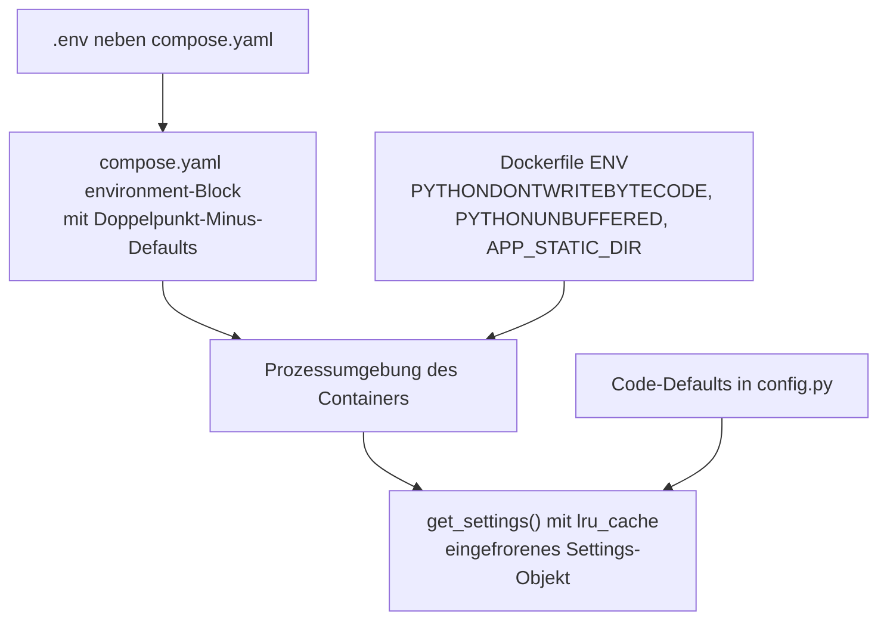

**Vorrangreihenfolge, von stark nach schwach:**

1. Explizit gesetzte Prozessumgebung (`docker run -e …`, Shell-Export bei lokalem Start).
2. `environment`-Block der Compose-Datei; die Form `${VAR:-default}` zieht dabei den Wert aus einer `.env` **neben** der Compose-Datei (`compose.yaml:12-21`).
3. `ENV`-Zeilen des Dockerfiles — sie greifen nur, wenn Compose die Variable nicht überschreibt (`Dockerfile:11-13`).
4. Code-Defaults in `backend/app/config.py:59-75`.

**Wichtige Eigenheit:** `get_settings()` trägt `@lru_cache(maxsize=1)` und liefert ein `@dataclass(frozen=True)` (`backend/app/config.py:11,57`). Die Konfiguration wird also **einmal** beim ersten Zugriff gelesen und ist danach unveränderlich. Es gibt kein Reload zur Laufzeit — jede Änderung erfordert einen Neustart des Prozesses.

**Die `.env`-Datei wird nicht von der Anwendung gelesen.** Es gibt kein `python-dotenv`-Aufruf im Code; das Paket kommt nur als Extra von `uvicorn[standard]` mit. Die `.env` wird ausschließlich von Docker Compose ausgewertet. Wer die Anwendung ohne Compose startet, muss die Variablen selbst in die Umgebung bringen.

### Konfiguration über Dateien

Zwei Einstellungen liegen nicht in der Umgebung, sondern als Dateien im Datenverzeichnis:

| Datei | Inhalt | Geschrieben durch | Beleg |
|---|---|---|---|
| `<APP_DATA_DIR>/secrets/abacus_api_key.local` | API-Schlüssel im Klartext, `chmod 0600` | `POST /api/connect` mit `remember_locally: true`; gelöscht durch `DELETE /api/api-key` | `backend/app/security.py:35-51` |
| `<APP_DATA_DIR>/settings/conversation_scopes.json` | `{"deployment_ids": [], "external_application_ids": [], "conversation_types": []}` | `PUT /api/conversation-scopes` | `backend/app/local_settings.py:12-25` |

#### Zusammenführung der Suchbereiche

Umgebungsvorgaben und Dateiinhalt **konkurrieren nicht, sondern addieren sich**. `merge_scope_summaries` vereinigt beide Quellen und entfernt Duplikate unter Beibehaltung der Reihenfolge (`backend/app/local_settings.py:28-39`, aufgerufen in `backend/app/main.py:218,376-378`). Eine Einschränkung über die Oberfläche kann eine Umgebungsvorgabe daher **nicht aufheben**, nur erweitern.

Die automatische Discovery greift nur, wenn nach dieser Vereinigung **kein einziger** Scope vorliegt (`backend/app/main.py:219-224`, `backend/app/abacus_client.py:278-288`). Wer also eine einzige Deployment-ID setzt, schaltet die Discovery für alle anderen ab.

### Feature-Flags

| Flag | Wirkung bei `false` | Standard |
|---|---|---|
| `APP_ALLOW_UI_API_KEY` | Die Eingabe eines Schlüssels über die Oberfläche wird mit HTTP 403 abgelehnt. Sinnvoll, wenn der Schlüssel ausschließlich über die Umgebung kommen soll | `true` |
| `APP_ALLOW_PERSISTENT_API_KEY` | Der Schlüssel darf nicht als Datei abgelegt werden (HTTP 403); die Oberfläche blendet das Kontrollkästchen aus, weil `StatusResponse.allow_persistent_api_key` mitgeliefert wird | `true` |

Weitere Flags gibt es nicht. Insbesondere sind die abgeschaltete API-Dokumentation, die Security-Header und die Basic-Auth-Ausnahme für `/api/health` **fest verdrahtet** und nicht konfigurierbar (`backend/app/main.py:59,66-68,73-84`).

### Unterschiede zwischen den Umgebungen

Es gibt **keine** getrennten Compose-Dateien für Entwicklung und Produktion — `compose.yaml` ist die einzige. Die Unterschiede ergeben sich aus dem Startweg:

| Aspekt | Container (`compose.yaml`) | Lokale Entwicklung (`README.md:48-66`) |
|---|---|---|
| Datenverzeichnis | `/data` im Volume `abacus_backup_data` | `/data` **relativ zur Laufwerkswurzel**, weil der Default greift. Unter Windows entsteht dadurch `C:\data`. **`APP_DATA_DIR` sollte lokal gesetzt werden** |
| Statisches Bundle | `/app/static`, im Image erzeugt | `/app/static` existiert nicht → die Oberfläche wird **nicht** ausgeliefert; stattdessen läuft der Vite-Dev-Server auf Port 5173 und leitet `/api` per Proxy auf `127.0.0.1:8080` (`frontend/vite.config.ts:6-11`) |
| Port | `127.0.0.1:8080` | Backend 8000 bei `uvicorn app.main:app --reload` ohne Portangabe, Frontend 5173 — der Vite-Proxy zeigt allerdings fest auf **8080**, weshalb `--port 8080` beim lokalen Backend nötig ist |
| Basic-Auth | über `.env` steuerbar | nur über Shell-Variablen |
| Härtung | `no-new-privileges`, unprivilegierter Benutzer, Loopback-Bindung | keine |

### Erzeugte `.env.example`

Im Projektwurzelverzeichnis existierte bereits eine `.env.example` mit acht der 13 relevanten Variablen. Sie wurde **nicht verändert**; die fehlenden Einträge sind in einem klar abgegrenzten Abschnitt **am Dateiende** ergänzt worden (`.env.example`, Abschnitt „Ergänzt am 2026-07-30"):

| Ergänzt | Grund |
|---|---|
| `APP_DATA_DIR` | Für den Betrieb ohne Compose zwingend zu setzen, sonst landen Daten in `/data` bzw. `C:\data` |
| `APP_STATIC_DIR` | Steuert, ob die Oberfläche überhaupt ausgeliefert wird |
| `APP_COMMIT` | Optionale Build-Metadaten in `/api/health` |
| `GIT_COMMIT` | Ausweichname für `APP_COMMIT` |
| `APP_VERSION` | Compose-Label `homelab.version`; wird von der Anwendung nicht gelesen |

Die Datei enthält **keine** echten Werte — alle Secret-Felder sind leer.

### Marker in diesem Dokument

Keine — alle Variablen sind mit Fundstelle belegt.

---

## 09 — Build und Deployment · app-abacus-chat-backup

Lokales Setup als kopierbare Befehlsfolge, Buildprozess, Artefakte, CI/CD-Stand, Deployment und Rollback.

[← Zurück zum Index](#dokumentation--app-abacus-chat-backup)

### Lokales Setup — Weg 1: Docker Compose (empfohlen)

```bash
# 1. Repository klonen und in das Projekt wechseln
git clone <REPO_URL> && cd app-abacus-chat-backup

# 2. Konfiguration vorbereiten (KEINE echten Werte einchecken)
cp .env.example .env
#    Mindestens setzen, sobald der Dienst ueber Loopback hinaus erreichbar sein soll:
#    APP_BASIC_AUTH_USER und APP_BASIC_AUTH_PASSWORD -- beide oder keine.
#    ABACUS_API_KEY kann leer bleiben; der Schluessel laesst sich auch in der UI eingeben.

# 3. Compose-Datei pruefen (offline, kein Build)
docker compose -f compose.yaml config -q

# 4. Bauen und starten (benoetigt Netzwerk fuer npm ci und pip install)
docker compose up -d --build

# 5. Bereitschaft pruefen
docker compose ps                       # STATUS soll "healthy" zeigen
curl -fsS http://127.0.0.1:8080/api/health

# 6. Oberflaeche oeffnen
#    http://127.0.0.1:8080
```

**Verifikationsstand der einzelnen Schritte:**

| Schritt | Ausgeführt? | Ergebnis |
|---|---|---|
| 3 — `docker compose config -q` | **ja**, am 2026-07-30 | fehlerfrei; die Compose-Datei ist gültig |
| 4 — `docker compose up -d --build` | **nein** | Der Build ruft `npm ci` (`Dockerfile:5`) und `pip install` (`Dockerfile:17`) auf. Netzwerkzugriff zum Auflösen von Abhängigkeiten ist für diese Dokumentation ausgeschlossen |
| 5/6 | **nein** | setzen Schritt 4 voraus |
| Syntaxprüfung des Backends | **ja**, am 2026-07-30 | Alle zwölf Dateien unter `backend/app/` sind syntaktisch gültiges Python (AST-Parse ohne Fehler) |

### Lokales Setup — Weg 2: ohne Docker

Diese Variante braucht **zwei** Prozesse. Sie weicht in einem Punkt von `README.md:48-66` ab: Der Vite-Proxy zeigt fest auf Port **8080** (`frontend/vite.config.ts:9`), das Backend muss also auf 8080 laufen — mit `uvicorn app.main:app --reload` allein startet es auf 8000.

```bash
# Terminal 1 -- Backend
cd backend
python -m venv .venv
source .venv/bin/activate            # Windows: .venv\Scripts\Activate.ps1
pip install -r requirements.txt      # benoetigt Netzwerk
export APP_DATA_DIR="$PWD/../.localdata"   # sonst schreibt die App nach /data bzw. C:\data
uvicorn app.main:app --reload --port 8080

# Terminal 2 -- Frontend (Dev-Server mit /api-Proxy auf 127.0.0.1:8080)
cd frontend
npm ci                               # benoetigt Netzwerk; nutzt package-lock.json
npm run dev
#    Oberflaeche: http://localhost:5173
```

Wer die Oberfläche **aus dem Backend heraus** ausliefern will statt über den Dev-Server, baut das Bundle und zeigt `APP_STATIC_DIR` darauf:

```bash
cd frontend && npm run build          # erzeugt frontend/dist
export APP_STATIC_DIR="$PWD/dist"     # Backend liefert dann /assets und den SPA-Fallback
```

Belege: `frontend/package.json:7-9`, `backend/app/config.py:59,68`, `backend/app/main.py:431-448`.

### Buildprozess und Artefakte

| Artefakt | Erzeugt durch | Inhalt | Beleg |
|---|---|---|---|
| `frontend/dist/` | `npm run build` = `tsc -b && vite build` | `index.html` plus `assets/index-*.js` und `assets/index-*.css` mit Content-Hash im Namen (lokal erzeugt, nicht versioniert) | `frontend/package.json:8` |
| Container-Image | `docker compose build` bzw. `docker build .` | Zwei Stages: Node-Build, dann Python-Runtime mit kopiertem Bundle | `Dockerfile:1-35` |
| Backup-ZIPs | Zur Laufzeit je Sicherung | Nutzdaten, kein Build-Artefakt | `backend/app/exporters.py:720-728` |

**Der Typecheck ist Teil des Builds.** `tsc -b` läuft mit `strict: true` vor `vite build`; ein Typfehler bricht den Image-Build ab (`frontend/tsconfig.json:10`, `frontend/package.json:8`).

**`frontend/dist/` wird nicht versioniert und nicht ausgeliefert.** `dist/` steht in der `.gitignore` (`.gitignore:4`) und ist nicht mehr im Repository (Stand 2026-09-29, `git ls-files frontend/dist` leer); die `.dockerignore` schließt das Verzeichnis zusätzlich aus (`.dockerignore:6`), damit im Image garantiert der frisch gebaute Stand landet.

### CI/CD

**Nicht vorhanden.** Es existiert weder `.github/workflows/` noch `.gitea/workflows/` noch `azure-pipelines.yml`, `Jenkinsfile`, `.gitlab-ci.yml` oder ein Pre-Commit-Hook. Es gibt entsprechend:

- keinen automatischen Build,
- keinen automatischen Test (es gibt auch keine Tests),
- keinen Image-Push in eine Registry,
- keine benötigten CI-Secrets.

**Konsequenz:** Jeder Build entsteht lokal auf dem Rechner des Betreibers; es gibt keinen nachvollziehbaren, zentral erzeugten Artefaktstand. **Handlungsoption:** Ein minimaler Workflow mit `docker build` und — sobald Tests existieren — `pytest` würde bereits die drei im projekteigenen Review genannten Fehlerklassen abfangen (`todo2026.md`, Abschnitt „Niedrig", Eintrag „Keine Tests, keine CI").

### Zielumgebungen und Deployment-Verfahren

| Aspekt | Stand |
|---|---|
| Zielumgebung | **Eine:** der Rechner des Betreibers, per Docker Compose. `SECURITY.md:18` bezeichnet die Anwendung ausdrücklich als lokal zu betreibendes Werkzeug |
| Image-Herkunft | `build: .` — lokal gebaut, **kein** Tag aus einer Registry (`compose.yaml:3`) |
| Orchestrierung | Docker Compose, ein Dienst. Kein Kubernetes-Manifest, kein Helm-Chart |
| Infrastructure as Code | **Keines.** Kein Terraform, kein Ansible, kein Pulumi im Projekt |
| Netzexposition | Portmapping `127.0.0.1:8080:8080` — Loopback des Hosts (`compose.yaml:9`) |
| Reverse-Proxy | Nicht Teil des Projekts; im Compose-Kommentar als Alternative zur Basic-Auth genannt (`compose.yaml:6-8`) |
| Neustartverhalten | **Keine `restart`-Policy.** Nach einem Host-Neustart läuft der Container nicht von selbst wieder an |
| Registry-Integration | keine |

#### Deployment-Ablauf für eine neue Version

```bash
git pull
docker compose up -d --build          # baut neu und ersetzt den Container
docker compose ps                     # auf "healthy" warten
docker compose logs -f --tail 50      # Startmeldungen pruefen, insbesondere den Auth-Status
```

Das Volume `abacus_backup_data` bleibt dabei erhalten — Sicherungen, Datenbank, API-Key-Datei und Scope-Datei überleben das Deployment (`compose.yaml:22-23,44-45`).

**Vor jedem Deployment prüfen:** Ist `APP_BASIC_AUTH_USER` gesetzt, muss auch `APP_BASIC_AUTH_PASSWORD` gesetzt sein — sonst startet der Container gar nicht, sondern beendet sich mit `RuntimeError` (`backend/app/main.py:115-125`). Das ist beabsichtigtes Fail-fast, überrascht aber, wenn man es nicht kennt.

### Rollback

Es gibt keinen automatisierten Rückweg. Belegbare Vorgehensweise:

```bash
# 1. Auf den letzten funktionierenden Stand zurueck
git log --oneline -10
git checkout <commit-hash>

# 2. Neu bauen und ersetzen
docker compose up -d --build

# 3. Pruefen
curl -fsS http://127.0.0.1:8080/api/health
```

| Rollback-Aspekt | Bewertung |
|---|---|
| Anwendungscode | **unkritisch** — der Container ist zustandslos; alles Persistente liegt im Volume |
| Datenbankschema | **unkritisch in der Praxis.** Es gibt keine Migrationen, also auch keine Rückmigration. Ein älterer Code kann allerdings mit einer neueren Datenbank in Konflikt geraten, wenn zwischenzeitlich Spalten hinzugekommen wären (`backend/app/database.py:17-58`) |
| Sicherungen | **unberührt** — reine Dateien im Volume, unabhängig von der Codeversion lesbar |
| Notfallweg ohne Anwendung | Volume-Inhalt direkt kopieren, siehe [10-betrieb.md](#backup-und-restore) |
| Image-Rollback über Tag | **nicht möglich** — es gibt kein Registry-Image und keine versionierten Tags |

### Versionierung und Release-Konvention

| Element | Stand | Beleg |
|---|---|---|
| Anwendungsversion | `APP_VERSION = "1.0.0"`, **fest im Quellcode**. Erscheint in `GET /api/health`, im Backup-Manifest und auf der Backup-Übersichtsseite | `backend/app/models.py:9`, `backend/app/main.py:177`, `backend/app/backup_engine.py:200` |
| Frontend-Version | `1.0.0` in `frontend/package.json:3` — **manuell** mit der Backend-Version synchron zu halten; es gibt keinen Mechanismus dafür | `frontend/package.json:3` |
| Changelog | `CHANGELOG.md` im Keep-a-Changelog-Format mit `[Unreleased]`-Abschnitt und `[1.0.0] — 2026-05-08` | `CHANGELOG.md:1-40` |
| SemVer | Als Konvention erkennbar (`SECURITY.md:5` verspricht Fixes für „die aktuelle Minor-Version der 1.x-Linie"), aber nirgends automatisiert | `SECURITY.md:5` |
| Git-Tags | **keine** — `git tag -l` liefert am 2026-09-29 nichts, obwohl `CHANGELOG.md` ein `[1.0.0] — 2026-05-08` führt | `git tag -l` |
| Release-Artefakt | Keines. Es gibt keinen Release-Prozess, der ein Image oder Archiv erzeugt | — |

Der `[Unreleased]`-Abschnitt des Changelogs enthält bereits zahlreiche Einträge (Timeout-Behandlung, Retry-Schaltfläche, Export-Reihenfolge, Dokumentation, die Fehlerbehebungen aus dem QA-Audit 2026-09-29) — die Version im Code steht dennoch unverändert auf `1.0.0`. Wer aus `/api/health` auf den Funktionsstand schließt, liegt daneben.

### Build- und Testergebnis (QA-Audit 2026-09-29)

Die im Juli nur im Arbeitsverzeichnis liegenden Härtungen (`USER app`, Loopback-Bindung, `no-new-privileges`, Security-Header, `_check_auth_config()`, abgeschaltete `/docs`) sind inzwischen **committet**; der Arbeitsbaum war zum Audit sauber (`PROJEKTSTAND.md`, Abschnitt „Aktivität").

| Prüfung | Ergebnis 2026-09-29 | Beleg |
|---|---|---|
| Testsuite | **nicht vorhanden** — kein Testverzeichnis, keine CI | `PROJEKTSTAND.md`, Abschnitt „Build/Test" |
| `python -m compileall backend/app` | grün | ebd. |
| Smoke-Skript (venv mit FastAPI) gegen die im Audit geänderten Funktionen: Diamant und Zyklus im Export, Basic-Auth mit Umlauten, Timeout/Fehler/Erfolg in `_call_with_timeout` | grün | ebd. |
| Frontend-Build | **nicht verifiziert** — im Audit nicht ausgeführt | ebd. |
| Image-Build | **nicht verifiziert** | — |

Im Audit behoben (Code-Commit `cf227a3`): Executor-Leck in `_call_with_timeout` (`backend/app/backup_engine.py:14-28`), Fehlerzählung bei fehlgeschlagenem Detail-Abruf (`backend/app/backup_engine.py:93-97,177-178`), UTF-8-Bytevergleich in `basic_auth_matches` (`backend/app/security.py:111-114`) und pfadbezogenes `seen` im Export (`backend/app/exporters.py:57-66`).

### Marker in diesem Dokument

Keine. Der frühere Marker zu Git-Release-Tags ist seit 2026-09-29 geschlossen (es gibt keine Tags).

---

## 10 — Betrieb · app-abacus-chat-backup

Logging, Health, Sicherung und Wiederherstellung der Anwendungsdaten, Störungsbilder, Wartung und Skalierungsgrenzen.

[← Zurück zum Index](#dokumentation--app-abacus-chat-backup)

### Logging

| Aspekt | Stand | Beleg |
|---|---|---|
| Framework | Python-`logging` mit `logging.getLogger("app")` — **ohne jede Konfiguration**. Es wird kein Handler, kein Level und kein Formatter gesetzt, also greift die Standardkonfiguration von Uvicorn | `backend/app/main.py:55` |
| Format | Klartext im Uvicorn-Standardformat; **kein** JSON, keine Korrelations-ID, kein strukturiertes Feld | keine Formatter-Konfiguration im Repository |
| Ziel | stdout/stderr des Containers, abrufbar über `docker compose logs` | `PYTHONUNBUFFERED=1` in `Dockerfile:12` sorgt für sofortige Ausgabe |
| Was tatsächlich geloggt wird | **Genau zwei Zeilen, beide beim Start:** `INFO` „Basic auth ACTIVE (public paths: /api/health)." oder `WARNING` „Basic auth DISABLED - the API is open, including chat backup downloads. …" | `backend/app/main.py:126-132` |
| Zugriffslog | Das Standard-Zugriffslog von Uvicorn (Methode, Pfad, Status) | Uvicorn-Default, nicht abgeschaltet |
| Was **nicht** geloggt wird | Jobstart und Jobende, Item-Fehler, SDK-Fehler, Verbindungsversuche, Löschvorgänge, fehlgeschlagene Anmeldungen | keine `logger`-Aufrufe außerhalb von `main.py:127,129` |
| Still verschluckte Ausnahmen | Zwei Stellen: die Scope-Discovery in `GET /api/status` (`except Exception: pass`) und der stille Verbindungsversuch (`except Exception: return`) | `backend/app/main.py:223-224`, `backend/app/main.py:372-373` |
| PII im Log | **Keine bewusste Ausgabe.** Chatinhalte, Titel und IDs erscheinen nicht im Serverlog — schlicht deshalb, weil überhaupt nichts geloggt wird. Das Zugriffslog enthält allerdings Pfade wie `/api/backups/<backup_id>/download` und `/api/jobs/<uuid>` | Uvicorn-Zugriffslog |
| Secret im Log | Ausgeschlossen: Der API-Schlüssel taucht in keinem Logaufruf auf, und alle an den Client gehenden Fehlertexte laufen durch `safe_error` | `backend/app/security.py:97-98` |

**Praktische Konsequenz:** Die einzige belastbare Fehlerquelle im Betrieb ist die `errors.log` **innerhalb** einer Sicherung bzw. das Feld `errors` der Job-API. Serverseitig gibt es keine Spur. Wenn ein Backup dauerhaft leer bleibt, sieht der Betreiber im Log nichts.

### Health und Metriken

| Endpunkt / Signal | Inhalt | Beleg |
|---|---|---|
| `GET /api/health` | `status` (`ok`/`degraded`/`down`), `version`, `uptime_s`, `checks[]` mit Name, Status und Latenz der SQLite-Prüfung, optional `commit`. HTTP 503 bei `down`, Header `Cache-Control: no-store` | `backend/app/main.py:168-187` |
| Datenbankprüfung | `SELECT 1`, ausgelagert in einen Thread und mit 2 Sekunden Timeout abgesichert — der Endpunkt kann also nicht hängen | `backend/app/main.py:153-165`, `backend/app/database.py:65-68` |
| Container-Healthcheck | Python-Einzeiler alle 30 s, Timeout 3 s, 3 Versuche, 20 s Karenz | `Dockerfile:32-33`, `compose.yaml:24-29` |
| HomeLAB_UX-Anbindung | Label `homelab.health: /api/health` — das Dashboard fragt denselben Endpunkt ab | `compose.yaml:38` |
| Prometheus / OpenTelemetry | **Nicht vorhanden.** Kein `/metrics`, kein Exporter, kein Tracing | keine entsprechende Abhängigkeit in `backend/requirements.txt` |
| Anwendungsmetriken | Nur indirekt über die API: `GET /api/jobs/{id}` liefert `total`, `done`, `failed`, `percent`; `GET /api/backups` liefert `size_bytes` je Sicherung | `backend/app/database.py:125-144,163-182` |

### Backup und Restore

Zu unterscheiden sind zwei Ebenen: die **Nutzdaten**, die dieses Werkzeug erzeugt, und die **Betriebsdaten** des Werkzeugs selbst.

#### Was gesichert werden muss

| Objekt | Ort | Kritikalität |
|---|---|---|
| Alle Sicherungen | `/data/backups/` im Volume `abacus_backup_data` | **hoch** — der eigentliche Wert; nicht rekonstruierbar, wenn die Quelle bei Abacus.AI gelöscht wurde |
| SQLite-Datenbank | `/data/app.db` | **niedrig** — reine Metadaten; verlorene Einträge bedeuten nur eine leere Backup-Liste in der Oberfläche |
| API-Schlüssel | `/data/secrets/abacus_api_key.local` | **mittel** — neu beschaffbar, aber ein Sicherungsmedium mit diesem Klartextschlüssel ist selbst schützenswert |
| Scope-Datei | `/data/settings/conversation_scopes.json` | **niedrig** — leicht neu einzugeben |

#### Sicherung des Volumes

```bash
# Anwendung stoppen, damit kein Job mitten im Schreiben ist
docker compose stop

# Volume in ein Archiv auf dem Host sichern
docker run --rm \
  -v abacus_backup_data:/data:ro \
  -v "$PWD":/out \
  alpine tar czf /out/abacus-data-$(date +%F).tar.gz -C /data .

docker compose start
```

Das Archiv enthält Chatverläufe **im Klartext** und den API-Schlüssel — es ist wie ein Passwortspeicher zu behandeln.

#### Restore des Volumes

```bash
docker compose down

# Volume neu anlegen (Name muss zum Compose-Projekt passen)
docker volume rm abacus_backup_data
docker volume create abacus_backup_data

# Archiv zurueckspielen
docker run --rm \
  -v abacus_backup_data:/data \
  -v "$PWD":/in \
  alpine tar xzf /in/abacus-data-2026-07-30.tar.gz -C /data

docker compose up -d
curl -fsS http://127.0.0.1:8080/api/health     # muss 200 mit status ok liefern
```

Danach in der Oberfläche unter **Backups** prüfen, ob die Liste wieder gefüllt ist. Fehlt sie, obwohl die Dateien vorhanden sind, ist die `app.db` nicht mit zurückgespielt worden — siehe den nächsten Abschnitt.

#### Restore ohne die Anwendung

Der wichtigste Fall: Der Nutzer will an **eine Konversation**, nicht an das System.

```bash
# Variante A -- ZIP ueber die Oberflaeche herunterladen und entpacken
unzip abacus_2026-07-30_09-14-22_1a2b3c4d.zip -d ./restore
xdg-open ./restore/index.html          # Windows: start .\restore\index.html

# Variante B -- direkt aus dem Volume kopieren, ohne die Anwendung zu starten
docker run --rm -v abacus_backup_data:/data:ro -v "$PWD":/out \
  alpine cp -r /data/backups/abacus_2026-07-30_09-14-22_1a2b3c4d /out/
```

`index.html` verlinkt alle Dateien **relativ** und funktioniert daher offline im Browser (`backend/app/exporters.py:580-582,700,711`). Die vollständigen Rohdaten je Konversation stehen in der zugehörigen `*.json`, das lesbare Gespräch in `*_Konversation.html`, das Transkript in `*.md`.

#### Datenbank verloren, Dateien vorhanden

Es gibt **keinen** Reimport-Mechanismus: Kein Codepfad liest bestehende Verzeichnisse ein und legt Datenbankeinträge an. Praktische Folgen:

- Die Oberfläche zeigt eine leere Backup-Liste, obwohl alle Dateien vorhanden sind.
- Download und Löschen über die API funktionieren für diese Sicherungen nicht mehr.
- Die Daten selbst sind vollständig erhalten und über das Dateisystem zugänglich.

**Handlungsoption:** Ein kleines Reconciliation beim Start, das Verzeichnisse unter `/data/backups` ohne Datenbankeintrag anhand ihrer `manifest.json` nachträgt. Dasselbe würde auch die verwaisten Teil-Backups abgebrochener Läufe sichtbar und löschbar machen.

### Störungsbilder

| # | Symptom | Ursache | Diagnosebefehl | Behebung |
|---|---|---|---|---|
| 1 | Container startet nicht, im Log steht „Basic auth is only half configured: …" | Genau eine der beiden Basic-Auth-Variablen ist gesetzt. Bewusstes Fail-fast (`backend/app/main.py:115-125`) | `docker compose logs --tail 30` | Beide Variablen setzen oder beide leeren, dann `docker compose up -d` |
| 2 | Log zeigt beim Start „Basic auth DISABLED - the API is open, including chat backup downloads." | Beide Auth-Variablen leer (`backend/app/main.py:129-132`) | `docker compose logs \| grep -i "basic auth"` | Nur akzeptabel bei Loopback-Bindung. Vor jeder Netzexposition beide Variablen setzen |
| 3 | Jeder API-Aufruf antwortet mit 400 „No Abacus.AI API key available." | Keine der drei Schlüsselquellen liefert etwas (`backend/app/abacus_client.py:179-180`) | `curl -u user:pass http://127.0.0.1:8080/api/status` — Felder `has_env_api_key` und `has_stored_api_key` prüfen | `ABACUS_API_KEY` setzen und neu starten, oder den Schlüssel in der Oberfläche eingeben |
| 4 | Chatliste bleibt leer, Antwort enthält die Warnung „Could not load deployment conversations because no supported scope could be set or discovered automatically." | Weder Umgebung noch Scope-Datei liefern einen Scope, und die automatische Discovery war erfolglos (`backend/app/abacus_client.py:284-288`) | `curl -u user:pass "http://127.0.0.1:8080/api/chats?refresh=true"` und `warnings` lesen | Unter **Settings** eine Deployment-ID, External-Application-ID oder einen Konversationstyp eintragen; alternativ `ABACUS_DEPLOYMENT_IDS` setzen |
| 5 | Chatliste zeigt veraltete Einträge, Warnung „Loaded from local cache." | Der Cache hat **keine TTL** und wird ohne `refresh` immer bevorzugt (`backend/app/main.py:259-263`) | Antwort auf `GET /api/chats` prüfen | In der Oberfläche „Aktualisieren" statt „Laden", bzw. `?refresh=true` |
| 6 | Job bleibt scheinbar hängen, `current_item` ändert sich lange nicht | Ein SDK-Aufruf läuft in den 120-Sekunden-Timeout; pro Item können bis zu zwei solcher Aufrufe anfallen (`backend/app/backup_engine.py:9,94,162`) | `curl -u user:pass http://127.0.0.1:8080/api/jobs/<id>` | Abwarten; das Item wird übersprungen und in `timed_out_items` vermerkt. Danach „Retry timed-out items" nutzen |
| 7 | Job steht nach einem Neustart auf `failed` mit „Job was interrupted by a container restart or process exit." | Der Lauf existierte nur im Prozess; beim Start werden hängengebliebene Jobs bereinigt (`backend/app/database.py:70-87`) | `curl -u user:pass http://127.0.0.1:8080/api/jobs/<id>` | Job neu starten. Das angefangene Verzeichnis unter `/data/backups` bleibt verwaist zurück und muss von Hand entfernt werden |
| 8 | Sicherung existiert als Verzeichnis, erscheint aber nicht in der Liste | Der Datenbankeintrag entsteht erst am Ende des Laufs (`backend/app/backup_engine.py:220-226`) | `docker compose exec abacus-backup-manager ls -la /data/backups` gegen `GET /api/backups` halten | Verzeichnis manuell auswerten oder löschen; ein Reimport existiert nicht |
| 9 | Backup gilt als erfolgreich, die JSON-Datei enthält aber nur eine dünne Vorschau | Der Detailabruf schlug fehl oder lief in den Timeout; `detail` blieb auf `raw_preview` stehen, es entstand trotzdem eine Datei — `failed` wird deshalb nicht erhöht (`backend/app/backup_engine.py:93-102,174-175`) | `manifest.json` prüfen: `timed_out_items` und `items[].errors` | Betroffene Items gezielt neu exportieren |
| 10 | Manifest meldet „History may be incomplete (history_items=…, total_events=…)" | Die eingebaute Vollständigkeitskontrolle: weniger geladene Einträge als von der API gemeldete Ereignisse (`backend/app/backup_engine.py:103-108`) | `grep -i "may be incomplete" /data/backups/<id>/errors.log` | Betroffene Konversation erneut exportieren; bei dauerhaftem Auftreten liegt eine Begrenzung auf SDK-Seite vor |
| 11 | Container ist `unhealthy`, `/api/health` liefert 503 | Der SQLite-Ping schlägt fehl — Datei fehlt, Volume nicht eingehängt oder Rechte falsch (`backend/app/main.py:153-165`) | `docker compose ps`, `curl -i http://127.0.0.1:8080/api/health`, `docker compose exec abacus-backup-manager ls -la /data` | Volume-Mount und Besitzverhältnisse prüfen; `chown -R app:app /data` geschieht nur zur Build-Zeit (`Dockerfile:26`) |
| 12 | Oberfläche zeigt nur JSON statt der Anwendung | `APP_STATIC_DIR` zeigt ins Leere; die Anwendung mountet dann weder `/assets` noch den SPA-Fallback (`backend/app/main.py:431-437`) | `docker compose exec abacus-backup-manager ls /app/static` | Image neu bauen, damit der Frontend-Build-Stage durchläuft |
| 13 | Download eines großen Backups läuft in einen Browser-Timeout | Fehlt das ZIP, wird es **synchron im Request** erzeugt (`backend/app/main.py:325-328`) | `docker compose logs -f` während des Downloads | Jobs mit `zip: true` starten, sodass das Archiv bereits vorliegt |

### Wartungsaufgaben

| Aufgabe | Intervall | Warum | Wie |
|---|---|---|---|
| Plattenplatz prüfen | monatlich, bei intensiver Nutzung häufiger | Es gibt **keine** Aufbewahrungsregel; jede Sicherung liegt zusätzlich als ZIP im selben Verzeichnis | `docker system df -v`, `GET /api/backups` liefert `size_bytes` je Eintrag |
| Alte Sicherungen löschen | nach Bedarf | Kein automatisches Aufräumen | `DELETE /api/backups/{id}?confirm=true` oder Schaltfläche in der Oberfläche |
| Verwaiste Verzeichnisse entfernen | nach jedem abgebrochenen Lauf | Verzeichnisse ohne Datenbankeintrag sind über die API unsichtbar | `docker compose exec abacus-backup-manager ls /data/backups` gegen `GET /api/backups` abgleichen |
| API-Schlüssel rotieren | gemäß eigener Richtlinie | Der Schlüssel liegt im Klartext in der Umgebung bzw. in der Datei | `DELETE /api/api-key`, neuen Schlüssel bei Abacus.AI erzeugen, `.env` anpassen, `docker compose up -d` |
| Basisimages aktualisieren | quartalsweise | `python:3.11-slim` und `node:20-bookworm-slim` sind bewegliche Tags ohne Digest-Pin | `docker compose build --pull && docker compose up -d` |
| Frontend-Abhängigkeiten prüfen | halbjährlich | Vite 5.x, React 18.x — siehe [03-stack-und-abhaengigkeiten.md](#veraltete-und-ungepflegte-pakete) | `npm outdated` im Verzeichnis `frontend` |
| Volume sichern | vor jedem Update, sonst monatlich | Einziger Ort der Nutzdaten | siehe [Sicherung des Volumes](#sicherung-des-volumes) |
| Jobtabelle beobachten | jährlich | Es gibt **keinen** Löschweg für Jobzeilen; die Tabelle wächst unbegrenzt | `docker compose exec abacus-backup-manager python -c "import sqlite3;print(sqlite3.connect('/data/app.db').execute('select count(*) from jobs').fetchone())"` |

### Skalierungsverhalten und bekannte Grenzen

| Grenze | Beschreibung | Beleg |
|---|---|---|
| **Single-Instance, zwingend** | Jobs leben als `asyncio`-Task im Prozess; ein zweiter Container kennt weder das Abbruchflag noch den laufenden Task. Zusätzlich teilen sich beide dieselbe SQLite-Datei | `backend/app/jobs.py:20-33` |
| **Kein horizontales Skalieren** | Ohne gemeinsamen Zustandsspeicher und ohne Queue ist ein zweiter Replikat-Container nicht sinnvoll | keine Queue im Repository |
| **SQLite-Sperren** | WAL ist aktiv und `timeout=30` gesetzt, aber jede Operation öffnet eine eigene Verbindung. Bei parallelen Jobs mit hoher Fortschrittsfrequenz sind `database is locked`-Situationen möglich | `backend/app/database.py:22,60-63` |
| **Prozessspeicher wächst mit dem Lauf** | Bei aktivem Open-WebUI-Format sammelt die Engine **alle** konvertierten Chats des Laufs bis zum Jobende im Speicher | `backend/app/backup_engine.py:70,132,208-211` |
| **Geteilter SDK-Client** | Alle Jobs nutzen denselben `AbacusService`; `last_warnings` und die entdeckten Scopes werden von parallelen Läufen überschrieben | `backend/app/main.py:52`, `backend/app/jobs.py:19` |
| **Keine Begrenzung paralleler Jobs** | Jeder `POST /api/export` startet sofort einen weiteren Lauf; es gibt keine Warteschlange und kein Limit | `backend/app/jobs.py:26-33` |
| **Sequenzieller Durchsatz** | Innerhalb eines Laufs wird streng ein Item nach dem anderen verarbeitet. Bei 1 000 Konversationen und je 2 Sekunden Antwortzeit dauert ein Lauf über eine halbe Stunde; ein einziger Timeout kostet zusätzlich 120 Sekunden | `backend/app/backup_engine.py:84-189` |
| **Hängende Worker-Threads** | Seit 2026-09-29 wird jeder Executor im `finally` heruntergefahren; ein in den Timeout gelaufener SDK-Aufruf lebt aber als Thread weiter, bis das SDK zurückkehrt | `backend/app/backup_engine.py:14-28` |
| **`GET /api/backups` wird langsam** | `size_bytes` wird bei jedem Aufruf durch rekursives Durchlaufen jedes Backup-Verzeichnisses berechnet | `backend/app/utils.py:93-104`, `backend/app/database.py:179` |
| **Kein Rate-Limit** | Weder für Basic-Auth-Versuche noch für `POST /api/connect`; ohne vorgelagerten Proxy ist beides unbegrenzt versuchbar | keine Limiter-Middleware in `main.py` |
| **Keine Ressourcengrenzen** | Compose setzt weder CPU- noch Speichergrenze | `compose.yaml` ohne `deploy`/`mem_limit` |

### Marker in diesem Dokument

Keine — alle Aussagen sind mit Fundstelle belegt.

---

## 11 — Sicherheit und Compliance · app-abacus-chat-backup

Authentifizierung, Umgang mit dem Abacus-API-Schlüssel, Verarbeitung personenbezogener Daten, priorisierte Sicherheitsbefunde und Lizenz-Fazit.

[← Zurück zum Index](#dokumentation--app-abacus-chat-backup)

> **Hinweis zum Stand (aktualisiert 2026-09-29):** Die Security-Header-Middleware, die Prüfung halb konfigurierter Auth, die Abschaltung von `/docs`, der unprivilegierte Container-Benutzer und die Loopback-Bindung des Ports sind inzwischen **committet** (Arbeitsbaum zum QA-Audit am 2026-09-29 sauber, `PROJEKTSTAND.md`). Im Audit wurden zusätzlich die Befunde 8, 10 und 14 sowie das Executor-Leck behoben (Commit `cf227a3`).

### Authentifizierung und Autorisierung

#### Verfahren

HTTP Basic Authentication mit genau einem Zugangspaar, durchgesetzt in einer einzigen Middleware.

| Eigenschaft | Umsetzung | Beleg |
|---|---|---|
| Geltungsbereich | **Alle** Pfade außer `/api/health` — die Middleware läuft vor jedem Routing | `backend/app/main.py:87-100` |
| Verhalten ohne Konfiguration | **fail-open**: Sind beide Variablen leer, ist `basic_auth_enabled` falsch und jede Anfrage geht ungeprüft durch | `backend/app/config.py:29-31` |
| Verhalten bei halber Konfiguration | **fail-fast**: `RuntimeError` im Startup-Hook, der Container startet nicht | `backend/app/main.py:115-125` |
| Vergleich der Zugangsdaten | `hmac.compare_digest` für Benutzername und Passwort, jeweils auf UTF-8-Bytes (seit 2026-09-29; beide Vergleiche werden immer ausgeführt) | `backend/app/security.py:111-114` |
| Header-Verarbeitung | Schemaprüfung case-insensitiv, Base64-Dekodierung in `try/except`, Trennung am **ersten** `:` — Passwörter mit Doppelpunkt funktionieren | `backend/app/security.py:101-110` |
| Antwort bei Fehlschlag | 401 mit `WWW-Authenticate: Basic` und dem Text „Authentication required" | `backend/app/main.py:95-99` |
| Ausnahmeliste | `frozenset({"/api/health"})`, im Code begründet mit HomeLAB_UX-Polling und Container-Healthcheck | `backend/app/main.py:66-68` |
| Sichtbarkeit des Zustands | Beim Start wird der Auth-Status protokolliert — `INFO` bei aktiv, `WARNING` mit ausdrücklicher Nennung der offenen Backup-Downloads bei inaktiv | `backend/app/main.py:126-132` |

Die Mechanik selbst ist sauber: Konstantzeitvergleich, robuste Header-Verarbeitung, minimale Ausnahmeliste mit Begründung, lauter Hinweis auf den offenen Zustand. Der Schwachpunkt ist nicht die Umsetzung, sondern der **Standardzustand**.

#### Rollenmodell

| Rolle | Rechte | Durchsetzungsort im Code |
|---|---|---|
| Anonym bei aktiver Auth | Nur `GET /api/health` | `backend/app/main.py:66-68,89` |
| Anonym bei **inaktiver** Auth (Standard) | **Vollzugriff auf alles** — Chatlisten, Start und Abbruch von Jobs, Download **und Löschen** aller Sicherungen, Eingabe und Persistierung eines fremden API-Schlüssels | keine Prüfung, `backend/app/config.py:29-31` |
| Authentifiziert | Vollzugriff auf alle Endpunkte | keine weitere Prüfung in den Handlern |
| Inhaber des API-Schlüssels | Bestimmt implizit, welche Konversationen überhaupt erreichbar sind — die eigentliche Autorisierung liegt bei Abacus.AI | `backend/app/abacus_client.py:170-218` |

Es gibt **keine** Rollendifferenzierung, keine Sitzungen, kein Benutzerverzeichnis und keine endpunktbezogene Rechteprüfung. Insbesondere sind die schreibenden Routen (`POST /api/export`, `PUT /api/conversation-scopes`, `DELETE /api/backups/{id}`, `DELETE /api/api-key`) durch **dieselbe** Schranke geschützt wie die lesenden — und damit im Standardzustand gar nicht.

### Umgang mit Secrets

#### Der Abacus-API-Schlüssel

Dies ist die zentrale Frage bei einem Backup-Werkzeug für fremde Chatverläufe: **Woher bekommt das Werkzeug die Zugangsdaten, und wo liegen sie danach?**

| Aspekt | Stand | Beleg |
|---|---|---|
| Drei mögliche Quellen | 1. Eingabe in der Weboberfläche (`POST /api/connect` mit `api_key`) · 2. Umgebungsvariable `ABACUS_API_KEY` · 3. Datei `<APP_DATA_DIR>/secrets/abacus_api_key.local` | `backend/app/abacus_client.py:176-178` |
| Vorrang | UI-Eingabe → Umgebung → Datei | `backend/app/abacus_client.py:177-178` |
| Übertragung vom Browser | Als JSON-Feld im Klartext über HTTP an `/api/connect`. Die Anwendung selbst terminiert **kein TLS** | `frontend/src/api.ts:32-37`, `frontend/src/components/ApiKeyPanel.tsx:90` (Eingabefeld `type="password"`) |
| Speicherung als Datei | Nur auf ausdrücklichen Wunsch (`remember_locally: true`) und nur, wenn `APP_ALLOW_PERSISTENT_API_KEY` aktiv ist | `backend/app/main.py:198-199,206-208` |
| Dateiformat | **Klartext**, eine Zeile, `chmod 0600` — Fehler beim Setzen der Rechte werden stillschweigend ignoriert (relevant auf Windows-Bind-Mounts) | `backend/app/security.py:35-43` |
| Verschlüsselung at rest | **keine** — weder Datei- noch Volume-Verschlüsselung | `backend/app/security.py:39` |
| Löschbarkeit | `DELETE /api/api-key` entfernt die Datei; die Oberfläche bietet dafür eine Schaltfläche | `backend/app/main.py:237-240`, `frontend/src/App.tsx:113-117` |
| Rotierbarkeit | Ja, aber manuell: alten Schlüssel löschen, neuen setzen, bei Umgebungsvariante Neustart nötig (`get_settings` ist gecacht) | `backend/app/config.py:57` |
| Ausgabe an den Client | **Nie.** `StatusResponse` liefert nur die booleschen Felder `has_env_api_key` und `has_stored_api_key`, nie den Wert | `backend/app/models.py:31-39` |
| Schwärzung | Jeder Schlüssel wird an allen vier Eintrittspunkten registriert und danach rekursiv aus Strings, Listen, Tupeln sowie Dict-Schlüsseln **und** -Werten entfernt — auch aus Exception-Texten | `backend/app/security.py:14-18,25-32,35-43,54-98` |
| Reichweite der Schwärzung | Jede geschriebene Datei: JSON, Markdown, beide HTML-Varianten, Open-WebUI-Export sowie jede HTTP-Fehlermeldung | `backend/app/exporters.py:84,117,241,248,443`, `backend/app/main.py:211,276,358` |
| Grenze der Schwärzung | Nur **registrierte** Werte. Ein fremdes Geheimnis im Chatinhalt bleibt unberührt. Das Set wird zudem nie geleert — auch nicht beim Löschen der Key-Datei | `backend/app/security.py:11,54-58` |

**Bewertung:** Die Schwärzung ist konsequenter umgesetzt als in vergleichbaren Werkzeugen und schließt den gefährlichsten Pfad — den eigenen Schlüssel im Export oder in einer Fehlermeldung. Der offene Punkt ist die **Klartextablage**: Wer Zugriff auf das Volume oder ein Volume-Backup hat, hat den Schlüssel und damit Zugriff auf **alle** Abacus.AI-Konversationen des Kontos, nicht nur auf die bereits gesicherten.

#### Basic-Auth-Zugangsdaten

| Aspekt | Stand |
|---|---|
| Speicherort | Ausschließlich Prozessumgebung; im Compose-Betrieb aus einer `.env` neben der Compose-Datei interpoliert (`compose.yaml:20-21`) |
| Ablage im Repository | keine — `.gitignore:1` schließt `.env` aus; getrackt ist nur `.env.example` mit leeren Feldern |
| Hashing | **keines** — das Passwort liegt im Klartext in der Umgebung. Wer `docker inspect` oder `/proc/<pid>/environ` lesen kann, liest es mit |
| Rotation | `.env` ändern, `docker compose up -d`; kein Hot-Reload |
| Docker Secrets / Vault | nicht genutzt |

### Verarbeitung personenbezogener Daten

**Dies ist ein Werkzeug, dessen einziger Zweck die Speicherung fremder Gesprächsinhalte ist.** Ein KI-Chatverlauf enthält typischerweise alles, was ein Nutzer je in ein Eingabefeld geschrieben hat: Namen, Adressen, Vertrags- und Gesundheitsangaben, Quellcode, Geschäftsinterna. Alles davon landet unverändert und unverschlüsselt auf der Platte.

| Datenart | Zweck | Rechtsgrundlage-**Kandidat** (Art. 6 DSGVO) | Speicherort | Löschfrist |
|---|---|---|---|---|
| **Vollständige Chatinhalte** (Fragen, Antworten, Zeitstempel, Modellnamen) | Datensicherung und Exportierbarkeit der eigenen Konversationen | Art. 6 Abs. 1 lit. f — berechtigtes Interesse an der Sicherung eigener Daten. Im rein privaten Gebrauch greift zusätzlich die Haushaltsausnahme Art. 2 Abs. 2 lit. c. **Enthalten die Chats Daten Dritter** (z. B. Kundenanfragen), ist eine eigenständige Grundlage erforderlich | `/data/backups/<id>/*/*.json`, `*.md`, `*_Konversation.html`, `*_openwebui.json`, zusätzlich in `backup.zip` — sämtlich Klartext | **keine** — es gibt keine Retention, keine Rotation, keinen Aufräumjob. Löschung nur manuell |
| **Chattitel** | Anzeige und Auswahl in der Oberfläche | wie oben | Tabelle `cached_chats.title`, `manifest.json`, `index.html`, Dateinamen | Titel im Cache bis zum nächsten `refresh=true`; in Manifest und Dateinamen unbegrenzt |
| **Rohdatenvorschau** (bis 24 Schlüssel, Strings auf 300 Zeichen gekürzt) | Fallback-Anzeige, wenn kein Detailabruf möglich war | wie oben | `cached_chats.raw_preview_json`; bei fehlgeschlagenem Detailabruf **auch als vollwertige Exportdatei** | wie oben |
| **Konversations- und Deployment-IDs** | Zuordnung, Deduplizierung, Wiederholungslauf | Art. 6 Abs. 1 lit. f | `jobs`, `backups`, `cached_chats`, `manifest.json`, `errors.log`, `index.html` | unbegrenzt |
| **Fehlertexte** (können Titel und IDs enthalten) | Nachvollziehbarkeit unvollständiger Sicherungen | Art. 6 Abs. 1 lit. f | `jobs.errors_json`, `errors.log`, `index.html` | unbegrenzt |
| **Abacus-API-Schlüssel** | Zugriff auf die Quelldaten | Art. 6 Abs. 1 lit. b/f | `/data/secrets/abacus_api_key.local` (Klartext, `0600`) oder Prozessumgebung | bis zum Löschen über `DELETE /api/api-key` |
| **Basic-Auth-Zugangsdaten** | Zugangsschutz | Art. 6 Abs. 1 lit. f | ausschließlich Prozessumgebung | mit dem Prozess |

**Was das Werkzeug nicht tut:** Es legt keine Nutzerkonten an, protokolliert keine Client-IPs in der Anwendung (nur im Uvicorn-Zugriffslog), setzt keine Cookies, nutzt keinen `localStorage` und sendet keine Telemetrie. Es gibt keinen Tracker, keine Analytics und keine externe Schriftart oder Icon-Quelle — die CSP erlaubt konsequent nur `'self'` (`backend/app/main.py:73-84`).

**Betroffenenrechte.** Auskunft und Löschung sind nur grob umsetzbar: Die kleinste löschbare Einheit ist eine **gesamte Sicherung** (`DELETE /api/backups/{id}?confirm=true`). Eine einzelne Konversation aus einer bestehenden Sicherung zu entfernen, ist über die API nicht möglich — nur durch manuelles Löschen der Dateien, wobei `manifest.json`, `index.html` und das ZIP dann inkonsistent zurückbleiben. Jobzeilen lassen sich überhaupt nicht löschen; es gibt kein `DELETE FROM jobs` im Code.

### Auftragsverarbeiter

| Empfänger | Übermittelte Daten | Bewertung |
|---|---|---|
| **Abacus.AI** | Ausgehend: der API-Schlüssel, Konversations-, Deployment- und External-Application-IDs sowie beim Verbindungstest eine feste englische Beispielabfrage (`backend/app/abacus_client.py:189`). Eingehend: die vollständigen Chatverläufe | Abacus.AI ist bereits **vor** dem Einsatz dieses Werkzeugs Verarbeiter der Daten — das Werkzeug **holt** Daten ab, statt neue dorthin zu senden. Es entsteht kein neues Auftragsverhältnis, aber die bestehende Beziehung zum Anbieter (inklusive Drittlandbezug) bleibt maßgeblich und sollte vertraglich abgesichert sein |
| Sonstige | **keine** | Es gibt keinen weiteren ausgehenden Netzwerkpfad. Die Oberfläche lädt keine externen Schriften, Icons oder Skripte; die CSP erlaubt ausschließlich `'self'` (`backend/app/main.py:73-84`) |

Das ist bemerkenswert sauber: Der einzige Datenabfluss geht an genau den Dienst, von dem die Daten ohnehin stammen.

### Transportverschlüsselung und Verschlüsselung at rest

| Ebene | Stand |
|---|---|
| Browser → Anwendung | **Kein TLS in der Anwendung.** Uvicorn hört auf HTTP/8080 (`Dockerfile:35`). **Konsequenz:** Basic-Auth-Zugangsdaten und ein in der Oberfläche eingegebener API-Schlüssel gehen im Klartext bzw. Base64 über die Leitung. Die Loopback-Bindung (`compose.yaml:9`) entschärft das im Einzelplatzbetrieb vollständig; bei Netzexposition ist ein TLS-terminierender Reverse-Proxy zwingend |
| Anwendung → Abacus.AI | Über das SDK; die Transportsicherheit liegt beim Paket `abacusai`. **TLS-Verifikation wird nirgends deaktiviert** — es gibt kein `verify=False`, kein `ssl._create_unverified_context` und keine entsprechende Umgebungsvariable im Repository |
| At rest — Sicherungen | **keine Verschlüsselung.** Alle Exportdateien und das ZIP liegen im Klartext im Volume; das ZIP ist nicht passwortgeschützt (`backend/app/exporters.py:723`) |
| At rest — Datenbank | **keine Verschlüsselung.** Kein SQLCipher, kein Dateisystem-Krypto in der Compose-Definition |
| At rest — API-Schlüssel | **Klartext** mit `chmod 0600` (`backend/app/security.py:39-43`) |

### Eingabevalidierung

| Eingabequelle | Validierung | Beleg |
|---|---|---|
| Alle JSON-Bodys | Pydantic-Modelle; unbekannte Typen führen zu HTTP 422 | `backend/app/models.py:17-113` |
| `formats`, `types`, `mode`, Job-Status | `Literal`-Typen — nur die definierten Werte sind zulässig | `backend/app/models.py:11-14` |
| Scope-Listen | `field_validator(mode="before")`: `None` → leere Liste, String wird an `[\s,;]+` getrennt und getrimmt, Nicht-Listen werden zu `[]` | `backend/app/models.py:67-83` |
| Umgebungslisten | Dieselbe Trennlogik in `split_env_list` | `backend/app/utils.py:46-50` |
| Boolesche Umgebungsvariablen | Whitelist `{1, true, yes, y, on}`; alles andere ist falsch — **ohne Warnung** bei Tippfehlern | `backend/app/config.py:50-54` |
| Backup-Pfade | `Path(...).resolve()` und `relative_to(backups_dir)`; bei Verletzung HTTP 400 | `backend/app/main.py:414-421` |
| SPA-Dateipfade | `resolve()` plus `relative_to(static_root)`; bei Verletzung HTTP 404 | `backend/app/main.py:438-448` |
| Erzeugte Dateinamen | `safe_filename`: NFKD-Normalisierung, ASCII-Reduktion, alles außer `[A-Za-z0-9_.-]` wird zu `_`, Kürzung auf 90 Zeichen, Trimmen führender Punkte | `backend/app/utils.py:26-30` |
| SQL | Ausschließlich parametrisierte Statements. Die einzige dynamische Stelle ist die `SET`-Klausel in `update_job`, deren Spaltennamen aus **festen Codeaufrufen** stammen und nie aus einem Request | `backend/app/database.py:99-113` |
| HTML-Ausgabe | `html.escape(..., quote=True)` an jeder Einsetzstelle; Links nur mit `http`/`https`-Präfix, sonst wird das Rohmarkup escaped | `backend/app/exporters.py:266-267,577-578,1123-1160` |
| Dateinamen in `index.html` | Zusätzlich `urllib.parse.quote` je Pfadsegment | `backend/app/exporters.py:580-582` |
| Rekursionsschutz | `to_plain_data` bricht bei Tiefe 30 ab, die Nachrichtensuche bei Tiefe 12, die Segmentabflachung bei Tiefe 32 | `backend/app/exporters.py:43,737-739,801-803` |

### Sicherheitsbefunde

Ergebnis der Code-Durchsicht am 2026-07-30, fortgeschrieben mit dem QA-Audit vom 2026-09-29, priorisiert. Behobene Befunde bleiben zur Nachvollziehbarkeit mit Vermerk **behoben** stehen. Die von der Spezifikation geforderte Standardliste ist vollständig abgearbeitet; Negativbefunde stehen im Abschnitt darunter.

| # | Schwere | Befund | Fundstelle | Empfehlung |
|---|---|---|---|---|
| 1 | ~~hoch~~ **behoben** | **Härtungen waren nicht eingecheckt.** Security-Header, Auth-Konfigurationsprüfung, abgeschaltete `/docs`, `USER app` und die Loopback-Bindung lagen am 2026-07-30 nur im Arbeitsverzeichnis. **Behoben:** inzwischen committet, Arbeitsbaum am 2026-09-29 sauber | `Dockerfile:27`, `compose.yaml:9-11`, `backend/app/main.py:59,108-138` | — |
| 2 | **hoch** | **Authentifizierung ist standardmäßig aus.** `basic_auth_enabled` ist nur wahr, wenn beide Variablen gesetzt sind; `compose.yaml` liefert beide als leere Defaults. Im Auslieferungszustand sind damit alle Endpunkte außer `/api/health` ungeschützt — einschließlich Download **und Löschung** vollständiger Chat-Backups sowie `POST /api/connect`, über das ein Angreifer einen fremden API-Schlüssel hinterlegen kann. Entschärft, aber nicht behoben, durch die Loopback-Bindung | `backend/app/config.py:29-31`, `compose.yaml:20-21`, `backend/app/main.py:89` | Auth verpflichtend machen: fehlt die Konfiguration, sollte die Anwendung wie bei halber Konfiguration abbrechen statt offen zu starten. Die Warnzeile beim Start ist eine gute Zwischenlösung, kein Ersatz |
| 3 | **hoch** | **Chatverläufe liegen unverschlüsselt und unbefristet im Volume**, zusätzlich als ZIP im selben Verzeichnis. Es gibt keine Retention, keine Rotation, keine Verschlüsselung und keine Löschung einzelner Konversationen. Wer Zugriff auf das Volume oder ein Volume-Backup erhält, hat den vollständigen, dauerhaft wachsenden Gesprächsbestand — plus den API-Schlüssel im selben Volume | `backend/app/config.py:59-67`, `backend/app/exporters.py:81-85,720-728`, kein Retention-Code | Konfigurierbare Aufbewahrung (Höchstalter oder Höchstzahl) mit Aufräumen beim Start; Volume-Verschlüsselung empfehlen und in `SECURITY.md` benennen; optional passwortgeschützte ZIPs |
| 4 | **mittel** | **Kein Rate-Limit und kein Lockout.** Weder die Basic-Auth-Prüfung noch `POST /api/connect` sind begrenzt. Bei Netzexposition ist Passwort-Brute-Force ebenso möglich wie das Durchprobieren fremder API-Schlüssel — letzteres erzeugt zusätzlich Last bei einem Dritten. Fehlversuche werden zudem **nicht protokolliert**, sind also spurlos | `backend/app/main.py:87-100,190-211` | Schlankes In-Memory-Limit auf Auth-Fehlschläge und `/api/connect`; alternativ am Reverse-Proxy. Fehlversuche mindestens auf `WARNING` protokollieren |
| 5 | **mittel** | **Rohe Exception-Texte gehen an den Client.** `safe_error` entfernt registrierte Secrets, gibt sonst aber `str(exc)` unverändert als HTTP-400-`detail` zurück. Damit können interne Pfade, SDK-Interna und Bibliotheksversionen nach außen gelangen | `backend/app/security.py:97-98`, `backend/app/main.py:211,276,358` | Generische Meldung mit Korrelations-ID an den Client, Volltext ins Serverlog |
| 6 | **mittel** | **Kein Logging und zwei stumme Ausnahmepfade.** Es gibt keinerlei Betriebsprotokoll außer zwei Startzeilen; die Scope-Discovery und der stille Verbindungsversuch verschlucken jede Ausnahme vollständig. Ein Sicherheitsvorfall oder ein dauerhaft fehlschlagender Verbindungsaufbau hinterlässt keine Spur | `backend/app/main.py:223-224,372-373` | Strukturiertes Logging konfigurieren; beide Stellen mindestens auf `WARNING` protokollieren |
| 7 | **mittel** | **Stille Truncation bei Listen ohne Paginierungsmetadaten.** Liefert eine SDK-Methode eine nackte Liste ohne Token und ohne `has_more`, endet die Schleife nach Seite 1. `list_chat_sessions` wird ohne explizites `limit` aufgerufen. Bei einem Backup-Werkzeug ist ein stiller Teilexport die gefährlichste Fehlerklasse — er fällt erst auf, wenn man das Backup braucht | `backend/app/abacus_client.py:141-147,265-268` | Explizites `limit` mitgeben und bei `len(page) == limit` offsetbasiert weiterblättern; ins Manifest schreiben, wenn eine Liste exakt an der Seitengrenze endete |
| 8 | ~~mittel~~ **behoben** | **Ein Timeout-Stub zählte als Erfolg.** `failed` wurde nur erhöht, wenn **keine** Datei entstand; nach einem Detail-Timeout galt ein Item mit Vorschau-Stub als gesichert. **Behoben 2026-09-29:** Ein `detail_ok`-Flag markiert jedes Item mit fehlgeschlagenem oder abgelaufenem Detail-Abruf als `failed`, auch wenn eine Stub-Datei geschrieben wurde | `backend/app/backup_engine.py:93-97,177-178` | — |
| 9 | **niedrig** | **Kein CSRF-Schutz.** Mit Basic-Auth sendet der Browser die Zugangsdaten automatisch mit. `POST /api/jobs/{id}/cancel` benötigt keinen Body und keinen besonderen Content-Type und ist damit per fremdem Formular auslösbar. Die Endpunkte mit JSON-Pflichtbody sowie `DELETE` sind über ein einfaches Formular nicht erreichbar, und `frame-ancestors 'none'` plus `X-Frame-Options: DENY` verhindern Clickjacking | `backend/app/main.py:299-304,73-84` | Zustandsändernde Endpunkte einen Custom-Header verlangen lassen (erzwingt eine Preflight-Prüfung), oder auf ein Token-Verfahren wechseln |
| 10 | ~~niedrig~~ **behoben** | **Nicht-ASCII-Zugangsdaten erzeugten HTTP 500 statt 401**, weil `hmac.compare_digest` auf `str` nur reines ASCII akzeptiert. **Behoben 2026-09-29:** Beide Seiten werden vor dem Vergleich nach UTF-8 kodiert; Umlaute führen zu 401 | `backend/app/security.py:111-114` | — |
| 11 | **niedrig** | **Kein Passwort-Hashing im Ruhezustand.** Das Basic-Auth-Passwort steht im Klartext in Umgebung und `.env`; wer `docker inspect` oder `/proc/<pid>/environ` lesen kann, liest es mit | `backend/app/config.py:74-75`, `compose.yaml:20-21` | Statt Klartext einen vorberechneten Hash in der Umgebung ablegen, oder Docker Secrets nutzen |
| 12 | **niedrig** | **Keine Schemaversionierung der Datenbank.** Nur `CREATE TABLE IF NOT EXISTS`; eine bestehende Datenbank erhält keine später ergänzten Spalten und scheitert dann zur Laufzeit statt beim Start | `backend/app/database.py:17-58` | `PRAGMA user_version` als Gate plus Migrationsliste |
| 13 | **niedrig** | **`abacusai>=1.4` ohne Obergrenze bei gleichzeitigem Duck-Typing.** Ein Major-Release bricht nicht laut, sondern still: Signaturvarianten passen nicht mehr, `hasattr` liefert `False`, das Backup bleibt leer. Die drei anderen Abhängigkeiten sind korrekt begrenzt | `backend/requirements.txt:4`, `backend/app/abacus_client.py:75-97` | Auf `<2.0` pinnen und die Grenze bewusst und geprüft anheben |
| 14 | ~~niedrig~~ **behoben** | **Mehrfach referenzierte Objekte gingen im Export verloren**, weil `_to_plain_data` die Objekt-ID nach dem Abstieg nicht aus `seen` entfernte. **Behoben 2026-09-29:** `seen` wird pfadbezogen geführt (`seen.discard` im `finally`); nur echte Zyklen werden abgeschnitten | `backend/app/exporters.py:57-66` | — |
| 15 | **niedrig** | **Toter Code im Sicherheitsmodul.** `mask_secret` ist definiert, wird aber nirgends aufgerufen. Ungenutzte Funktionen in einem Sicherheitsmodul laden dazu ein, sie später ohne Prüfung zu verwenden | `backend/app/security.py:61-66` | Entfernen oder bewusst einsetzen |
| 16 | **niedrig** | **Verwaiste Teil-Backups.** Bricht ein Job ab, bleibt ein Verzeichnis ohne Datenbankeintrag zurück: unsichtbar in der Liste, über die API nicht löschbar, dauerhaft Platz belegend — und es enthält personenbezogene Daten | `backend/app/backup_engine.py:63-76` gegenüber `220-226` | Reconciliation beim Start: Verzeichnisse ohne Datenbankeintrag nachtragen oder entfernen |

#### Geprüft, kein Befund

| Prüfpunkt | Ergebnis |
|---|---|
| **Hartkodierte Secrets** | **Keine.** Grep über `backend/app/` und `frontend/src/` nach Zuweisungen von Schlüsseln, Passwörtern und Tokens liefert keinen Treffer. Die einzigen Zugangsdaten kommen aus Umgebung, Request oder Datei |
| **Default-Passwörter** | **Keine.** Es gibt keinen vorbelegten Benutzer und kein Standardpasswort; `.env.example` enthält ausschließlich leere Felder |
| **`CORS: *`** | **Nicht vorhanden.** Es gibt überhaupt keine CORS-Konfiguration — Oberfläche und API teilen sich denselben Origin. Der portfolioweite Wildcard-Befund trifft hier nicht zu |
| **Fehlende AuthN auf schreibenden Routen** | Alle schreibenden Routen liegen hinter derselben Middleware wie die lesenden. Es gibt keinen Endpunkt, der die Auth gezielt umgeht — der einzige Ausnahmepfad `/api/health` ist lesend und gibt keine Konfigurationsdaten preis. **Aber:** Bei Standardkonfiguration ist die Auth komplett aus (Befund 2) |
| **SQL-Injection** | **Nicht vorhanden.** Alle Statements sind parametrisiert; die einzige dynamische `SET`-Klausel bezieht Spaltennamen aus festen Codeaufrufen, nie aus Requests (`backend/app/database.py:99-113`) |
| **`eval` / `exec` / `pickle` / `subprocess`** | **Nicht vorhanden.** Grep über das gesamte Backend liefert keinen Treffer |
| **Deaktivierte TLS-Verifikation** | **Nicht vorhanden.** Kein `verify=False`, kein unverifizierter SSL-Kontext, keine entsprechende Umgebungsvariable |
| **Path Traversal** | **Abgesichert.** Backup-Pfade und SPA-Dateipfade werden per `resolve()` und `relative_to()` gegen ihr Wurzelverzeichnis geprüft (`backend/app/main.py:414-421,438-448`); Backup-IDs gehen nie als Pfadbestandteil in einen Dateizugriff, sondern nur als Datenbankschlüssel. Erzeugte Dateinamen sind auf `[A-Za-z0-9_.-]` reduziert |
| **Datei-Upload** | **Nicht vorhanden** — es gibt keinen Endpunkt, der Dateien entgegennimmt |
| **SSRF** | **Nicht vorhanden.** Ausgehender Verkehr läuft ausschließlich über den SDK-Client; kein Codepfad nimmt eine URL aus einem Request für einen serverseitigen Abruf |
| **XSS im HTML-Export** | **Abgesichert.** `html.escape(quote=True)` an jeder Einsetzstelle; im Markdown-Subset werden nur `http(s)`-Links als `<a>` gerendert und mit `rel="noopener noreferrer"` versehen, alles andere wird escaped (`backend/app/exporters.py:1123-1160`) |
| **XSS in der Oberfläche** | **Abgesichert.** Kein `dangerouslySetInnerHTML`, kein `innerHTML` im Frontend; sämtliche Ausgabe läuft über die React-Textescapierung |
| **Offene Debug-Endpunkte** | **Keine.** `/docs`, `/redoc` und `/openapi.json` sind ausdrücklich abgeschaltet, mit Begründung im Code (`backend/app/main.py:57-59`) |
| **Security-Header** | **Vorhanden:** CSP, `X-Content-Type-Options`, `X-Frame-Options`, `Referrer-Policy` — gesetzt auf jeder Antwort, auch auf 401. Fehlend: `Strict-Transport-Security` (sinnvollerweise Aufgabe eines TLS-terminierenden Proxys) und `Permissions-Policy` |
| **Container als root** | **Behoben und committet:** `adduser --system --group app` plus `USER app` (`Dockerfile:25-27`), ergänzt um `no-new-privileges:true` (`compose.yaml:10-11`) |
| **Docker-Socket** | **Nicht gemountet.** Es gibt keinen Socket-Zugriff und keine Docker-API-Nutzung |
| **Secrets im Repository** | Getrackt sind nur `.env.example` (leere Felder) und `LICENSE`. Keine Schlüssel, keine Datenbank, keine Backups; `.gitignore:1,10-11` schließt `.env`, `data/` und `backups/` aus |
| **Konstantzeitvergleich** | `hmac.compare_digest` für beide Felder auf UTF-8-Bytes; seit 2026-09-29 werden beide Vergleiche immer ausgeführt (`backend/app/security.py:111-114`) |
| **Backup-Integritätsprüfung** | **Vorhanden und ungewöhnlich sorgfältig:** Die Engine vergleicht die Anzahl geladener History-Einträge mit der von der API gemeldeten Gesamtzahl und schreibt das Ergebnis je Item ins Manifest (`backend/app/backup_engine.py:103-108`, `backend/app/exporters.py:120-138`) |

### Lizenz-Compliance-Fazit

`ZIEL_LIZENZ` = **proprietär / nicht zur Weitergabe**.

| Aspekt | Bewertung |
|---|---|
| Eigenes Repository | 🔴 **Widerspruch zur Zielvorgabe.** Das Projekt steht unter **MIT** (`LICENSE:1-21`) und erlaubt damit ausdrücklich Nutzung, Änderung, Weitergabe und Unterlizenzierung durch jeden Empfänger. **Konsequenz:** Eine Weitergabe ist nicht nur möglich, sondern lizenzrechtlich eingeladen. **Handlungsoption:** Entweder die Zielvorgabe für dieses Projekt bewusst auf „offen" korrigieren — wofür `SECURITY.md:11` mit dem Verweis auf GitHub Security Advisories spricht — oder die `LICENSE` durch einen proprietären Text ersetzen und den README-Verweis anpassen. So oder so gehört die Entscheidung dokumentiert |
| Frontend-Abhängigkeitsbaum | 🟢 182 Pakete: 165 × MIT, 11 × ISC, 4 × Apache-2.0, 1 × BSD-3-Clause, 1 × CC-BY-4.0. **Kein GPL, kein LGPL, kein AGPL, kein MPL, kein `unknown`** |
| Apache-2.0 (`typescript` u. a.) | 🟢 unkritisch, **NOTICE-Pflicht bei Weitergabe**. Alle vier Pakete sind Build-Zeit-Werkzeuge und landen nicht im ausgelieferten Bundle |
| CC-BY-4.0 (`caniuse-lite`) | 🟡 **Namensnennungspflicht** bei Weitergabe. Build-Zeit-Datenbank. **Handlungsoption:** NOTICE-Eintrag |
| Backend-Abhängigkeiten | 🔴 **Nicht bewertbar.** Es gibt kein Python-Lockfile und kein gebautes Image; die Lizenz von `abacusai` und der gesamte transitive Baum sind unbekannt. Nach dem Bewertungsmaßstab ist `unknown` wie starkes Copyleft zu behandeln. **Handlungsoption:** Beim nächsten Build die Paketmetadaten aus dem Image auslesen und in [03-stack-und-abhaengigkeiten.md](#tabelle-1a--direkte-abhängigkeiten-backend) nachtragen |
| Container-Basisimages | 🟡 `python:3.11-slim` und `node:20-bookworm-slim` werden unverändert als Basis genutzt; Debian-Pakete bringen eine Mischung permissiver und copyleft-Lizenzen mit, die bei **Weitergabe des Images** relevant würde. Für den reinen Eigenbetrieb unkritisch. Nicht verifiziert, da kein Image vorliegt |

**Gesamtampel: 🔴** — nicht wegen der Abhängigkeiten, die im belegbaren Teil sauber sind, sondern wegen zweier offener Punkte: der **MIT-Lizenz im Widerspruch zur Zielvorgabe** und der **nicht ermittelbaren Backend-Lizenzen**. Beide sind mit überschaubarem Aufwand klärbar.

### Marker in diesem Dokument

Eigene Marker enthält dieses Dokument nicht — alle Sicherheitsbefunde sind mit Fundstelle belegt. Übernommen aus [03-stack-und-abhaengigkeiten.md](#tabelle-1a--direkte-abhängigkeiten-backend) wirkt hier ein Marker fort:

- ⚠️ NICHT ERMITTELBAR — Lizenzen der Backend-Abhängigkeiten inklusive `abacusai`; die Lizenz-Ampel bleibt bis zur Klärung 🔴

---

## 12 — Offene Punkte · app-abacus-chat-backup

Sammlung aller Marker aus den Dokumenten 01–11, getroffene Annahmen, technische Schulden mit Aufwand- und Risikoschätzung sowie priorisierte nächste Schritte.

[← Zurück zum Index](#dokumentation--app-abacus-chat-backup)

### Alle `NICHT ERMITTELBAR`-Marker

| # | Marker | Dokument | Warum nicht ermittelbar | Wie zu schließen |
|---|---|---|---|---|
| 1 | Patch-Versionen und SHA-256-Digests der Basis-Images `python:3.11-slim` und `node:20-bookworm-slim`; exakte Debian-Version des Runtime-Images | [03](#laufzeitumgebungen), [04](#basis-images) | Beide Tags sind beweglich; auf dem Host existiert kein gebautes Abbild, und ein Build erfordert Netzwerkzugriff | Einmalig bauen und `docker image inspect` auswerten; dauerhaft die `FROM`-Zeilen auf `@sha256:…` pinnen |
| 2 | Aufgelöste Versionen der vier Backend-Abhängigkeiten (`fastapi`, `uvicorn`, `pydantic`, `abacusai`) | [03](#tabelle-1a--direkte-abhängigkeiten-backend) | Es existiert **kein** Python-Lockfile und keine eingecheckte virtuelle Umgebung; `requirements.txt` enthält nur Bereiche | `pip freeze` bzw. `uv pip compile` in ein Lockfile schreiben und einchecken |
| 3 | Vollständiger transitiver Abhängigkeitsbaum des Backends inklusive Lizenzen | [03](#tabelle-1a--direkte-abhängigkeiten-backend) | Kein Lockfile, keine Installation vorhanden | Lockfile erzeugen; Lizenzen aus den Paketmetadaten im gebauten Image auslesen |
| 4 | Lizenz des Pakets `abacusai` | [03](#tabelle-1a--direkte-abhängigkeiten-backend), [11](#lizenz-compliance-fazit) | Paket liegt lokal nicht vor, Netzwerkabfragen ausgeschlossen. **Bis zur Klärung nach Bewertungsmaßstab 🔴** | `pip show abacusai` im gebauten Image oder die `METADATA` des Wheels lesen |
| 5 | Release-Daten der Pakete zur Prüfung „letzter Release älter als 24 Monate" | [03](#veraltete-und-ungepflegte-pakete) | Lockfiles enthalten keine Zeitstempel; Registry-Abfragen ausgeschlossen | `npm outdated` bzw. Registry-Abfrage bei nächster Gelegenheit |
| 6 | Im Image installierte Systempakete mit Version und Lizenz | [04](#im-image-installierte-systempakete) | Das Dockerfile installiert keine zusätzlichen Pakete; alles stammt aus dem Basis-Image und wäre nur per `dpkg -l` im laufenden Container zu ermitteln | `docker compose exec … dpkg -l` nach einem Build |
| 7 | UID und GID des Container-Benutzers `app` | [04](#laufzeitparameter) | `adduser --system` vergibt die ID dynamisch; der Wert steht erst im gebauten Image | Feste IDs vergeben (`--uid 10001 --gid 10001`) — löst den Marker dauerhaft auf |
| 8 | Image-Gesamtgröße und Größe je Layer | [04](#image-größe-und-layer) | Erfordert `docker history` auf einem gebauten Abbild | Nach dem nächsten Build erheben |
| 9 | Konkrete HTTP-Endpunkte, Basis-URL, Rate Limits, Kontingente und Kosten der Abacus.AI-API | [05](#konsumierte-externe-api) | Der Code spricht ausschließlich SDK-Methoden an; die URLs stecken im Paket `abacusai`, das lokal nicht installiert ist | Nach der Installation den SDK-Quellcode auswerten oder die Anbieterdokumentation heranziehen |
| 10 | ~~Existenz und Konvention von Git-Release-Tags~~ — **geschlossen 2026-09-29:** es gibt keine Tags (`git tag -l` leer) | [09](#versionierung-und-release-konvention) | — | Release aus `[Unreleased]` schneiden und taggen (siehe P3) |

**Dokumente ohne Marker:** 01, 02, 06, 07, 08, 09, 10 — dort ist jede Aussage aus dem Code belegt.

**Gemeinsame Wurzel:** Sieben der neun offenen Marker (1, 2, 3, 4, 6, 7, 8) verschwinden, sobald **einmal** ein Image gebaut und inspiziert wird. Der Rest hängt an fehlenden Konventionen, nicht an fehlendem Zugriff.

### Getroffene Annahmen

| # | Annahme | Grundlage | Risiko bei Irrtum |
|---|---|---|---|
| 1 | ~~Die Dokumentation beschreibt das Arbeitsverzeichnis, nicht den Commit `73f2b41`~~ — **entfallen 2026-09-29:** alle Härtungen sind committet, der Arbeitsbaum war zum QA-Audit sauber | `PROJEKTSTAND.md`, Abschnitt „Aktivität" | — |
| 2 | `python:3.11-slim` folgt dem aktuellen Debian-Stable | Übliche Bauweise der offiziellen Python-Images; im Tag nicht ausgewiesen | Gering — betrifft nur die Beschreibung, nicht das Verhalten |
| 3 | Die Lizenzen `fastapi` (MIT), `uvicorn` (BSD-3-Clause) und `pydantic` (MIT) entsprechen dem allgemein bekannten Stand | Paketwissen, ausdrücklich als **nicht verifiziert** gekennzeichnet | Gering; alle drei sind permissiv und seit Jahren stabil lizenziert |
| 4 | `ZIEL_LIZENZ` = proprietär gilt auch für dieses Projekt | Vorgabe aus `docs/_doc-spec.md` | **Hoch** — das Projekt trägt eine MIT-Lizenz und `SECURITY.md` geht von einem öffentlichen Repository aus. Möglicherweise ist die Zielvorgabe hier schlicht die falsche |
| 5 | Der Betrieb erfolgt als Einzelplatzwerkzeug hinter Loopback | `SECURITY.md:18`, Kommentar in `compose.yaml:6-8` | Bei Netzbetrieb ohne Basic-Auth ist die Anwendung vollständig offen |
| 6 | Die Angaben zum Ressourcenbedarf in [04](#ressourcenbedarf) sind **geschätzt** | Kein laufender Container, keine `docker stats`-Messung | Als Schätzung gekennzeichnet; für Kapazitätsplanung nicht belastbar |
| 7 | ~~`frontend/dist/` bildet nicht zwingend den aktuellen Quellcode ab~~ — **entfallen:** `frontend/dist/` ist nicht mehr versioniert (`git ls-files frontend/dist` leer am 2026-09-29) | `.gitignore:4` | — |

### Technische Schulden

Stand 2026-09-29: erledigte Schulden bleiben durchgestrichen zur Nachvollziehbarkeit stehen. Aufwand: **S** (< 1 Tag) · **M** (1–3 Tage) · **L** (1–2 Wochen) · **XL** (> 2 Wochen). Risiko bezieht sich auf die Folge bei Nichtstun.

| # | Schuld | Aufwand | Risiko | Fundstelle |
|---|---|---|---|---|
| 1 | ~~Härtungen nicht eingecheckt~~ — **erledigt** (committet, Stand 2026-09-29) | S | — | `Dockerfile:27`, `compose.yaml:9-11`, `backend/app/main.py` |
| 2 | **Auth standardmäßig aus**, während alle Endpunkte inklusive Backup-Download und -Löschung dahinter liegen. **Teilweise erledigt:** halbe Konfiguration bricht den Start ab, Port nur an Loopback gebunden; ohne beide Variablen bleibt die API offen | S | mittel | `backend/app/config.py:29-31`, `backend/app/main.py:115-138` |
| 3 | **Keine Retention, keine Verschlüsselung der Sicherungen** — unbefristet wachsender Klartextbestand personenbezogener Daten im selben Volume wie der API-Schlüssel | M | **hoch** | `backend/app/config.py:59-67` |
| 4 | **Stille Truncation der Paginierung** — Teilbackup ohne Fehlermeldung; bei einem Backup-Werkzeug die gefährlichste Fehlerklasse | M | **hoch** | `backend/app/abacus_client.py:141-147` |
| 5 | ~~Timeout-Stub zählt als Erfolg~~ — **erledigt 2026-09-29** (`detail_ok`-Flag) | S | — | `backend/app/backup_engine.py:93-97,177-178` |
| 6 | **Keine Tests, keine CI** — die risikoreichsten Teile (Paginierung, Nachrichtenerkennung, Rollennormalisierung, Vollständigkeitsheuristik, Markdown-Erzeugung) sind reine Funktionen und ohne Infrastruktur testbar. Die Schulden 4, 5 und 12 wären durch Unit-Tests aufgefallen | L | **hoch** | kein Testverzeichnis, keine Workflows |
| 7 | **Kein Retry, kein Backoff, kein 429-Handling** — dafür Lastverstärkung im Fehlerfall, weil `try_call_variants` bei **jedem** Fehler die nächste Variante probiert | M | mittel | `backend/app/abacus_client.py:100-110` |
| 8 | **Kein strukturiertes Logging**, dazu zwei stumm verschluckte Ausnahmen. **Teilweise:** ein `logging`-Logger protokolliert den Auth-Status, es fehlt aber eine Logging-Konfiguration (INFO geht unter uvicorn verloren) | M | mittel | `backend/app/main.py:223-224,372-373` |
| 9 | **Kein Rate-Limit, kein Lockout, kein Auth-Logging** | M | mittel | `backend/app/main.py:87-100` |
| 10 | **Kein Python-Lockfile** — Builds sind nicht reproduzierbar; `abacusai` ohne Obergrenze bei gleichzeitigem Duck-Typing | S | mittel | `backend/requirements.txt:1-4` |
| 11 | **Verwaiste Teil-Backups** — Verzeichnisse ohne Datenbankeintrag sind unsichtbar, nicht löschbar und enthalten personenbezogene Daten | M | mittel | `backend/app/backup_engine.py:63-76` |
| 12 | ~~Executor wird auf dem Erfolgspfad nie heruntergefahren~~ — **erledigt 2026-09-29** (`finally: pool.shutdown(wait=False, cancel_futures=True)`) | S | — | `backend/app/backup_engine.py:14-28` |
| 13 | **Doppelte Exporte organisationsweiter Konversationen** — `include_org_level_conversations` liefert dieselbe Konversation je Deployment, der Dedupe-Schlüssel unterscheidet sie | S | mittel | `backend/app/abacus_client.py:436,292-296` |
| 14 | **Keine Schemaversionierung** — `CREATE TABLE IF NOT EXISTS` ohne Migrationspfad | S | mittel | `backend/app/database.py:17-58` |
| 15 | **Rohe Exception-Texte an den Client** | S | mittel | `backend/app/security.py:97-98` |
| 16 | **Kein CSRF-Schutz** bei Basic-Auth; `POST /api/jobs/{id}/cancel` ist per fremdem Formular auslösbar | S | niedrig | `backend/app/main.py:299-304` |
| 17 | ~~Nicht-ASCII-Zugangsdaten erzeugen HTTP 500~~ — **erledigt 2026-09-29** (Bytevergleich) | S | — | `backend/app/security.py:111-114` |
| 18 | ~~Datenverlust bei mehrfach referenzierten Objekten~~ — **erledigt 2026-09-29** (`seen` pfadbezogen) | S | — | `backend/app/exporters.py:57-66` |
| 19 | **Chat-Cache ohne TTL** — `refreshed_at` wird geschrieben, aber nie ausgewertet | S | niedrig | `backend/app/database.py:229-248` |
| 20 | **Deprecated Startup-Hook** `@app.on_event("startup")` statt `lifespan`; dazu eine neue SQLite-Verbindung je `update_job` | S | niedrig | `backend/app/main.py:135`, `backend/app/database.py:99-113` |
| 21 | **Jobtabelle ohne Löschweg** — wächst unbegrenzt, kein `DELETE FROM jobs` im Code | S | niedrig | `backend/app/database.py` |
| 22 | **Toter Code** `mask_secret` im Sicherheitsmodul | S | niedrig | `backend/app/security.py:61-66` |
| 23 | **Version im Code fest auf `1.0.0`**, während `CHANGELOG.md` bereits sechs `[Unreleased]`-Einträge führt; Frontend-Version manuell zu synchronisieren | S | niedrig | `backend/app/models.py:9`, `frontend/package.json:3` |
| 24 | **Frontend-Build-Kette auf Vite 5.x und React 18.x**; `dev` und `preview` binden auf `0.0.0.0` | M | niedrig | `frontend/package.json:7-9,13-24` |
| 25 | ~~`frontend/dist/` eingecheckt~~ — **erledigt** (nicht mehr versioniert, Stand 2026-09-29) | S | — | `.gitignore:4` |

### Empfohlene nächste Schritte

Priorisierung deckungsgleich mit „Offene Probleme nach Priorität" in `PROJEKTSTAND.md` (QA-Audit 2026-09-29).

#### P1

1. **Stille Truncation bei Bare-List-Paginierung** (Schuld 4, M) — `backend/app/abacus_client.py:141-146`: liefert eine SDK-Methode eine nackte Liste ohne `page_token`/`has_more`, endet die Schleife nach der ersten Seite, ältere Chats fehlen unbemerkt. Explizites `limit`, bei `len(page) == limit` weiterblättern, im Manifest vermerken.

#### P2

2. **Kein Retry/Backoff/`Retry-After`/429-Handling** (Schuld 7, M); `try_call_variants` iteriert auch bei Last-Fehlern weiter und verstärkt die Last.
3. **Doppelexport organisationsweiter Konversationen** (Schuld 13, S) — Dedupe-Schlüssel enthält `deployment_id` (`backend/app/abacus_client.py:292-294`).
4. **Backups unverschlüsselt und ohne Retention** unter `/data/backups`, im selben Volume wie die API-Schlüsseldatei (Schuld 3, M).
5. **`abacusai>=1.4` ohne Obergrenze** trotz Duck-Typing auf Methodensignaturen; kein Python-Lockfile (Schuld 10, S) — schließt zugleich die Marker 2, 3 und 4.
6. **Keine Tests, keine CI** (Schuld 6, L) — die reinen Funktionen (Paginierung, `_best_message_list`, `_normalize_role`, Markdown-Erzeugung, `safe_filename`) sind ohne Infrastruktur testbar; dazu E2E gegen einen Fake-SDK-Client.

#### P3

7. **Logging nur teilweise** (Schuld 8): Logger vorhanden, aber keine Logging-Konfiguration; zwei `except`-Pfade verschlucken Ausnahmen.
8. **Vite 5.4.21**, `dev`/`preview` mit `--host 0.0.0.0` (Schuld 24).
9. **`@app.on_event("startup")`** (`backend/app/main.py:135`) statt `lifespan` (Schuld 20); keine Schemaversionierung per `PRAGMA user_version` (Schuld 14).
10. **Rate-Limit/Lockout/Auth-Logging** an `/api/connect` und Auth-Middleware (Schuld 9); CSRF-Schutz bei Basic-Auth (Schuld 16); generische Fehlermeldungen mit Korrelations-ID (Schuld 15).
11. **Reconciliation verwaister Teil-Backups** (Schuld 11); Chat-Cache-TTL (Schuld 19); Löschweg für die Jobtabelle (Schuld 21); toter Code `mask_secret` (Schuld 22).
12. **Versionierung ordnen** (Schuld 23): Release aus `[Unreleased]` schneiden, `APP_VERSION` anheben, Tag setzen.
13. **Lizenzfrage entscheiden:** `LICENSE` ist MIT, `docs/` nimmt „proprietär" an; bei MIT eine `NOTICE` für Apache-2.0-/CC-BY-4.0-Anteile.

Ergänzend ohne Priorität im Audit: **einmal bauen und inspizieren** (S) — schließt sieben der neun offenen Marker (Digests, Systempakete, UID/GID, Layer-Größen, Backend-Versionen und -Lizenzen).

### Marker in diesem Dokument

Dieses Dokument sammelt die Marker der Dokumente 01–11; eigene Marker enthält es nicht.
